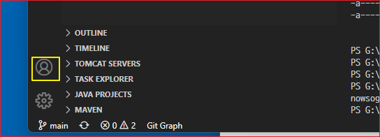

# Copilot 

## VSCode에서의 자격증명
VSCode의 왼쪽 사이드 메뉴의 하단에 사람 아이콘을 클릭하면 github 자격증명을 확인해 볼 수 있다. 

계정을 선택한 다음에 Managed Trusted Extension을 선택하면 계정에 인증된 extension 들을 볼 수 있다.  copilot이 보이면 그 계정이 copilot을 사용할 수 있도록 인증된 계정이다. 

* VSCode Extensions
  * Better comment
  * Debugger for Java
  * Dependency Analytics
  * ESLint
  * Extension Pack for Java
  * Git Graph
  * Github copilot 
  * GitLens - Git supercharged
  * Gradle Extension Pack
  * Gradle for Java
  * Gradle Language Support
  * GraphQL
  * IntelliCode API Usage Example
  * Jupyter
  * Jupyter Keymap
  * Jupyter Notebook Renders 
  * Language Support for Java(TM) by Redhat
  * Liver Server
  * Lombok Annotations Support for VS Code
  * Markdown All in One
  * Markdown Preview Enhanced
  * Maven for Java
  * Microsoft Edge Tools for Java
  * Microsoft Office Add-in Debugger
  * Paste Image
  * Prettier - Code formatter
  * Project Manager for Java
  * Pylance
  * Python 
  * Python Preview
  * Red Hat Commons
  * Slack Theme
  * Spring Boot Dashboard
  * Spring Boot Tools
  * Task Explorer
  * Test Runner for Java
  * Tomcat for Java
  * Vetur
  * vsscode-icons
  

