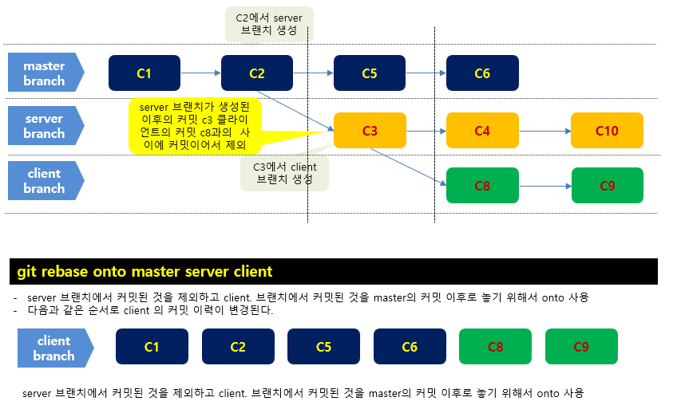
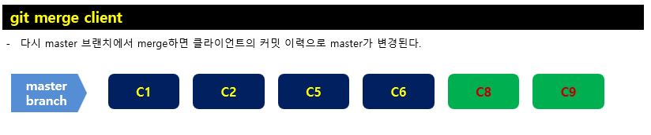
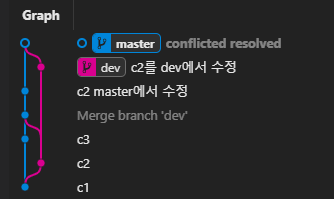

# Git 사용 방법

자세한 설명은 생략한다. 


## 기본 사용 

### 저장소 만들기
디렉터리를 만들고 그 디렉터리에 들어가서 init를 사용한다. 

```shell
mkdir temp
cd temp
git init
```
그 아래에 .git 폴더가 생성된다. 
```shell
📂temp
   📂.git 
     📂hooks 
     ... 생략 
```

### clone 하기 


```shell
git clone [repostitory url] [dir]
```


**repository url**
원격 저장소의 git url 

**dir**
저장소를 로컬에 복제할 위치를 지정한다. 

**예시**

```shell
git clone https://github.com/abcd/gitbook-js.git 
```
디렉터리를 지정하지 않으면 바로 아래에 gitbook-js 폴더가 생성되고 거기에 클론한다. 


### 파일 추가 
git add 명령을 사용한다.  확장자가 .c 인 파일 모두 추가한다. 
```shell
git add *.c
```

### 커밋
commit를 사용하여 커밋한다. 

```shell
git commit -m '여기에 커밋 메시지를 작성한다.'
```

### 커밋 이력 확인
**기본**
최신순으로 commit history를 볼 수 있다.
```shell
git log
```
커밋 이력이 보인다. 
```shell
PS D:\gittemp\test> git commit -m "음 가"
[master (root-commit) dd6fdbc] 음 가
 1 file changed, 1 insertion(+)
 create mode 100644 test.c
PS D:\gittemp\test> git log
commit dd6fdbc0cdc508260d87319e238debc23e3a67fc (HEAD -> master)
Author: nowsogood <latteonterrace@gmail.com>
Date:   Wed Dec 1 15:49:18 2021 +0900
```
**아이디와 타이틀만 표시**
```shell
git log --oneline // 커밋 이력 중 커밋 ID 와 타이틀 메시지만 조회
```
**모든 브랜치의 커밋 이력 조회** 

```shell
git log --oneline --decorate --graph --all// 모든 브랜치 커밋 이력 조회
```

**특정 파일의 커밋 이력 조회** 
```shell
git log [파일명]
```
**특정 디렉토리의 커밋 이력 조회** 
```shell
git log [폴더명]
```

**다른 브랜치의 로그 보기** 
```shell
git log [브랜치]
```
**원격 브랜치의 로그 보기**

```shell
git log [리모트 이름]/[브랜치 이름]
```

**변경 내용과 함께 보기** 
여러 옵션 중 -p, --patch 는 굉장히 유용한 옵션이다. -p 는 각 커밋의 diff 결과를 보여준다. 다른 유용한 옵션으로 `-2`가 있는데 최근 두 개의 결과만 보여주는 옵션이다:

```shell
git log -p 
```

특정 파일만 변경이력과 내용을 볼 수 있다. 
```shell
git log -p index.jsp 
```

**커밋에서 변경한 파일 이름 알기**
```shell
git log --name-only 
```
뒤에 커밋 아이디르 주면 해당 커밋의 변경된 파일 목록을 볼 수 있다. 
```shell
git log --name-only [커밋 아이디]
```

최근 두 개의 결과만 diff하려면 숫자 옵션을 사용한다. 
```shell
git log -p -2 // 최근 두 개의 결과만 diff 를 보여준다.
```

**내가 커밋한 것만 보려면**
```shell
git log --author=[이름] 
```

**머지 히스토리와 함께 보려면**
```shell
git log --oneline --graph
```

**A 브랜치에는 없지만 B 브랜치에 있는 커밋을 보려면**
두 브랜치에 공통으로 있는 커밋은 생략된다. 
```shell
git log [A 브랜치]..[B 브랜치]
```

A 브랜치는 생략할 수 있다. 
```shell
git log ..[B 브랜치]
```

브랜치를 바꾸면 반대가 된다. 
```shell
git log [B 브랜치]..[A 브랜치]
```

**두 브랜치 사이에 서로 없는 커밋만 보고 싶다면**
```shell
git log [A branch]...[B branch]
```


### diff
변경사항을 확인하기 위해서 사용한다. 
```shell
git diff
```

commit된 파일상태와 현재 수정중인 상태 비교
```shell
git diff
```
commit된 파일상태와 add된 파일 상태 비교
```shell
git diff --staged
```

commit간의 상태 비교하기 - commit hash 이용
```shell
git diff [비교할commit해쉬1] [비교할commit해쉬2]
```

commit간의 상태 비교하기 - HEAD 이용
```shell
git diff HEAD HEAD^
```
가장 최근의 커밋과 그 전의 커밋을 비교한다

branch간의 상태 비교하기 - HEAD 이용
```shell
git diff [비교할branch1] [비교할branch2]
```


### fetch 하기 

```shell
git fetch origin master 
```

### pull 하기 
```shell
git pull origin master 
```
### push 하기 

```shell
git push origin master
```

강제로 push하기
```shell
git push -f orgin master
```


## 사용자 관리 
프로젝트 마다 사용자가 다르면 각 프로젝트의 로컬 git에 사용자를 설정해야 한다. 

### 프로젝트의 이름 및 이메일 확인
```shell
//이름 확인
git config user.name
//이메일 확인
git config user.email 
```
### global 이름 및 이메일 확인
```shell
git config --global user.name 
git config --global user.email
```
### 이름 삭제 
```shell
git config --global user.name 
git config --global user.email
```
### 이름 설정
```shell
git config --global user.name  이름
git config --global user.email 이메일
```

## 원격 저장소 관리 
원격 저장소는 여러개 연결할 수 있다. 
### 원격 저장소 확인 

```shell
git remote -v
```


### 원격 저장소 연결
```shell
git remote add [이름] [원격저장소 URL]
```
### 원격 저장소 끊기 
```shell
git remote remove [원격저장소 이름]
```


### PUSH할 때 다른 계정으로 push 되어서 권한이 없을 때 

github에서 clone한 프로젝트를 푸시할 때 다른 계정으로 푸시가 되어서 권한이 없다는 오류를 만나게 되는 경우가 있다. 이런 경우의 해결 방법을 알아 보자.
프로젝트 폴더에서 다음의 명령어를 입력하여 리모트 리파지토리 정보를 출력한다.

```shell
git remote -v
```
다음과 같이 출력이 된다.
```shell
PS G:\gitbook\projects\gitbook-tool> git remote -v
origin  https://github.com/rtgo/gitbook-tool.git (fetch)
origin  https://github.com/rtgo/gitbook-tool.git (push)
```
다음의 명령을 사용하여 리모트 정보를 수정해야 하는데 리모트 정보 앞에 '사용자이름@'을 붙인다. 형식은 이렇게 한다.

```shell
https://[사용자이름]@github.com/rtgo/gitbook-cloud.git
```

사용자 이름이 abc라면 다음과 같이 한다
```shell
git remote set-url origin https://abc@github.com/rtgo/gitbook-cloud.git
```


## 브랜치 관리 

**토픽 브랜치란**, 기능 추가나 버그 수정과 같은 단위 작업을 위한 브랜치 입니다. 여러 개의 작업을 동시에 진행할 때에는, 그 수만큼 토픽 브랜치를 생성할 수 있습니다.

토픽 브랜치는 보통 통합 브랜치로부터 만들어 내며, 토픽 브랜치에서 특정 작업이 완료되면 다시 통합 브랜치에 병합하는 방식으로 진행됩니다. 이러한 토픽 브랜치는 '피처 브랜치(Feature branch)' 라고 부르기도 합니다.


### 브랜치 목록
로컬 브랜치 조회
```shell
git branch 
```

원격 브랜치 조회
```shell
git branch -r 
```
모든 브랜치 조회
```shell
git branch -a
```

### 브랜치 생성
```shell
git branch [브랜치명]
```
### 브랜치로 작업하기 
checkout 한다. 
```shell
git checkout [브랜치명]
```

### 브랜치 삭제 
```shell
 git branch -d [브랜치]
```

### 원격에 브랜치 생성
remote add 명령어를 사용하여 원격 저장소를 지정하고 git push를 이용하여 푸시한다. 
```shell
git remote add origin  [원격 리파지토리 URL]
git push origin [브랜치명]
```


## 커밋 관리 
### reset하기 
특정 버전으로 리셋한다. 
```shell
git reset --hard 69242d1a
```

### revert 
커밋한 내용을 취소한다. 커밋 이전의 상태로 되돌린다. 

```shell
git revert 69242d1a
```

### 커밋 내용 덮어 쓰기 
커밋의 내용을 덮어쓸 때는 git commit의 amend 옵션을 사용
```shell
git commit --amend 
```

amend의 옵션의 경우 스테이징에 추가된 내용을 반영해주는 동시에 커밋 메시지도 변경해준다. 


### merge 하기 
master에서 c1을 커밋하고 dev 브랜치를 생성한 다음 c2를 커밋한다. 다시 마스터 브랜치로 스위치하고 c3를 커밋한다. 
```shell
[master]  C1 - c3
[dev]       \_ c2 
```
master 브랜치에서 dev의 커밋을 머지한다. 
```shell
git merge dev 
```
그러면 커밋한 순서대로 master 브랜치의 커밋이 정렬된다. 
```shell
[master]  C1 - c2 - c3
[dev]       \_ c2 
```


**merge 취소하기**
```shell
git merge --abort
```
**충돌 상황 확인**
```shell
git status
```
```shell
git status
On branch master
You have unmerged paths.
  (fix conflicts and run "git commit")
  (use "git merge --abort" to abort the merge)

Unmerged paths:
  (use "git add <file>..." to mark resolution)
        both modified:   c2

no changes added to commit (use "git add" and/or "git commit -a")
```

Unmerged paths 영역에 conflict가 발생한 sample 파일의 이름이 보입니다. conflict가 여러 파일에서 발생하면 해당 파일들의 이름이 모두 이 영역에 보이게 된다. 

충돌한 파일을 수정하여 해결한다. 
다음에 add와 commit를 해준다. 
```shell
git add c2 
git commit -m "conflict resolved"
```


### rebase 하기 

master에서 파일 커밋 
```shell
[master]   first 
```
dev 브랜치에서 두번재  파일 생성
```shell
[develop]          second 
[master]   first - 
```
다시, master에서 thrid 파일 생성
```shell
[develop]          second 
[master]   first           third
```
dev에서 rebase 실행 
```shell
git checkout dev
git rebase master 
```
그러면 dev에서 커밋 이력은 다음과 같다. 
```shell
[develop]  first third second 
```
정리하면, 
checkout할 때 dev 브랜치에서는 first만 존재, 이것은 마스터와 base가 같다. 
dev에서 second 생성하고 , master에서 third를 생성한다. 
순서를 기준으로 하면 third가 second 다음에 나와야 하는데 
rebase를 하면 처음 dev를 checkout할 때 상태로 기준(base)를 맞추고
base할 때의 커밋 이후에 커밋된 것들을 가져와서 놓는다. 그러면 다음과 같이 순서가 된다. 
```shell
[develop] first - third 
```
이렇게 한 다음에 dev에서 커밋한 것을 뒤에 놓는다. 그래서 커밋 이력을 보면 다음과 같은 순서가 된다. 
```shell
[develop]  first - third - second 
```

#### onto 사용 

master , server, client  세 개의 브랜치가 있다고 가정한다.  server와 client 브랜치의 변경 사항을 master에 리베이스하려면 --onto 옵션을 사용한다. 

```shell
[master]      c1->c2->c5->c6 
[server]           \_ c3->c4->c10   
[client]                \_c8->c9
```

```shell
git rebase --onto master server client 
```
결과는 다음과 같다. 
```shell
[master]      c1->c2->c5->c6
[client]      c1->c2->c5->c6->c8->c9 
[server]      c1->c2->c3->c4->c10
```
client에 server 토픽 브랜치 생성 이후에 master에 커밋된 c5, c6가 들어 온다. 

c2에서 server 토픽 브랜치가 생성되었고 , c3에서 client 토픽 브랜치가 생성되었는데, c2 이후에 client 토픽 브랜치가 생성된 이후에 커밋된 c8 까지의 커밋을 제거하고, master 다음에 client가 커밋한 것을 놓는다. 




이제 master 브랜치로 돌아가사 'Fast-forward' 시킬 수 있다. 
```shell
git checkout master
git merge client
```
그러면 커밋 이력은 다음과 같이 된다. 
```shell
[master]      c1->c2->c5->c6->c8->c9 
[client]      c1->c2->c5->c6->c8->c9 
[server]      c1->c2->c3->c4->c10
```
클라이언트와 마스터가 같아 진 것을 볼 수 있다. 



> 이렇게 하는 이유는 c2 이후에 server 브랜치에서 c3를 커밋하고 client 토픽 브랜치를 생셩했기 때문에 client와 server 브랜치의 공통 조상까지의 커밋인 c3를  client에서 없대고 싶을 때 적용한다. 


## 파일 상태 확인
git status로 상태를 확인한다. 리포지토리의 상태를 보여주는 명령인  git status 명령을 사용하면 관리되고 있는 파일과 디렉토리 목록을 확인해 볼 수 있다. 

```shell
git status
```
```shell
PS D:\gittemp\test> git status
On branch master
nothing to commit, working tree clean
```

* **Untracked** 
  * 워킹 디렉토리에 있는 파일들. Untracked, Tracked의 두 가지 상태로 나뉜다.  
  * 파일에 변경이 일어나면 Tracked 상태가 된다. 
  * 파일을 새로 만들면 Untracked 상태이고 git가 파일을 추적하지 않는다.  
  * git add로 추가해야 staging에 저장되고 tracked 상태가 된다. 
* **Tracked**
  * Tracked 상태의 파일들은 다시 Unmodified, Modified , Staged 3개로 나뉜다. 
  * Staged
    * staging area에 있는 파일들
  * 커밋을 하면 Unmodified가 된다. 
  * Unmodified 파일을 수정하면 Modifeid가 된다. 


## 기타
### 충돌(Conflict) 해결 
master 브랜치와 dev 브랜치에서 각각 c2를 수정하고 master 커밋한다. master 브랜치에서 dev를 master로 머지하면  c2가 충돌이 발생한다. 
```shell
git merget dev
```
충돌되었다는 메시지가 출력된다. 
```shell
> git merge dev
Merge made by the 'recursive' strategy.
 c2 | 1 +
c5c0554 c1
PS D:\gittemp\test> git merge dev
Auto-merging c2
CONFLICT (content): Merge conflict in c2
Automatic merge failed; fix conflicts and then commit the result.
```
충돌된 파일을 보면 다음과 같이 되어 있다. 
```txt
c2
<<<<<<< HEAD
마스터에서 c2의 내용을 수정 
=======
c2를 dev 브랜치에서 수정
>>>>>>> dev
```

HEAD 아래가 현재 작업 디렉터리의 파일 내용이고 ====== 아래가 머지할려는  브랜치의 변경사항이다. 이를 해결해야 한다. 

merge를 하면 merge한 commit이 하나 더 생긴다. 




### 푸시하지 않는 커밋 확인 
나중에 작성 


