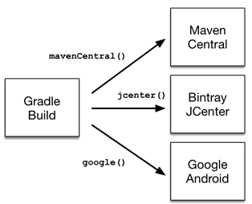
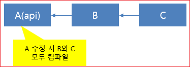
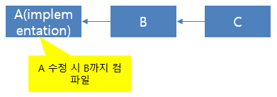

# Gadle (3) - build.gradle   #1 build.gradle 개요 


 Maven은 pom.xml 파일을 사용하여 프로젝트를 빌드하지만 Gradle은 **build.gradle 파일을 사용**하여 프로젝트를 빌드한다.  Gradle의 특징과 설정파일에 대한 기본 개념을 파악한다.

**특징** 
* Gradle은 build.gradle을 사용하여 프로젝트를 빌드한다.
* build.gradle 파일은 기본적으로 Project 클래스의 인스턴스다.
* Gradle은 maven과 같은 life-cycle이 없다. 
* Gracle은 대신에 task를 사용한다.
* task는 직접 만들 수도 있고 미리 만들어진 것을 사용할 수도 있다.
* task를 사용하기 위해서는 plugin을 추가해야 한다. 
* build task를 수행하기 위해서는 java plugin을 추가한다.
* task 간에는 미리 정의된 의존성이 있어 build task를 실행 시 다른 task들이 먼저 실행된다.
* task를 생성시 의존성을 정의할 수 있다.


**설정 파일 기본 개념**

* Gradle 기본 설정 파일은 build.gradle이다. settings.gradle 파일이 존재할 경우 settings.gradle 파일까지 빌드에 포함해 실행한다. 
* settings.gradle 파일은 여러 개의 모듈로 분리해 개발하는 경우 유용하게 사용할 수 있다.
* Gradle에서 속성은 gradle.properties 파일에서 관리할 수 있다.
* build.gradle 이 아닌 다른 빌드 파일을 선택해 실행하는 경우 "gradle -b 설정파일"과 같이 실행한다. 이와 같이 실행할 경우 settings.gradle 은 무시된다.


> plugin에는 미리 정의된 많은 tasks가 있다.  plugin 간에는 task와 마찬가지로 의존성을 정의할 수 있다.  플러그인이 추가되면 task만 추가되는 것이 아니라 task간의 의존 관계도 같이 추가된다.


## build.gradle 기본 구조


그래들은 프로젝트 빌드를 위해 build..gfadle 파일을 사용한다. 아래는 build.gradle 파일의 기본 구조를 보여준다.  plugins에 java 플러그인을  추가하여 잘  정의된  태스크들을 사용하여 프로젝트를 빌드 할 수  있다.   respositories에 의존성을 가져오도록 설정한다. 의존성은 dependencies에서 관리한다. 

```shell
plugins {
    id 'java'
}

group 'org.example'
version '1.0-SNAPSHOT'

repositories {
    mavenCentral()
}

dependencies {
    testImplementation 'org.junit.jupiter:junit-jupiter-api:5.6.0'
    testRuntimeOnly 'org.junit.jupiter:junit-jupiter-engine'
    implementation 'com.microsoft.azure:msal4j:1.8.0'
    implementation 'com.microsoft.graph:microsoft-graph:2.4.1'
    implementation 'org.slf4j:slf4j-nop:1.8.0-beta4'
}

task hello {
    println "hellO"
}
```

## plugin
Gradle 빌드 툴은 기본적인 라이프 사이클을 제공하지 않는다.  Maven 빌드 툴은 빌드 설정 파일이 상속개념이지만 그래들은 상속보다는 구성 Composition을 통한 확장을 선택했다. 이 구성을 통한 확장의 핵심에 plugin이 있다.  “apply plugin : ‘java’”와 같이 Java 플러그인을 사용하도록 설정하는 순간 자바 프로젝트에 대한 라이프 사이클이 추가된다.


gradle은 환경을 구축할 때 매번 같은 작업을 반복적으로 발생하는 작업들을 plugin으로 정의해 이미 제공하고 있다.  자바 기반으로 개발하는 경우에 java 플러그인과 war 플러그인을 활용해 빌드 환경을 구축할 수 있다.


### java 플러그인
build..gradle 파일에 다음과 같이 설정한다.

```shell
apply plugin: ‘java’
```
### war 플러그인
```shell
apply plugin: ‘war’
```
war 플러그인은 java 플러그인과 의존관계에 있다.  빌드 스크립트에 war plugin을 추가하면 java 플러그인은 별도로 추가할 필요가 없다.

> Gradle의 모든 빌드 단위는 task로 정의한다. task는 Ant의 target과 같은 개념이다. Gradle에서는 개발자가 추가하고 싶은 빌드 단위가 있으면 새로운 task를 추가할 수 있다.


## Repository 설정

Gradle은 Maven, Ivy 또는 플랫 디렉토리 형식을 기반으로 하나 이상의 저장소에서 종속성을 해결할 수 있다. 소프트웨어를 구축하는 조직은 공개 바이너리 리포지토리를 활용하여 오픈 소스 종속성을 다운로드하고 사용할 수 있다. 
```shell
repositories {
    jcenter()
    maven {
        url "https://maven.springframework.org/release"
    }
    maven {
        url "https://maven.restlet.com"
    }
}
```
* maven() maven 리파지터리.
* google() 구글 리파지터리.
* jcenter() jecnter 리파지터리.
* mavenLocal() 로컬 리파지터리. 




## 의존성 설정
Gradle 프로젝트에 대해 선언 된 모든 종속성은 특정 범위(scope)에 적용된다. 예를 들어 일부 종속성은 소스 코드를 컴파일하는 데 사용해야하는 반면 다른 종속성은 런타임에만 사용할 수 있어야한다.
```shell
범위 group:’그룹아이디’, name: ‘아티팩트아이디’, version: ‘버전’
```
**의존성 범위** 
**api**
api 종속성이 외부 API를 변경하면 Gradle이 컴파일 시 해당 종속성에 액세스할  권한이 있는 모듈을 모두 다시 컴파일하기 때문입니다.  그러므로 api 종속성이 많이 있으면 빌드 시간이 상당히 증가합니다. 종속성의 API를 별도의 모듈에 노출시키고 싶은 것이 아니라면  라이브러리 모듈은 implementation 종속성을 대신 사용해야 합니다.



**implementation**
이 종속성 구성을 사용하면 빌드 시스템이 재컴파일해야 하는 모듈의 수가 줄어들기 때문에 빌드 시간이 상당히 개선될 수 있습니다.  대부분의 앱과 테스트 모듈은 이 구성을 사용해야 합니다.




* **compileOnly** — 프로덕션 코드를 컴파일하는 데 필요하지만 런타임 클래스 경로의 일부가 아니어야 하는 종속성의 경우
* **implementation**(대체 compile) — 컴파일 및 런타임에 사용
* **runtimeOnly**(supersedes runtime) — 컴파일이 아닌 런타임에만 사용됨
* **testCompileOnly**- compileOnly테스트를 위한 것 외에는 동일
* **testImplementation** — 동등한 테스트 implementation
* **testRuntimeOnly** — 동등한 테스트 runtimeOnly


api의 범위와 implementatio의 범위의 차이를 잘 모르겠으면 아래의 코드를 참고한다.  의존성이 외부로 노출되는지 내부에서만 사용하는지에 따라 api와 implementation을 구분하여 사용해야 한다

```java
import org.apache.commons.httpclient.*; 
import org.apache.commons.lang3.exception.ExceptionUtils; 
import java.io.UnsupportedEncodingException;
 
public class HttpClientWrapper {
    private final HttpClient client; // private member: implementation details
     // HttpClient is used as a parameter of a public method
    // so "leaks" into the public API of this component
    public HttpClientWrapper(① HttpClient client) {
        this.client = client;
    }
 
    // public methods belongs to your API
    public byte[] doRawGet(String url) {
        GetMethod method = new GetMethod(url);
        try {
            int statusCode = doGet(method);
            return method.getResponseBody();
         } catch (Exception e) {
            ②ExceptionUtils.rethrow(e); // this dependency is internal only
        } finally {
            method.releaseConnection();
        }
        return null;
    }
 
    // GetMethod is used in a private method, so doesn't belong to the API
    private int doGet(GetMethod method) throws Exception {
          ... 생략 ... 
         return statusCode;
    }
}
```

① 이것은 public method에 주입된다. 따라사 외부에 exposed된다. api로 선언해야한다.
② 이것은 컴포넌트의 public으로 선언된 메소드에서 사용되는 것이 아니라 메서드 내부에서만 사용하기 때문에 implementation 의존이다

```shell
//외부 jar 파일들에 대한 의존성을 여기에 설정한다
dependencies {
    api 'commons-httpclient:commons-httpclient:3.1'
    implementation 'org.apache.commons:commons-lang3:3.5'
}
```

## 빌드하기 

IntelliJ에서는 Gradle 도구 창에서 build를 실행하면 buid가 실행된다. 터미널에서는 간단히  gradle build 를 입력하면 build가 실행된다.  IntelliJ를 사용하면 task를 나누어서 사용할 수 있기 때문에 편리하게 gradle을 사용할 수 있다.


**IntelliJ에서 빌드**    
Gradle 창에서 build>build 실행한다.

**실행할 수 있는 태스크들 확인**
intellij의 terminal 또는 powershell에서 다음을 실행한다.

```shell
gradle tasks
```
java 플러그인을 추가하는 것만으로 많은 태스크들이 추가된다.

**터미널에서 빌드**
```shell
gradle build
```


