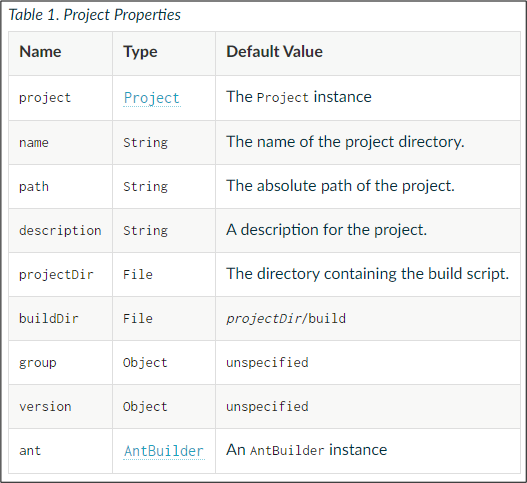

# Gadle (9) - build.gradle #7 응용

## Project API

build 스크립트는 Project 객체와 연관되어 있고 build scrip를 실행함으로써 프로젝트를 구성한다. 사실, 최상위 프러퍼티들은과 블럭들은 Project의 일부이다.


**Project 객체의 프러퍼티에 접근하기**
```shell
// build.gradle

println project.name
```
Project objec는 표준 프러퍼티들을 제공한다.



## 지역변수 사용 
def 를 사용하여 지역변수를 정의할 수 있다.

```shell
def myname = "park"

task hello {
    println project.getVersion()
    println project.buildDir
    println myname
}
```
## 임의의 객체 사용
읽기 쉬운 방식으로 임의의 객체들을 다음과 같이 생성할 수 있다.
```shell
import java.text.FieldPosition

tasks.register('configure') {
    doLast {
        def pos = configure(new FieldPosition(10)) {
            beginIndex = 1
            endIndex = 5
        }
        println pos.beginIndex
        println pos.endIndex
    }
}
```

## Groovy 
gradle은 Groovy를 사용한다.  Groovy의 자세한 문법은 아래의 URL을 참고한다.

https://docs.groovy-lang.org/latest/html/documentation/index.html#_closures

**Properties 사용**
```shell
project.getVersion() //아래와 동일
project.version

project.setVersion('1.0.1') //아래와 동일
project.version = '1.0.1'
```
build.gradle에서 메서드를 정의하고 호출하는 방법을 살펴본다.

**Methods 사용**

파라미터가 한 개인 printInfo() 메서드를 정의하고 호출하는 방법을 보여준다.

```shell
void printInfo(String info) {
    println info;
}
task hello {
    printInfo project.name
}
```
메서드 호출은 괄호 없이 호출할 수 있다.

```shell
task hello {
    printInfo project.name
}
```

인자가 없는 메서드는 괄호를 사용해야 한다.
```shell
void printInfo() {
    println project.name
}
task hello {
    printInfo()
}
```
파라미터가 여러개인 메서드를 정의하고 호출하는 방법을 살펴본다.
```shell
void printInfo(String prefix, String info) {
    println(prefix +  info)
}
task hello {
    printInfo("Hello ", "World")
}
```

메서드 호출은 괄호 없이 호출할 수 있다. 파라미터는 콤마(,)로 구분한다.
```shell
printInfo "Hello ", "World"
```
블록 또한 메서드이며, 마지막 인자에 대한 특별한 타입일 뿐이다.

**Block 사용**

블록은 빌드 요소의 여러 측면을 한번에 구성하기 위한 메커니즘이다. configuratio을 중첩하는 방법을 제공함으로써 구조화된 데이터 형식을 나타내게 해준다. 

* 특정한 signature를 가진 메서드로 구현된다.
* 규정되지 않은 메서드 및 property 대상(delegate 대리인)을 변경할 수 있다.

**Block 메서드 signature**
* 적어도 하나의 인자가 필요하다
* 마지막 인자는 groovy.lang.Closure type이나 org.gradle.api.Action type이어야 한다.

예를 들어, Project.copy(Action)은 이런 요구 사항과 일치하므로 다음 구문을 사용할 수 있다.

```shell
copy {
    into "$buildDir/tmp"
    from 'custom-resources'
}
```
클로저는 객체의 동작을 주 목적으로 하는 일종의 코드 블록이며 또한 클로저는 하나의 객체이다.  인자를 받고 값을 리턴할 수 있다는 점에서 메서드 처럼 동작한다. 그러나 메서드 처럼 메서드명과 시그니처를 선언하지 않아도 동작할 수 있다. 익명의 코드 블럭이라고 생각하면 된다.

**Closure**

메서드 호출에서 콜로저 인자를 전달하는데, 전달된 값의 이름이 없어도 “it”를 만들어 준다. 
```shell
// closuere 선언
def multiple = {
    return it *2
}

task hello {
     // closure 호출
    [2,4,8].each {
        println "${it} * 2 = ${multiple(it) }"
    }
}
```
**클로저의 리턴 구문**
* 로저가 실행하다 마지막 문장을 평가하고 나면 그 결과 값이 리턴된다.
* 이것을 end return이라고 하는데 return 키워드는 써도 되고 안써도 된다.
* 명시적으로 수행중 리턴을 해줘야 할 경우  return을 적어줘야 한다.

클로저의 위임에 대해서 더 알아보려면 다음의 URL을 참고한다.

https://blog.daum.net/stshms/7

Groovy DSL에 대해서 더 알아보려면 다음의 URL을 참고한다.

https://www.tutorialspoint.com/groovy/groovy_dsls.htm


