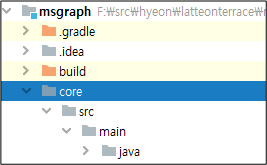

# Gadle (10) - buildScript #1 

* 소스코드를 빌드하고 실행하는데 필요한 글로벌 레벨의 depencies & repositories 설정
* build.gradle 파일 그 자체를 위한 것. Package Manager / Docker file / spirng-boot-gradle-plugin과 같이 빌드에 필요한 의존성 추가
* 따라서 소스코드 컴파일과 같은 빌드 작업을 시작하기 전에, 빌드 시스템 준비 단계에서 제일 먼저 실행되는 블록
* 결국 빌드 자체를 위한 의존성 & 레포를 설정하는 곳


## Multi Project 구성

gradle에서 multi-project를 구성하고 빌드하는 방법을 살펴본다.

**settings.gradle**
최상위 프로젝트의 settings.gradle 파일을 열고 다음을 입력한다.

```shell
rootProject.name = 'msgraph'

include ‘core’, 'mylib’,
```

rootProject.name은 최상위 프로젝트 이름이다. 기본적으로는 프로젝트 폴더명으로 만들어 진다. 
include를 사용하여 하위 프로젝트를 포함한다. 여러개의 하위 프로젝트는 콤마로 구분한다.

**core 하위 프로젝트 폴더 생성**

최상위 프로젝트에서 하위 프로젝트로 만들 폴더를 생성한다. 여기서는 core로 생성한다. 생성한 core 폴더에 소스 폴더인 src/main/java를 만든다. build.gradle 파일도 생성한다



**core 프로젝트의 build.gradle 설정**
하위 프로젝트인 core에 build.gradle 파일을 다음과 같이 설정한다. 이 설정은 core 폴더 하위의 프로젝트에만 적용된다.  

```shell
apply plugin: 'java'        // 'java'라는 Gradle 플러그인 적용
sourceCompatibility = 1.8   // Java 호환 버전을 1.8로 설정
repositories {
    mavenCentral()
}
dependencies {
    compile 'ch.qos.logback:logback-classic:1.2.3'
    compile 'ch.qos.logback:logback-core:1.2.3'
    testCompile 'junit:junit:4.12'
}
```
**mylib 하위 프로젝트 폴더 생성**

최상위 프로젝트에서 하위 프로젝트로 만들 폴더를 생성한다. 여기서는 mylib으로 생성한다. 생성한 mylib 폴더에 소스 폴더인 src/main/java를 만든다.


**mylib 프로젝트의 build.gradle 파일 생성**
하위 프로젝트 루트 폴더에도 build.gradle 파일을 생성한다. mylib 프로젝트는 core 프로젝트를 의존한다. project(‘:core’)를 사용하여 의존성을 추가한다.

```shell
apply plugin: 'java'        // 'java'라는 Gradle 플러그인 적용
sourceCompatibility = 1.8   // Java 호환 버전을 1.8로 설정
repositories {
    mavenCentral()
}

dependencies {
    compile project(':core')
    compile 'ch.qos.logback:logback-classic:1.2.3'
    compile 'ch.qos.logback:logback-core:1.2.3'
    testCompile 'junit:junit:4.12'
}
```

**build하기**
build gradle을 실행하여 빌드해보자. 정상적으로 모든 프로젝트가 빌드된 것을 확인할 수 있다.

```shell
$ gradle build

Deprecated Gradle features were used in this build, making it incompatible with Gradle 7.0.
Use '--warning-mode all' to show the individual deprecation warnings.
See https://docs.gradle.org/6.6.1/userguide/command_line_interface.html#sec:command_line_warnings

BUILD SUCCESSFUL in 4s

```

core 프로젝트와 mylib 프로젝트에 각각 build 폴더가 생성된 것을 확인할 수 있다.

**공통 설정 적용**

프로젝트 간 공통 설정이 필요할 수 있다. 이러한 부분은 최상위 프로젝트의 build.gradle 파일에 모든 하위 프로젝트에 적용되는 공통 설정을 한다.

```shell
allprojects {
    apply plugin: 'java'

    group 'org.example'
    version '1.0-SNAPSHOT'

    repositories {
        mavenCentral()
    }

    dependencies {
        testImplementation 'org.junit.jupiter:junit-jupiter-api:5.6.0'
        testRuntimeOnly 'org.junit.jupiter:junit-jupiter-engine'
        implementation 'com.microsoft.azure:msal4j:1.8.0'
        implementation 'com.microsoft.graph:microsoft-graph:2.4.1'
        implementation 'org.slf4j:slf4j-nop:1.8.0-beta4'
    }
}
```
* subprojects 내의 모든 설정값들은 모든 하위 프로젝트에 적용된다. 
* allprojects 최상위 프로젝트를 포함한 모든 하위 프로젝트에 공통으로 적용한다면 이것을 사용한다. 


프로젝트 간 공통 설정이 필요할 수 있다. 이러한 부분은 최상위 프로젝트의 build.gradle 파일에 모든 하위 프로젝트에 적용되는 공통 설정을 한다


```shell
allprojects {
    apply plugin: 'java'

    group 'org.example'
    version '1.0-SNAPSHOT'

    repositories {
        mavenCentral()
    }

    dependencies {
        testImplementation 'org.junit.jupiter:junit-jupiter-api:5.6.0'
        testRuntimeOnly 'org.junit.jupiter:junit-jupiter-engine'
        implementation 'com.microsoft.azure:msal4j:1.8.0'
        implementation 'com.microsoft.graph:microsoft-graph:2.4.1'
        implementation 'org.slf4j:slf4j-nop:1.8.0-beta4'
    }
}
```

프로젝트 별로 상세한 설정이 필요한 경우 아래와 같이 각 프로젝트 별로 설정을 따로 나눌 수 있다.


```shell
def coreProject = [project(':core')]
def libProject  = [project(':mylib’)]

allprojects {
    apply plugin: 'java'
    group 'org.example'
    version '1.0-SNAPSHOT'
    repositories {        mavenCentral()    }
}
configure(coreProject) {
    dependencies {
        testImplementation 'org.junit.jupiter:junit-jupiter-api:5.6.0'
        testRuntimeOnly 'org.junit.jupiter:junit-jupiter-engine'
        implementation 'com.microsoft.azure:msal4j:1.8.0'
        implementation 'com.microsoft.graph:microsoft-graph:2.4.1'
        implementation 'org.slf4j:slf4j-nop:1.8.0-beta4'
    }
}
configure(libProject) {
    dependencies {
        testImplementation 'org.junit.jupiter:junit-jupiter-api:5.6.0'
        testRuntimeOnly 'org.junit.jupiter:junit-jupiter-engine'
        implementation 'com.microsoft.azure:msal4j:1.8.0'
        implementation 'com.microsoft.graph:microsoft-graph:2.4.1'
        implementation 'org.slf4j:slf4j-nop:1.8.0-beta4'
    }
} 

```

**빌드 스크립트 의존성 추가**

buildScript는 Gradle 빌드 스크립트 자체를 위한 의존성이나 변수,Task, Plugin 등을 지정할 수 있다. 서드파티 플러그인이나 Task, Class 등을 빌드 스크립트 내에서 추가로 사용하려면 해당 의존성을 추가해야 한다. build.gradle 자체를 실행하기 위한 것이라고 보면 된다.


* 소스코드를 빌드하고 실행하는데 필요한 글로벌 레벨의 depencies & repositories 설정
* build.gradle 파일 그 자체를 위한 것. Package Manager / Docker file / spirng-boot-gradle-plugin과 같이 빌드에 필요한 의존성 추가
* 따라서 소스코드 컴파일과 같은 빌드 작업을 시작하기 전에, 빌드 시스템 준비 단계에서 제일 먼저 실행되는 블록
* 결국 빌드 자체를 위한 의존성 & 레포를 설정하는 곳

Spring 부트 기반 프로젝트를 진행하는 경우, 이를 위한 spring-boot-gradle-plugin 의존성을 추가해야 한다. Spring Boot 사용 시 executable jar나 war 패키징, 앱 실행, spring-boot-dependencies의 dependency management 기능 등을 사용할 수 있게 하는 플러그인이다.


```shell
buildscript {
    ext {
       springRepo = 'http://repo.spring.io/libs-release'
    }

    repositories {
       maven { url springRepo }
    }

    dependencies {
       classpath "org.springframework.boot:spring-boot-gradle-plugin:2.0.4.RELEASE"
    }
}
```


