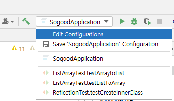
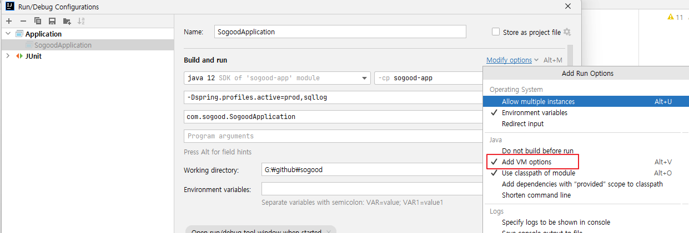
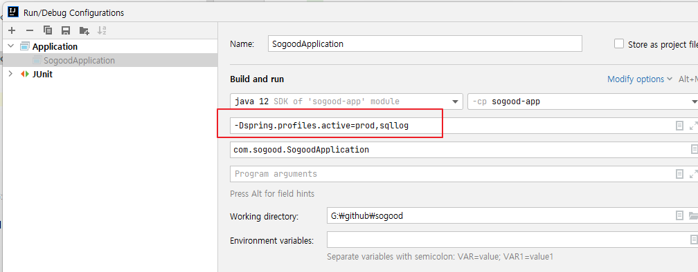
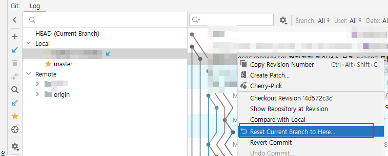
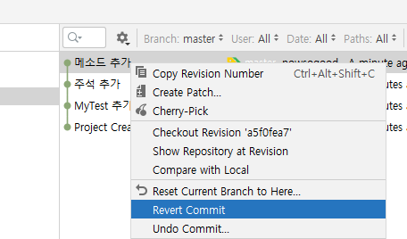
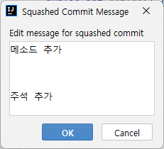
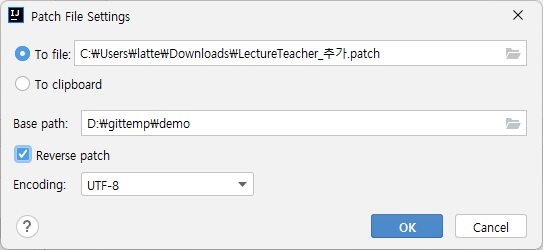
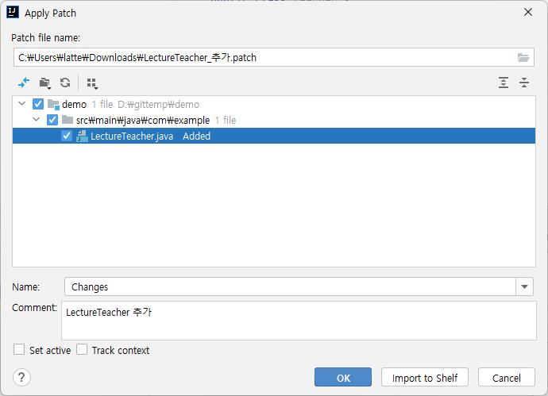
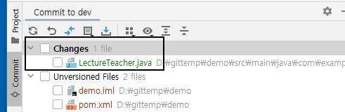
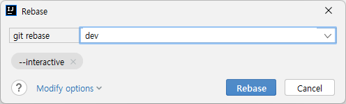

# IntelliJ 사용법


## 설정 
### Maven 설정 
settings.xml에서 Maven Home path와 User Settings file 설정한다. 

 


### editor \> file encodings 설정


### tomcat 서버 추가


### JDK 설정 
#### Platform Settings
Project Structure에서 Platform Settings 클릭한다. SDKS에서 JDK를 설정한다. 


#### Project Settings 
Project Structure에서 Project Settings를 클릭한다. Project SDK에 Project가 사용하는 JDK를 설정한다. 


### Memory 설정

"z" 키를 두 번 누른다. 


```shell
-Xms128m
-Xmx998m
```
이 값을 늘린다. 

```shell
-Xms128m
-Xmx2048m
```

**Compile Option 설정**
Settings > Build, Execution.. > Compiler에서 Share build process heap size를 2048로 설정한다. 

> 설정하지 않으면 GC overhead limit exceeded ... 이런 에러가 나다. 
> 


GC overhead limit exceeded 발생시

### Edit Custom VM Options
file encoding이 없으면 다음을 추가한다. 
```shell
-Dfile.encoding=UTF-8
```

### SpringBoot 사용 시 VM 옵션 설정 

실행하려면 SpringBoot Application main 메서드에서 실행 버튼을 클릭한다. 

Edit Configuration 선택



Add VM Options을 선택한다. 



JDK 설정 아래의 박스 친 곳에 옵션값을 설정한다. 



```shell
-Dspring.profiles.active=prod,sqllog
```


## 프로젝트 생성 
### 새로운 프로젝트 생성 

File > New > Project를 선택한다.  Empty Project를 선택한다. 


이클립스에서 프로젝트는 IntelliJ에서는 모듈이라고 부른다. 프로젝트는 이클립스의 워크 스페이스라고 생가하면 된다. 

* Project name에 이름을 입력한다. 
* Projecdt location에  위치할 디렉터리를 설정한다. 


새창을 열고 냐고 물어 본다. 새창으로 열겠다. 


Project Structure 창이 열리고 모듈을 입력하라고 나온다. 일단 cancel 버튼을 클릭하여 취소한다.  그러면 다음 이미지와 같이 보일 것이다. 


### git에서 clone하기 

VCS > Get From Version Control 을 클릭한다.  

* Clone할 URL을 입력한다. 
* 아까 생성한 프로젝트 폴더를 선택하고 git 리파지토리 이름과 동일하게 폴더 이름을 뒤에 추가한다. 

리파지토리 이름이 aaa.git 이면 aaa를 입력한다. 


프로젝트를 열거냐고 물어보는데 cancel 버튼을 클릭한다.  다음과 같이 디렉터리 구조가 될 것이다. 

```shell
📂 project folder 
   📂 .idea  // IntelliJ가 생성한 폴더 
   📂 clone한 project 디렉터리 
```

### 모듈 임포트 

File > Project Structure를 클릭한다.  Modules 항목을 선택하고 '+' 버튼을 클릭한다. 


Select File or Directory to Import 창에서 Clone한 프로젝트 폴더를 선택한다.  Import Module 창에서 Maven 프로젝트이면 Maven을 선택하고 Gradle 프로젝트이면 Gradle을 선택한다. 


## Git 

### 작업 브랜치 확인
```shell
📂HEAD        // 현재 작업중인 브랜치를 가리킨다. 
📂Local      // 로컬 브랜치 폴더
  📄dev ↙     // 화살표 있는 것이 checkout된  작업중인 topic 브랜치 
  ★ master    // 통합 브랜치
📂Remote     // 원격 리파지터리 폴더 
  📄origin     // 원격 리파지터리 
  📄my-origin  // 원격 리파지터리 
```


### 커밋 이력 확인 

**브랜치 커밋 이력 확인**
```shell
  All       // 전체 브랜치 커밋 이력 확인 
  Select    
  Recent    // 최근 작업한 브랜치 커밋 이력확인
★ HEAD      // HEAD(현재 브랜치)의 커밋 이력 확인
★ master    // master 브랜치의 커밋 이력확인 
★ origin/master  // 원격 리파지토리의 브랜치 커밋 이력 확인
-------------------------
Local >     // 로컬 브랜치 선택하여 커밋 이력 확인
my-origin >  // 원격 브랜치를 선택하여 커밋 이력 확인
origin >     // 원격 브랜치를 선택하여 커밋 이력 확인
```


### Git 패널 

```shell
📂HEAD
   📂 .idea  // IntelliJ가 생성한 폴더 
   📂 clone한 project 디렉터리 
```


### 사용자 정보 설정

* commit/push 하기 전에 반드시 사용자 정보 확인하고 변경할 것 

global 이름 말고 프로젝트의 local 이름을 확인해야 한다. 


```shell
//이름 확인
git config user.name
//이메일 확인
git config user.email 
```

Local  이름 및 이메일 확인
```shell
git config --local user.name 
git config --local user.email
```

Local 이름 확인은 '--local' 옵션사용. 
또는 만약에 각 프로젝트마다 각각의 다른 정보를 사용하고 싶다면 --global옵션을 빼고 사용해주면 된다. 


**이름 변경**
```shell
 git config --local user.name 이름 
 git config --local user.email 이메일 
```


### Fetch 
Git pannel의 왼쪽 사이드 아이콘 바에서 Fetch All Remotes 선택 


### Update  Project
Git 메뉴에서 Update Project를 선택하면 Merge할 것인지 Rebase할 것인지 물어 본다. 


### 원격 브랜치에 브랜치 Push 
Git 패널에서 작업 브랜치를 선택하고 우측 마우스를 클릭한다. 


Push를 선택한다. 


Push Commits to 창에서 원격 리파지토리를 선택한다. 


커밋 히스토리를 엎어 쓰기 위해서 강제로 푸시하고 싶으면  Force Push를 선택한다. 


### Rest 




* **Soft** 커밋을 선택한 커밋으로 되돌리고 나머지는 staging 상태로 변경
* **Mixed** 커밋을 선택한 커밋으로 되돌리고 나머지는 스태이징 이전 상태로 변경
* **Hard** 커밋을 선택한 커밋으로 되돌리고 이전 커밋들은 모두 삭제

### Revert 
커밋한 내용을 취소한다. 커밋 이전의 상태로 되돌린다.


C3 커밋의 소스는 다음과 같이 되어 있다. 
```java
package com.example;

public class MyTest {
    /** 이름 반환 */
    public String getName() {
        return "Hello";
    }
}
```
여기에 메소드를 추가하고 커밋한다. 
```java
package com.example;

public class MyTest {
    /** 이름 반환 */
    public String getName() {
        return "Hello";
    }
    public int getAge() {
        return 10;
    }
}
```

커밋 이력은 다음과 같은데 C4를 Revert해보자. 
```shell
C4  <-- revert 하면 
C3 
C2
C1 
```
Commit History 에서  우측 마우스를 클릭하여 Revert Commit를 선택한다. 




추가한 메서드가 사라지고 새로운 커밋이 생긴다. 
```shell
C5  <-- revert한 커밋 생긴다
C4  <-- revert 하면 
C3 
C2
C1 
```
소스파일을 보면 다시 원래의 소스대로 커밋한 내용이 사라진다. 
```java
package com.example;

public class MyTest {
    /** 이름 반환 */
    public String getName() {

        return "Hello";
    }
}
```

### Undo commit 
이번에 다시 getAge() 메서드를 추가하고 커밋한다. 그런 다음에 Undo commit를 하면 커밋 이전 상태, 즉 Staging 상태로 되돌린다. 커밋 이력은 사라진다. 

``
```shell
C4  <-- Undo commit하면 커밋이 취소되고 커밋된 파일은 Staging 상태로 되돌아 간다.
C3 
C2
C1 
```
다음과 같이 커밋 이력이 변경된다. 
```shell
C3 
C2
C1 
```

### Squash 
여러 개의 커밋을 하나의 커밋으로 변경하고자 할 때 사용한다. 오른쪽 마우스 클릭해서 Squash Commits를 선택한다. 
```shell
C4  <-- 선택하고 
C3  <-- 선택해서 Squash commits 선택한다. 
C2
C1 
```
커밋 메시지가 표시되는 데 커밋 메시지를 정리한 다음에 OK 클릭한다.



```shell
C3  <-- C3, C4가 합쳐지고 하나의 커밋으로 바뀐다.
C2
C1 
```
### Drop commmit
Drop Commit를 선택하면 Commit가 삭제된다. 

### Cherry Pick 
git cherry-pick이란 다른 브랜치에 있는 커밋을 선택적으로 내 브랜치에 적용시킬 때 사용하는 명령어이다.

master 브랜치에서 다음과 같은 커밋 이력을 가지고 있을 때 dev 브랜치를 생성한다. 
```shell
// master branch의 커밋 이력
C4
C3  
C2
C1 
```
dev 브랜치로 체크아웃하고 커밋을 추가한다. 
```shell
// dev branch의 커밋 이력 
C5
C4
C3  
C2
C1 
```
다시 master 브랜치를 체크아웃하고 커밋을 추가한다.  마스터의 커밋 이력은 다음과 같을 것이다. 

```shell
// 마스터 브랜치의 커밋 이력 
C6
C4
C3  
C2
C1 
```
이재 dev의 커밋이력에서 커밋을 선택하고 Cherry Pick을 해보자.  master 브랜치를 체크아웃 한 상태에서 해야 한다. 

```shell
// dev 브랜치의 커밋이력 
C5 <-- Cherry pick한다.
C4
C3  
C2
C1 
```
그리고 마스터 브랜치의 커밋 이력을 확인한다. 다음과 같이 C5 커밋이 최신 커밋으로 보일 것이다. 
```shell
// master branch의 커밋 이력 
C5  <-- Check pick한 커밋이 최신 커밋이 된다. 
C6
C4
C3  
C2
C1 
```

### Patch 하기 

Patch 파일을 만들어서 배포하고 적용하는 방법을 알아보자.  dev 브랜치에서 새로운 커밋을 하고  오른쪽 마우스 버튼 클릭하여 Create Patch를 클릭한다. 


```shell
// dev branch의 커밋 이력 
C7  <-- 이 것을 패치로 만든다. 
C5
C4
C3  
C2
C1 
```

적절하게 경로를 선택한다.  Base path와 Encoding은 디폴트를 사용한다. 



지정한 경로에 파일이 생성된다. 이제 패치를 master 브랜치로 체크아웃한다. 


메인 메뉴에서 Git > Patch > Apply patch를 선택한다.  Select Path 화면에서 패치 파일을 선택한다. 

같은 프로젝트에서 커밋하고 패치파일 만들었으면 커밋을 삭제한 다음에 해야 한다. 




OK 버튼을 클릭한다.  그러면 Changes 에 패치 내역이 들어 온 것을 확인할 수 있다. 



충돌이 있으면 충돌을 해결하고 커밋하면 된다. 


### Compare 
**파일 비교** 
파일 끼리 비교하는 방법이다. 

* 프로젝트에서 파일을 선택하고 
* 우측 마우스 클릭
* Compare With 선택
* 비교할 파일을 선택한다. 


**리비전 비교** 
커밋 이력과 비교하는 방법이다. 
* 프로젝트에서 파일을 선택하고 
* 우측 마우스 클릭
* Git > Compare With Revision 클릭
* 리비전 선택 


**브랜치 비교** 
브랜치 간에 비교하는 방법이다. 

* 프로젝트에서 파일을 선택하고 
* 우측 마우스 클릭
* Git > Compare With Branch 선택


### Stash 


### Rebase 
master 브랜치에서 다음의 커밋 이력인 상태에서 dev 브랜치를 생성한다. 
```shell
// master branch의 커밋 이력 
C1 
```
dev 브랜치를 체크아웃하고 커밋을 추가한다. 
```shell
// devr branch의 커밋 이력 
C2
C1 
```
다시 master 브랜치를 check out한다.  커밋을 두 번 한다. 
```shell
C4
C3
C1 
```
이제 dev 브랜치를 생성했던 시점 커밋인 C1을 기준(base)으로 하여 dev에서 변경된 커밋을 적용하고 다시 그 위해 master에서 추가한 커밋을 두는 리베이스를 해보자. 

* master 브랜치를 체크아웃한다. 
* Project 탭에서 프로젝트를 선택하고 우측 마우스를 클릭한다음에 Git > Rebase를 선택한다.  
* rebase할 브랜치 dev를 선택한다.  
* Modify options에 --interactive를 선택한다. 
* Rebase 버튼을 클릭한다. 





* Start Rebasing 버튼을 클릭한다. 


그러면 master 브랜치의 커밋 이력이 다음과 같이 될 것이다. 
```shell
C4 <-- master 브랜치의 커밋을 위로 올린다. 
C3 <-- master 브랜치의 커밋을 위로 올린다. 
C2 <--- dev의 커밋 
C1 
```


