# IntelliJ 사용법


## 설정 
### Maven 설정 
settings.xml에서 Maven Home path와 User Settings file 설정한다. 

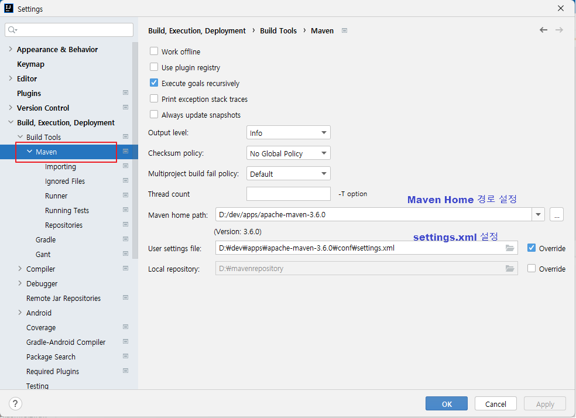 


### editor \> file encodings 설정
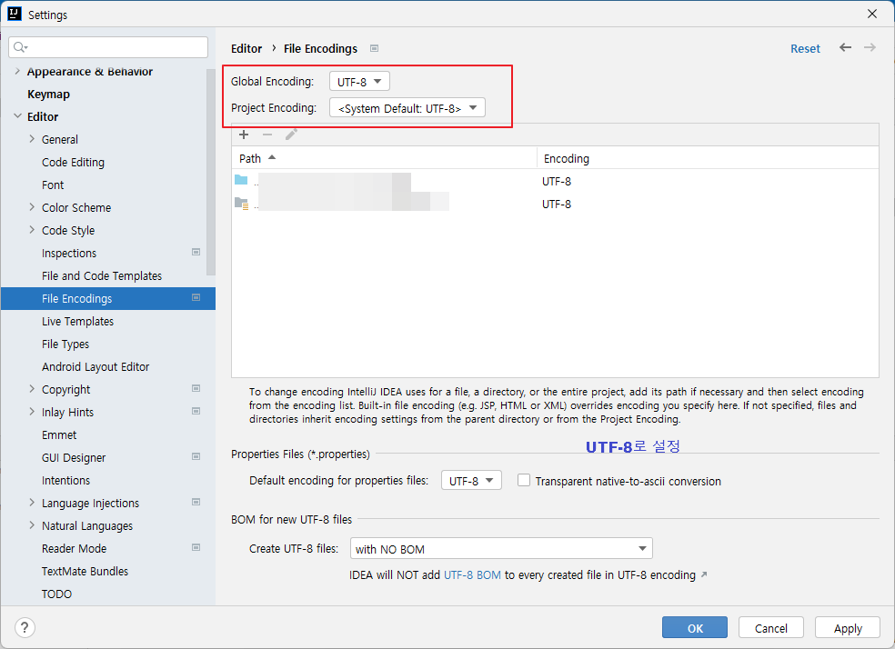


### tomcat 서버 추가
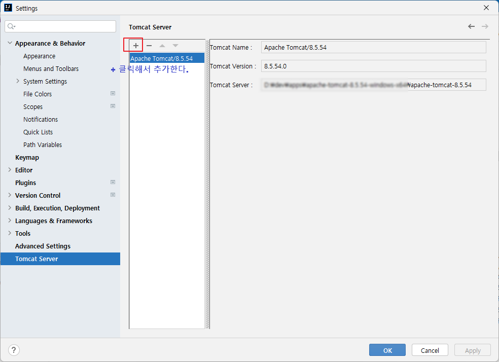

### JDK 설정 
#### Platform Settings
Project Structure에서 Platform Settings 클릭한다. SDKS에서 JDK를 설정한다. 


#### Project Settings 
Project Structure에서 Project Settings를 클릭한다. Project SDK에 Project가 사용하는 JDK를 설정한다. 


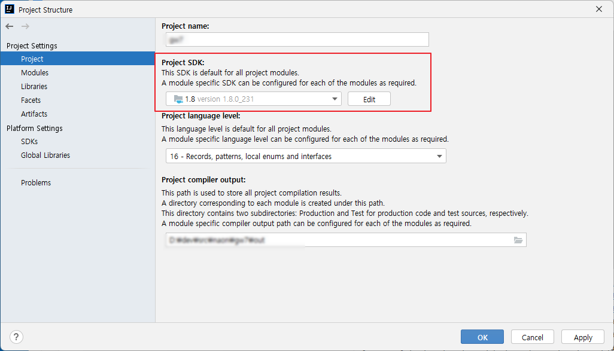


### Memory 설정

"z" 키를 두 번 누른다. 

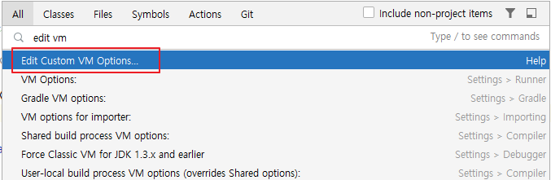


```shell
-Xms128m
-Xmx998m
```
이 값을 늘린다. 

```shell
-Xms128m
-Xmx2048m
```

**Compile Option 설정**
Settings > Build, Execution.. > Compiler에서 Share build process heap size를 2048로 설정한다. 

> 설정하지 않으면 GC overhead limit exceeded ... 이런 에러가 나다. 
> 
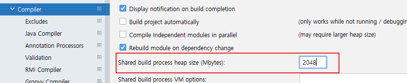


GC overhead limit exceeded 발생시

### Edit Custom VM Options
file encoding이 없으면 다음을 추가한다. 
```shell
-Dfile.encoding=UTF-8
```


## 프로젝트 생성 
### 새로운 프로젝트 생성 

File > New > Project를 선택한다.  Empty Project를 선택한다. 


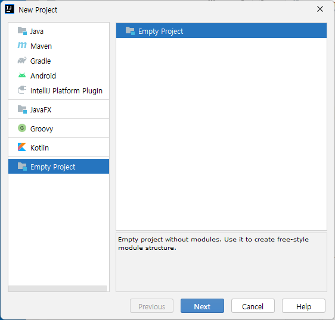

이클립스에서 프로젝트는 IntelliJ에서는 모듈이라고 부른다. 프로젝트는 이클립스의 워크 스페이스라고 생가하면 된다. 

* Project name에 이름을 입력한다. 
* Projecdt location에  위치할 디렉터리를 설정한다. 


새창을 열고 냐고 물어 본다. 새창으로 열겠다. 

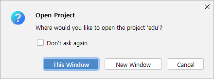


Project Structure 창이 열리고 모듈을 입력하라고 나온다. 일단 cancel 버튼을 클릭하여 취소한다.  그러면 다음 이미지와 같이 보일 것이다. 

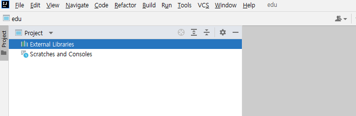


### git에서 clone하기 

VCS > Get From Version Control 을 클릭한다.  

* Clone할 URL을 입력한다. 
* 아까 생성한 프로젝트 폴더를 선택하고 git 리파지토리 이름과 동일하게 폴더 이름을 뒤에 추가한다. 

리파지토리 이름이 aaa.git 이면 aaa를 입력한다. 


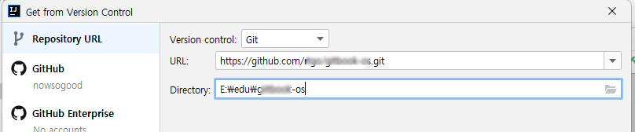

프로젝트를 열거냐고 물어보는데 cancel 버튼을 클릭한다.  다음과 같이 디렉터리 구조가 될 것이다. 

```shell
📂 project folder 
   📂 .idea  // IntelliJ가 생성한 폴더 
   📂 clone한 project 디렉터리 
```

### 모듈 임포트 

File > Project Structure를 클릭한다.  Modules 항목을 선택하고 '+' 버튼을 클릭한다. 


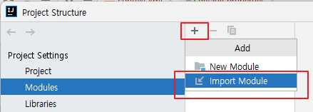

Select File or Directory to Import 창에서 Clone한 프로젝트 폴더를 선택한다.  Import Module 창에서 Maven 프로젝트이면 Maven을 선택하고 Gradle 프로젝트이면 Gradle을 선택한다. 


## Git 

### 작업 브랜치 확인
```shell
📂HEAD        // 현재 작업중인 브랜치를 가리킨다. 
📂Local      // 로컬 브랜치 폴더
  📄dev ↙     // 화살표 있는 것이 checkout된  작업중인 topic 브랜치 
  ★ master    // 통합 브랜치
📂Remote     // 원격 리파지터리 폴더 
  📄origin     // 원격 리파지터리 
  📄my-origin  // 원격 리파지터리 
```


### 커밋 이력 확인 
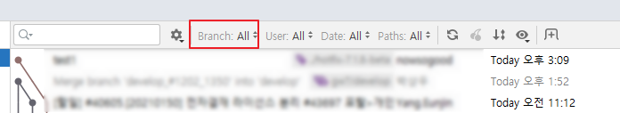
**브랜치 커밋 이력 확인**
```shell
  All       // 전체 브랜치 커밋 이력 확인 
  Select    
  Recent    // 최근 작업한 브랜치 커밋 이력확인
★ HEAD      // HEAD(현재 브랜치)의 커밋 이력 확인
★ master    // master 브랜치의 커밋 이력확인 
★ origin/master  // 원격 리파지토리의 브랜치 커밋 이력 확인
-------------------------
Local >     // 로컬 브랜치 선택하여 커밋 이력 확인
my-origin >  // 원격 브랜치를 선택하여 커밋 이력 확인
origin >     // 원격 브랜치를 선택하여 커밋 이력 확인
```


### Git 패널 

```shell
📂HEAD
   📂 .idea  // IntelliJ가 생성한 폴더 
   📂 clone한 project 디렉터리 
```


### 사용자 정보 설정

* commit/push 하기 전에 반드시 사용자 정보 확인하고 변경할 것 

global 이름 말고 프로젝트의 local 이름을 확인해야 한다. 


```shell
//이름 확인
git config user.name
//이메일 확인
git config user.email 
```

Local  이름 및 이메일 확인
```shell
git config --local user.name 
git config --local user.email
```

Local 이름 확인은 '--local' 옵션사용. 
또는 만약에 각 프로젝트마다 각각의 다른 정보를 사용하고 싶다면 --global옵션을 빼고 사용해주면 된다. 


**이름 변경**
```shell
 git config --local user.name 이름 
 git config --local user.email 이메일 
```


### Fetch 
Git pannel의 왼쪽 사이드 아이콘 바에서 Fetch All Remotes 선택 
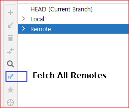


### Update  Project
Git 메뉴에서 Update Project를 선택하면 Merge할 것인지 Rebase할 것인지 물어 본다. 


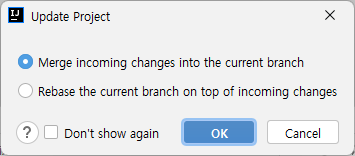


### 원격 브랜치에 브랜치 Push 
Git 패널에서 작업 브랜치를 선택하고 우측 마우스를 클릭한다. 


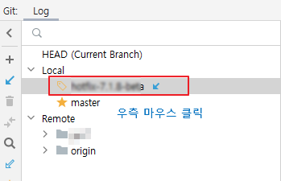

Push를 선택한다. 

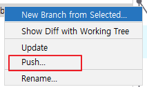

Push Commits to 창에서 원격 리파지토리를 선택한다. 

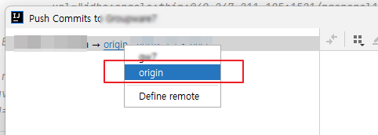

커밋 히스토리를 엎어 쓰기 위해서 강제로 푸시하고 싶으면  Force Push를 선택한다. 
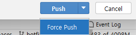