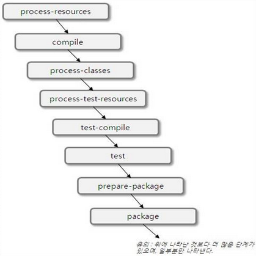
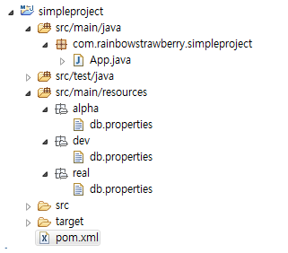

# Maven (1)


## Lifecycle 

Maven에서는 clean, build, site의 세가지 Lifecycle을 제공하고 있다. 컴파일(compile), 테스트(test), 패키지(package), 배포(deploye) 등의 과정은 빌드 Lifecycle에 속한다. 
Maven은 모든 빌드 단위에 대한 Lifecycle이 예약되어 있어서 개발자가 임으로 변경할 수 없다.  
각 Lifecycle은 순서를 갖는 단계(Phase)로 구성된다. 

일반적으로 프로젝트 빌드 과정을 보면 빌드 결과를 삭제, 컴파일에 필요한 자원 복사, 소스 크드 컴파일, 테스트, 압축(캐피지), 배포 과정을 거친다. 메이븐은 이러한 빌드 단계를 미리 정의하고 빌드 순서를 라이프사이클이라 하고 라이프사이클 빌드 단계를 페이즈라고 한다. 

Ant는 프로젝트를 빌드하기 위하여 모든 target 프로젝트를 생성할 때마다 새롭개 생성해야 한다.  그러나 Maven의 경우 디폴트 디렉토리를 사용하고 있다면 Maven에서 제공하고 있는 디폴트 Goals을 이용하여 빌드하는 것이 가능한다.  Maven의 Goal은 Ant의 Target과 같은 개념으로 생각하면 된다. 

빌드 페이즈는 플러그인의 골로 구성된다. 빌드 페이즈(build phase)가 빌드 라이프사이클의 특정 단계에 대한 책임이 있지만 빌드페이즈에 묶여진 플러그인의 Goal들에 의해서 실행된다. 


Maven은 프로젝트의 라이프사이클 기반 프레임워크를 제공한다고 했다. 앞서 프로젝트를 생성한 뒤 컴파일하고(mvn compile), 테스트 하고(mvn test), 패키징 하는(mvn package) 과정을 정해진 명령어를 이용해서 실행했는데, 이때 compile, test, package는 모두 빌드 라이프사이클에 속하는 단계(Phase)이다.


Maven은 clean, build (default), site의 세 가지 라이프사이클을 제공하고 있다. 각 라이프사이클은 순서를 갖는 단계(phase)로 구성된다. 또한, 각 단계별로 기본적으로 실행되는 플러그인(plugin) 골(goal)이 정의되어 있어서 각 단계마다 알맞은 작업이 실행된다. 아래 표는 디폴트 라이프사이클을 구성하고 있는 주요 실행 단계를 순서대로 정리한 것이다.


**디폴트 라이프 아이클의 주요 단계(Phase)**


라이프사이클의 특정 단계를 실행하려면 다음과 같이 mvn [단계이름] 명령어를 실행하면 된다.

```shell
mvn test
mvn deploy
```

라이프사이클의 특정 단계를 실행하면, 그 단계의 앞에 위치한 모든 단계가 실행된다. 예를 들어, test 단계를 실행하면 test 단계를 실행하기에 앞서 generate-sources 단계부터 test-compile 단계까지 각 단계를 순서대로 실행한다. 

각 단계가 실행될 때에는 각 단계에 묶인 골(goal)이 실행된다. 

플러그인을 직접 실행할 수도 잇다. mvn 명령어에 단계 대신 실행할 플러그인을 지정하면 된다. 

```shell
mvn surfire:test
```


단, 플러그인 골을 직접 명시한 경우에는 해당 플로그인만 실행되기 때문에 라이프 사이클의 단계가 실행되지는 않는다.


**플러그인 골(Plugin Goal)**

Maven에서 플러그인을 실행할 때에는 **'플러그인이름:플러그인지원골'** 의 형식으로 실행할 기능을 선택한다. 예를 들어, compiler:compile은 'compiler'는 플러그인에서 'compile' 기능(goal)을 실행한다는 것을 뜻한다.


### default 라이프 사이클 
#### validate 
프로젝트가 빌드를 완벽하게 할 수 있는 모든 필요한 정보들을 가지고 있으며 맞는지 확인한다. 

#### compile 

프로젝트의 소스 코드 컴파일. src/main/java의 모든 것을 /target/classes에 커파일한다. 

```xml
<build>
   <sourceDirectory>src/java</sourceDirectory> 
   <outputDirectory>classes</outputDirectory>
</build>
```

#### test-compile

테스트 목적 디렉토리 안에서 테스트 소스 코드 컴파일. 컴파일과 동일하며 경로만 다르다. 
```xml
<build>
   <testSourceDirectory>src/java</testSourceDirectory>
   <testOutputDirectory>classes</testOutputDirectory>
</build>
```


#### test 

surefire 플러그인을 사용한다. surefire 플러그인은 메이븐의 단위테스트 플러그인이다. 테스트 소스 디렉토리에서 *Test로 끝나는 모든 클래스를 찾아서 JUnit과 같은 단위 테스트 프레임워크에서 실행시키는 것이다.  만약 테스트의 성공여부와 상관없이 생성하고 싶을 경우에는 실패를 무시하도록 설정할 수 있다. 


```xml
<build>
  <plugins>
      <plugin>
                 <grouid>org.apache.maven.plugins</grouid>
                 <artifactid>maven-surefire-plugin</artifactid>
                 <configuration>
                         <testFailureIgnore>true</testFailureIgnore>
                 </configuration>
       </plugin>
   </plugins>
</build>
```
#### package


컴파일된 코드를 가지고 jar나 war 또는 ear과 같은 배포할 수 있는 형태로 패키지 하는 것

#### verify
품질 기준에 적합하고 유효한 패키지인지 검증하기 위한 어떠한 확인 작업을 실행한다. 

#### install

다른 프로젝트에서 지역적으로 패키지를 사용하기 위하여, 로컬 저장소 안에 패키지를 인스톨 시킨다. 산출물을 로컬 레파지토리에 생성한다. 생성경로는 target/xxxxx.war

#### deploy
다른 개발자들이나 프로젝트들과 공유하기 위하여 원격 레파지토리로 산출물을 배포한다. settings.xml이나 pom.xml에 설정된 레파지토리 정보에 따라 산출물을 원격 저장소에 배포한다.

## Phase 

Phase는 Build Lifecycle의 각각의 단계를 의미한다. Phase는 특정 순서에 따라서 goal이 실행되도록 구조를 제공한다. Phase간에는 의존 관계가 있다.  예를 들어 package page가 수행되기 위해서는 이전 phase가 순서대로 수행된 다음에 실행된다. 


Maven의 Lifecycle은 프로젝트를 빌드하는데 관련된 순차적인 단계들이다.  Maven은 수 많은 생명주기를 지원하지만 가장 자주 사용되는 것은 기본 Maven  생명주기로 프로젝트의 기본적인 통합을 검증하는 단계로 시작해서 제품으로 프로젝트를 배포하는 것과 관련된 단계로 끝난다.





Phase는 Maven의 Build Lifecycle의 한 부분으로 각각의 Phase는 어떤 일을 할지 정의하지 않고 어떤  Goal을 실행할지 설정한다. Plugin의 goal은 생명주기 단계에 붙일 수 있다.  Package Phase에서 Jar Plugin의 jar goal을 실행한다. 


각각의 phase는 그 안에 0개 이상의 goal을 가질 수 있다. package Phase는 jar packaging과 같은 프로젝트의 jar 파일을 생성하는 것으로 알고 있지만 maven은 생명주기의 특정 phase가 실행이 되면 그 인전의 모든 phase를 순차적으로 모두 수행한다. 즉 mvn package를 실행할 때 maven은 package 단계까지 모든 Phase를 실행하고 생명주기 Phase를 거치는 과정에서 해당 Phase에 속한 모든 goal들을 실행한다


## Goal 
GOAL은 표준 GOAL이나 다른 GOAL과 함께 실행되며 빌드의 일부분을 차지하는 구성요소로써 메이븐에 있어서 작업의 단위이다.  소스코드를 컴파일하는 Compiler plugin의 compile goal 또는 단위테스트를 실행할 수 있는 Surefire Plugin의 test goal을 들 수 있다. 

Maven으로 의미있는 작업을 하기 위해서는 Plugin을 다운 받아야 한다. 명령을 실행하면 자동으로 다운를 받는다. Maven의 대부분의 책임을 maven 생명주기에 영향을 주고 goal에 대한 접근을 제공하는 Plugin에 위힘하도록 되어 있다. Plugin은 여러개의 Goal을 가지고 있고 Goal은 Plugin에 포함되어 있는 명령이다. 즉 Plugin은 하나 이상의 Goal의 집합체이다. 


## Phase와 Goal의 관계

메이븐에서 제공하는 보든 기능은 플러그인 기반으로 동작한다. 메이븐에서 기본으로 제공하는 Phase를 실행하면 해당 Phase와 연결된 플러그인의 Goal이 실행된다. 각 phase는 0개이상의 goal과 바인드 되어 있으며, 대부분 0개나 1개의 Goal이 바인드 되어 있다. 

Maven에서 플러그인을 실행할 때 ‘플러그인이름:플러그인지원골’의 형식으로 실행할 기능을 선택할 수 있다. 예를들어 mvn compiler:compile은 ‘compiler’플러그인에서 ‘compile’ 기능(goal)을 실행한다는 것을 뜻한다. 


## Maven 명령어 사용법 
```shell
mvn [옵션] [플러그인 이름]:[GOAL 이름]
or
mvn [옵션][단계이름]
```

### 프로젝트 생성 
자바프로젝트를 생성하려면 다음을 참고로 하여 타이핑 한다. 
```shell
mvn archetype:generate -DarchetypeGroupId=
                     -DarchetypeArtifactId=
                     -DarchetypeVersion=1.0
                     -DgroupId=
                     -DartifactId=
```


 예를 들어 아래와 같이 작성한다. 

 ```shell
 mvn archetype:generate  -B -DarchetypeGroupId=org.apache.maven.archetypes 
        -DarchetypeArtifactId=maven-archetype-quickstart 
        -DarchetypeVersion=1.0 
        -DgroupId=org.melody.framework  
        -DartifactId=org.melody.framework 
        -Dversion=1.0
 ```


 ### 웹 프로젝트 
```shell
 mvn archetype:generate 
            -DgroupId=org.melody 
            -DartifactId=org.melody 
            -DarchetypeArtifactId=maven-archetype-webapp
```
예를 들어 아래와 같이 작성한다.  
```shell
mvn archetype:generate 
            -DgroupId=edu.web
            -DartifactId=edu.web
            -DarchetypeArtifactId=maven-archetype-webapp
```

### Eclipse 프로젝트 전환 


메이븐을 이용하여 생성한 메이븐 프로젝트를 이클립스에서 사용하기 위하여 이클립스 프로젝트로 변환하려면 다음을 입력한다. 
```shell
mvn eclipse:eclipse
```


### Third party jar install

메이븐의 원격레파지토리에서 제공하지 않는 라이브러리를 자신의 로컬 리파지토리에 추가할 필요가 있는 경우에 다음의 문법을 사용하여 추가한다. 

```shell
mvn install:install-file
  -Dfile=<path-to-file>
  -DgroupId=<group-id>
  -DartifactId=<artifact-id>
  -Dversion=<version>
  -Dpackaging=<packaging>
  -DgeneratePom=true        
```


예를 들어 아래와 같이 작성한다. 
```shell
mvn install:install-file 
        -Dfile=tomato_jef_adapt_pojo-20090107.jar             
        -DgroupId=tomato 
        -DartifactId=tomato_jef_adapt_pojo 
        -Dversion=20090107 
        -Dpackaging=jar 
        -DgeneratePom=true
```

### 테스트 코드 컴파일 실행 
```shell
mvn test
```

### 테스트 코드 컴파일
```shell
mvn test-compile
``` 

### jar, war로 압출 
```shell
mvn package
```
### 리파지토리 등록
```shell
mvn install
```
### Main Class 실행 
```shell
mvn exec:java –Dexec.mainClass=com.mycompany.com.Sample –Dexec.args=”hello”
```

### Maven 빌드 시 Test Package 제외하기
```shell
mvn install –Dmode=T –Dmaven.test.skip=true
```


### Maven Dependencies된 jar파일 다운받기

```shell
mvn dependency:copy-dependencies
```


## settings.xml 


[여기 참고](https://maven.apache.org/settings.html) 


settings.xml 파일이 위치할 두개의 장소가 있다. 
```shell
$M2_HOME/conf/settings.xml
${user.home}/.m2/settings.xml
```


### 로컬저장소 설정

디폴트 경로는 ${user.home}/.m2/repository 이다.  변경하고 싶으면, 
\<localRepository\>에 저장소 경로를 설정한다.
```xml
<localRepository>F:/mavenrepository</localRepository>
```


## POM 

Maven은 project object model(POM)를 기반으로 한 툴로  POM 파일을 참고하여 프로젝트를 빌드한다. 따라서 POM 파일(XML)을 이해하는 것이 매우 중요하다.  

| 요소 | 	설명 |
| ---- | ----|
| prerequisites |	필요한 메이븐 버전 설정 |	
| scm	 |	소스관리 시스템 정보 |	
| issueManagement	 |	이슈관리 시스템 정보 |	
| ciManagement	 |	자동 빌듣 CI tool 정보 |	
| repositories	 |	리파지터리 정보 |	
| distributionManagement |		리파지터리 배포 설정 |	
| properties |		프러퍼티 설정 |	
| dependencyManagement |		의존성 관리 |	
|  dependencies	 |	의존성들 |	
|  dependency	 |	의존성 |	
| build	빌드 설정 |	
|  extensions	 |	이 빌드에서만 사용하는 산출물의 목록. |	
|  pluginManagement	 |	상속받은 자식 POM들에서 사용가능 |	
|  plugins	 |	해당 POM에서만 사용하는 plugin 설정 |	
| reporting	 |	site 생성 phase에서 문서화 작업 설정. |	
| profiles |		특정 환경에서 빌드 설정 |	


```xml
<?xml version="1.0" encoding="UTF-8"?>
<project>
  <modelVersion>4.0.0</modelVersion>
	<groupId>com.naonsoft.james</groupId>
	<artifactId>naonsoft-james</artifactId>
	<version>1.0-SNAPSHOT</version>
	<packaging>pom</packaging>
	<name>Naonsoft James Project</name>
  <description></description>
  <url>http://james.naonsoft.com/</url>
	<inceptionYear>2014</inceptionYear>
	<developer></developer>
	<prerequisites></prerequisites>
	<scm></scm>
	<issueManagement></issueManagement>
	<ciManagement></ciManagement>
	<repositories></repositories>
	<distributionManagement><distributionManagement>
	<properties></properties>
	<build>
	   <extensions></extensions>
	   <pluginManagement>
	   </pluginManagement>
	   <plugins>
	   </plugins>
	<reporting></reporting>
	<profiles>	</profiles>   
</project>
```


## scm 
소스관리 시스템에 대한 정보를 기입한다. SCM(Software Configuration Management)을 사용한다면 형상관리에 대한 정보를 작성한다.

```xml
<scm>
<connection>scm:svn:svn://svn.naonsoft.com/naon_package/james/naonsoft-james/trunk</connection>
<developerConnection>scm:svn:svn://svn.naonsoft.com/naon_package/james/naonsoft-james/trunk</developerConnection>
<url>http://svn.naonsoft.com/naon_package/james/naonsoft-james/trunk</url>
</scm>
```


### issueManagement
이슈관리 시스템을 사용한다면 이슈관리 시스템에 대한 정보를 기입한다.
```xml
	<issueManagement>
		<system>Redmine</system>
		<url>http://redmine.naonsoft.com</url>
	</issueManagement>
```

### ciManagement
자동빌드 시스템을 사용한다면 자동빌드 시스템에 대한 정보를 기입한다. 
```xml
<ciManagement>
		<system>Jenkins</system>
		<url>https://builds.naonsoft.com/</url>
</ciManagement>
```


## Properties 

Maven의 properties는 값의 placeholder이다.  Ant에서 properties와 비슷하다. 이것들의 값들은 POM에서 어디서든 접근이 가능하다. ${X}와 같은 표기법을 사용한다. X는 프로퍼티이다.


다섯가지 다른 스타일이 있다.

1.	env.X : env가 앞에 붙은 변수는  shell의 실행환경의 변수를 반환한다. 예를들어, ${env.PATH}는 PATH 환경 변수 PATH를 포함한다. 
주의: 윈도우에서는 대소문자에 민감하다. 모두 대문자로 사용하도록 한다.
2.	projext.x: POM에서 dot(.) 표기된 경로는 상응하는 요소의 값이다. 예를들어 , <project><version>1.0</version></project>는 ${project.version}을 경유하여 접근할 수 있다.
3.	settings.x: settings.xml에서 dot(.) 표기된 경로는 상응하는 요소의 값을 포함한다. 예를들어, <settings><offline>false</offline><settings>는 ${settings.offline}을 경유하여 접근할 수 있다. 
4.	Java System Properties: 모든 프러퍼티들은 java.lang.System.getProperties() 통해 접근할 수 있는데, POM의 프러퍼티와 마찬가지로 유용하다. ${java.home}과 같은 식으로 사용한다.
5.	x: POM의 <properties/>요소 내부에 설정하는데, <properties><someVar>value</someVar></properties>는 ${somVar}로 사용될 수있다.

```xml
<properties>
	<project.build.sourceEncoding>UTF-8</project.build.sourceEncoding>
	<target.jdk>1.8</target.jdk>
	<deployTechnicalSiteDirectory />
	<devServerUrl>file:///opt/apache-tomcat-7.0.42/james/ROOT/WEB-INF/lib</devServerUrl>
	<testServerUrl>sftp://nmp.naonsoft.kr/opt/naonsoft-james-server-app-1.0-beta/lib</testServerUrl>
	<perfServerUrl>sftp://27.255.70.90/opt/james/apache-james-3.0-perf/lib</perfServerUrl>
</properties>
```

Maven에서도 property를 사용할 수 있는데 프로퍼티를 이용하여 동적인 환경 구성이 가능하다. 프로퍼티의 종류에는 project 프로퍼티 settings 프로퍼티, Java System 프러퍼티, 사용자 정의 프로퍼티가 있다.  사용자 정의 프로퍼티는 아래와 같이 직접 정의해서 사용할 수 있다. 


```xml
     <properties>
          <hibernate.version>4.2.2.Final</hibernate.version>
          <javamail.version>1.4.5</javamail.version>
      </properties>
```

 프로퍼티를 사용하는 방법은 ${}안에 프로퍼티명을 넣으면 된다. ${project.build.outputDirectory}와 같이 작성하면 된다.  기본적인 프로퍼티들을 살펴보자.


### 내장 프로퍼티들
\${baseDir} pom.xml을 포함하는 디렉토리를 나타낸다. 
\${version} \${project.version}과 동일하다.

### Project 프로퍼티들
```shell
${project.build.directory}
"target" 디렉토리에 대한 경오를 나타낸다.
${project.build.outputDirectory} 
"target/classes" 디렉토리를 나타낸다. 
${project.name} 
프로젝트의 이름이다. 
${poject.version} 
프로젝트의 버전이다.
${project.build.finalName} 
생성된 프로젝트가 패키징 될 때 생성될 파일의 최종 이름이다.
```


[여기 참고](http://maven.apache.org/plugins/maven-antrun-plugin/examples/classpaths.html) 

You can also use these classpath references:
•	maven.compile.classpath
•	maven.runtime.classpath
•	maven.test.classpath
•	maven.plugin.classpath


## Maven Coordinates 

### 	modelVersion
4.0.0으로 설정. pom의 버전

### grouId
프로젝트를 생성하는 조직의 고유 아이디를 결정한다. 일반적으로 도메인 이름을 사용한다.  com.naon 도메인 이름을 사용하면 com/naon 구조로 폴더(디렉토리)가 만들어 진다.
### artifactId
프로젝트를 식별하는 유일한 아이디를 의미한다.  프로젝트를 빌드하면 결과물-산출물이라고도 함-이 생기는데 war로 묶인 파일일 수도 있고 jar 묶인 파일일 수도 있다.  이 산출물의 이름과 버전명을  붙여서 산출물명이 결정이 된다. artifactId가 test이고 version이 0.01-SNAPSHOT이면 산출물의 이름은 test-0.01-SNAPSHOT.war가 된다. 확장자는 packaging에 설정된 값이 붙여진다. grouId가 com.naon이면 com/naon 디렉토리 아래에 test라는 폴더가 생성되고 그아래의 0.01-SNAPSHOT 디렉토리가 만들어 진다.  그 아래에 test-01.01-SNAPSHOT.war 파일이 놓이게 된다.  

### version
지금 배포되고 있는 산출물의 버전을 명시한다.

### packaging
해당 프로젝트를 어떤 형태로 packaging 할 것인지를 결정한다.  jar, war, ear 등이 해당된다.

* jar – jar 파일로 패키징
* war – war 파일로 패키징
* ear – ear 파일로 패키징
* pom – 상속(inheritance)과 집합(aggregation)-multi module-프로젝트들은 pom으로 설정.


### name
프로젝트의 이름을 기입한다.
### description
프로젝트의 설명을 기입한다.
### url
프로젝트의 URL을 기입한다.
### inceptionYear
프로젝트의 시작년도를 기입한다.
### developers
개발자 정보를 기입한다.

```xml
<developers>
		<developer>
			<id>jhonson</id>
			<name>Jhonson Choi</name>
			<email>jhonsonchoi@gmail.com</email>
			<timezone>9</timezone>
			<roles>
				<role>Developer</role>
				<role>PMC Member</role>
			</roles>
		</developer>
</developers>
```


### prerequisites
Maven 버전을 기입한다.
```xml
<prerequisites>
		<maven>3.0.2</maven>
</prerequisites>
```


## POM Relationships
Maven의 하나의 강력한 관점은 프로젝트 관계를 다루는데 있다. 프로젝트 관계는 의존성, 상속(inheritance),그리고 집합(aggregation)을 포함한다. 

### Dependencies
POM의 주춧돌(cornerstone)은 그것의 의존성 리스트다. 대부분의 모든 프로젝트는 빌드, 실행될 때 정확히 다른 것들에 의존한다. 


```xml
<project xmlns="http://maven.apache.org/POM/4.0.0"
  xmlns:xsi="http://www.w3.org/2001/XMLSchema-instance"
  xsi:schemaLocation="http://maven.apache.org/POM/4.0.0
                      http://maven.apache.org/xsd/maven-4.0.0.xsd">
  ...
  <dependencies>
    <dependency>
      <groupId>junit</groupId>
      <artifactId>junit</artifactId>
      <version>4.0</version>
      <type>jar</type>
      <scope>test</scope>
      <optional>true</optional>
    </dependency>
    ...
  </dependencies>
  ...
</project>
```

* groupid, artifactid, version
* classifier 동일한 POM에서 빌드되는 산추물을 구분하는 것을 허용
* type
  * 산출물의 packaging type
  * jar, ejb-client, test-jar 
*	scope task의 classpath에 대한 참조
  * compile :컴파일시에만
  * provided : 컴파일과 비슷하지만, JDK 또는 container가 제공
  * runtime : 실행시에만 필요
  * test : test 시에만 필요
  * system : provided와 비슷하지만 JAR를 명백히 제공해야 함
  systemPath : dependency scope가 system일 때만 사용된다 예) \${java.home}/lib


### Exclusions
포함하지 않을 프로젝트 의존성을 설명한다. 
```xml
project xmlns="http://maven.apache.org/POM/4.0.0"
  xmlns:xsi="http://www.w3.org/2001/XMLSchema-instance"
  xsi:schemaLocation="http://maven.apache.org/POM/4.0.0
                      http://maven.apache.org/xsd/maven-4.0.0.xsd">
  ...
  <dependencies>
    <dependency>
      <groupId>org.apache.maven</groupId>
      <artifactId>maven-embedder</artifactId>
      <version>2.0</version>
      <exclusions>
        <exclusion>
          <groupId>org.apache.maven</groupId>
          <artifactId>maven-core</artifactId>
        </exclusion>
      </exclusions>
    </dependency>
    ...
  </dependencies>
  ...
</project>
```


### 상속
프로젝트에서 공통으로 사용하는 설정은 공통 POM 파일을 만들어 관리하고 하위 모듈에서 이 POM 파일을 상속할 수 있다. 부모 POM 파일을 살펴보자.

**부모 POM**
```xml
<project xmlns="http://maven.apache.org/POM/4.0.0"
  xmlns:xsi="http://www.w3.org/2001/XMLSchema-instance"
  xsi:schemaLocation="http://maven.apache.org/POM/4.0.0
                      http://maven.apache.org/xsd/maven-4.0.0.xsd">
  <modelVersion>4.0.0</modelVersion>
 
  <groupId>org.codehaus.mojo</groupId>
  <artifactId>my-parent</artifactId>
  <version>2.0</version>
  <packaging>pom</packaging><!-- pom으로 설정 -->
</project>
```

부모와 집합(aggregation: multi-moudule) 프로젝트들을 위해서 패키징 타입은 pom으로 설정해야 한다.  이들 타입들은 lifecycle stage들의 하나의 set에 바인드 된 goal들을 정의해야 한다. 그리고 package phase은 jar:jar goal을 실행할 것이다.  packaing이 pom이면 실행된 goal은 site:attach-descriptor일 것이다. 따라자 우리는 parent POM에 값들을 추가할 것이다. 그것은 그것의 자식들(children)에 의해 상속될 것이다.  자식들에 의해서 상속을 받을 부모 POM안의 요소들은 다음과 같다.


* dependencies
* developers and contributors
* plugin lists
* reports lists
* plugin executions with matching ids
* plugin configuration


```xml
<project xmlns="http://maven.apache.org/POM/4.0.0"
  xmlns:xsi="http://www.w3.org/2001/XMLSchema-instance"
  xsi:schemaLocation="http://maven.apache.org/POM/4.0.0
                      http://maven.apache.org/xsd/maven-4.0.0.xsd">
  <modelVersion>4.0.0</modelVersion>
 
  <parent>
    <groupId>org.codehaus.mojo</groupId>
    <artifactId>my-parent</artifactId>
    <version>2.0</version>
    <relativePath>../my-parent</relativePath>
  </parent>
 
  <artifactId>my-project</artifactId>
</project>
```

relativePath 요소를 주목해야 한다.  그것은 요구되지 않지만 local 또는 원격 리파지토리들에서 찾기 전에 프로젝트의 부모을 위해 주어진 경로의 첫번째 탐색에서 Maven에게 식별자로 사용되어 질 수 있다. 


```xml
<project>
  <modelVersion>4.0.0</modelVersion>
  <groupId>net.javajigi</groupId>
  <artifactId>wikibook</artifactId>
  <packaging>pom</packaging>
  <version>1.0-SNAPSHOT</version>
  [...]
</project>
```

 위의 부모 POM 파일을 상속하는 자식 POM 파일은 parent를 사용하여 부모 POM 파일을 상속 받는다. 
```xml
<project>
  <modelVersion>4.0.0</modelVersion>

  <parent>
    <groupId>net.javajigi</groupId>
    <artifactId>wikibook</artifactId>
    <version>1.0-SNAPSHOT</version>
  </parent>

  <groupId>net.javajigi</groupId>
  <artifactId>wiki-web-parent</artifactId>
  <version>1.0-SNAPSHOT</version>
  [...]
</project>
```


부모 POM을 상속받은 POM들은 부모의 값들을 상속받는다. 모든 POM은 기본 Super POM으로부터 상속 받는다. dependencyManagement를 사용한 부모의 의존 정보를 자식들이 상속받는다.


### 집합 Aggregation(or Multi-Moudle)
모듈들을 가진 프로젝트는 multimodul 또는 aggregator project로 알려져 있다. 모듈들은 이 POM이 목록화하고 하나의 그룹으로 실행할 프로젝트들이다. 프로젝트를 패키지화한 pom은 다음과 같이 그것들을 리스팅하는 것에의해 프로젝트들의 set의 빌드를 모아서 할 수 있다


```xml
<project xmlns="http://maven.apache.org/POM/4.0.0"
  xmlns:xsi="http://www.w3.org/2001/XMLSchema-instance"
  xsi:schemaLocation="http://maven.apache.org/POM/4.0.0
                      http://maven.apache.org/xsd/maven-4.0.0.xsd">
  <modelVersion>4.0.0</modelVersion>
 
  <groupId>org.codehaus.mojo</groupId>
  <artifactId>my-parent</artifactId>
  <version>2.0</version>
  <packaging>pom</packaging>
 
  <modules>
    <module>my-project</module>
    <module>another-project</module>
  </modules>
</project>
```


## \<profiles\>


POM 4.0에서 새로은 특징은  프로젝트가 빌드될 때 환경에 의존적인 환경을 변경하는 것이다. profile 요소는 선택적인 activation과 profile이 활성화(activated)될 때 POM에 만들어질 변경들의 Set을 포함할 수 있다. 예를들어 테스트 환경에서 빌드되는 프로젝트는 다른 Database를 가리킬 수 있다. 또는 의존들이 사용되는  JDK Version에 근거하여 다른 리파지토리들로 부터 가져올 수 있다. 


pom  파일에 profile 요소를 사용하여 환경에 맞쳐서 패키징을 할 수 있도록 처리한다.

```xml
<project xmlns="http://maven.apache.org/POM/4.0.0"
  xmlns:xsi="http://www.w3.org/2001/XMLSchema-instance"
  xsi:schemaLocation="http://maven.apache.org/POM/4.0.0
                      http://maven.apache.org/xsd/maven-4.0.0.xsd">
  ...
  <profiles>
    <profile>
      <id>test</id>
      <activation>...</activation>
      <build>...</build>
      <modules>...</modules>
      <repositories>...</repositories>
      <pluginRepositories>...</pluginRepositories>
      <dependencies>...</dependencies>
      <reporting>...</reporting>
      <dependencyManagement>...</dependencyManagement>
      <distributionManagement>...</distributionManagement>
    </profile>
  </profiles>
</project>
```


Activations들은 profile의 키이다. 프로파일의 힘은 특정한 환경 라애에서만 기본 POM을 변경하는 능력으로부터 온다. 그들의 환경은 activation 요소를 통하여 열거한다. 


```xml
project xmlns="http://maven.apache.org/POM/4.0.0"
  xmlns:xsi="http://www.w3.org/2001/XMLSchema-instance"
  xsi:schemaLocation="http://maven.apache.org/POM/4.0.0
                      http://maven.apache.org/xsd/maven-4.0.0.xsd">
  ...
  <profiles>
    <profile>
      <id>test</id>
      <activation>
        <activeByDefault>false</activeByDefault>
        <jdk>1.5</jdk>
        <os>
          <name>Windows XP</name>
          <family>Windows</family>
          <arch>x86</arch>
          <version>5.1.2600</version>
        </os>
        <property>
          <name>sparrow-type</name>
          <value>African</value>
        </property>
        <file>
          <exists>${basedir}/file2.properties</exists>
          <missing>${basedir}/file1.properties</missing>
        </file>
      </activation>
      ...
    </profile>
  </profiles>
</project>
```

jdk : 이것은 test가 특정 jdk version 아래에 실행될 때 activate한다. 
os : 특정 OS환경에서 실행될 때
property :  name=value 쌍의  특정 프로퍼티가 발견될었을 때 실행된다. 
file : 주어진 파일이름의 파일이 존재할 때 activation이 실행된다. 


## \<profiles\> 환경에 맞게 패키징 하기 (1)
개발은 하다보면 로컬환경에서 먼저 테스트를 하게 되고 개발, 알파,스테이징, 운영에 순차적으로 테스트 배포하게 된다. 

개발환경이 바뀔 때마다 DB 접속정보와 같은 설정들을 매번 바꿔줘야 한다면 불편할 것이다.  

이런 문제들을 해결하고자 메이븐 프로젝트는 profiles 기능을 제공한다. 


* 특정 build 환경에 맞춘 리소스의 재배치  환경에 대한 옵션 설정 등을 할 수 있다. 
* 위에 설명한 것과 같이 보통 빌드 환경을 개발/알파/스페이징/운영 시스템 단위로 구분한다고 했을 때 , 각 단계에서 필요로 하는 설정 정보나 리소스 파일들을 배치시키는 역할을 한다고 보면 된다. 이렇게 배포 환경 별 빌드 환경을 재구성 시킬 수 있는 방안을 profiles 를 통해서 작성할 수 있다. 


### resources 폴더 생성 및 설정 파일 추가
테스트를 위해 simpleproject라는 메이븐 프로젝트를 새로 생성한다. 
여기에 src/main/resources 폴더를 추가한 후, 개발환경별로 폴더를 따로 만들었다.(dev, alpha, real)
그 이후에 설정 파일을 넣어 주었다.(db.properties) 




### 설정파일 내용(db.properties) 
db.properties에 각 개발환경에서 사용할 DB 접속정보를 넣어 주었다.


```properties
db.username=dev
db.password=dev-pwd
db.url=dev_db_url
```

### pom.xml 설정
개발환경의 pom.xml 파일의 project 태그 안에 profiles 태그를 추가한다. 각 Profile 이름을 설정한다. 

```xml
<profiles>
    
    <profile>
       <id>dev</id>
       <properties>
          <env>dev</env>
       </properties>
    </profile>
    
    <profile>
       <id>alpha</id>
       <properties>
          <env>alpha</env>
       </properties>
    </profile>


    <profile>
       <id>real</id>
       <properties>
          <env>real</env>
       </properties>
    </profile>
</profiles>
```

그 다음으로 빌드할 때 어떤 디렉토리를 사용할지 설정한다. 

```xml
<build>
   <resources>
     <resource>
          <directory>src/main/resource/${env}</directory>
     </resource>
   </resouces>
   <testResources>
      <testResouce>
          <directory>src/test/resource/${env}</directory>
      </testResource>
   </testResources>
</build>
```


마지막으로 빌드설정을 따로 하지 않았을 때 어떤 개발환경을 default로 사용할지 설정한다. 

```xml
<properties>
  <env>dev</env>
</properties>
```

### 빌드설정

이제 빌드를 해볼텐데 메이븐 빌드를 할 때 –P 옵션으로 어떤 개발환경을 사용할지만 적어주면 된다. 
```shell
mvn install –P dev
```


## \<profiles\> 환경에 맞게 패키징 하기 (2)
pom 파일에 profile 요소를 사용하여 환경에 맞게 패키징할 수 있도록 처리 

resource 디렉토리를 운영 환경 별로 나누어서 생성 
예) local/test/dev/stage/product 등

1.	pom 파일 내에  profile 설정 – activeByDefault 속성을 이용하여 default는 local로 처리
2.	maven install 시에 package 옵션 처리 
- jenkins build 설정 시 해당 옵션 처리 

```xml
<profiles>
   <profile>
      <id>local</id>
      <properties>
         <profiles.active>local</profiles.active>
      </properties>
      <activation>
         <activeByDefault>true</activeByDefault>
      </activation>
      <build>
        <finalName>${project.artifactId}-${project.version}</finalName>
        <directory>${project.basedir}/target</directory>
        <resources>
            <resource>
              <directory>${project.basedir}/src/main/resources</directory>
            </resource>
            <resource>
              <directory>${project.basedir}/src/main/env/local</directory>
            </resource>
        </resources>
      </build>
   </profile>

   <profile>
      <id>dev</id>
      <properties>
         <profiles.active>dev</profiles.active>
      </properties>
      <build>
        <finalName>${project.artifactId}-${project.version}</finalName>
        <directory>${project.basedir}/target</directory>
        <resources>
            <resource>
              <directory>${project.basedir}/src/main/resources</directory>
            </resource>
            <resource>
              <directory>${project.basedir}/src/main/env/dev</directory>
            </resource>
        </resources>
      </build>
   </profile>
   
</profiles>


```

```shell
mvn clean package –Plocal
```

* Profile 사용 목적은 서로 다른 빌드 환경간의 이식성이다. 
* 실행 시 profile 옵션을 사용한다. 마이너스 대문자 P(ex. mvn compile –Prelease)\
* 실행 위치의 pom.xml , 실행위치의 profiles.xml, $USER_HOME/settings.xml , \$M2_HOME/conf/settings.xml 순으로 profile 항목을 찾는다.
* profile id가 동일한 경우가 나타나면 해당 profile 에서 선언된 내용을 적용한다. 즉, 사용자 정의 환경변수 evn의 값이 release로 변경됨.


### profile activation  사용
정의한 환경과 실행환경이 일치하면 profile에 설정한 값들이 project에 설정한 값에 대체한다. 
mvn –Ddeploy=true  실행시 아래 activation 수행됨 


```xml
<profiles>

<profile>
  <activation>
    <property>
        <name>deploy</name>
        <value>true</value>
    </property>
  </activation>
  <build>
    <plugins>       
        <plugin>
            <artifactId>maven-antrun-plugin</artifactId>
            <executions>
                <execution>
                    <phase>compile</phase>
                    <goals>
                        <goal>run</goal>
                    </goals>
                    <configuration>
                        <tasks>
                            <mkdir dir="../webapps" />
                            <copy todir="../webapps"
 overwrite="true" preservelastmodified="true">
                                <fileset  dir="${basedir}/web">
                                    <include name="**/*" />
                                </fileset>
                            </copy>
                        </tasks>
                    </configuration>
                </execution>
            </executions>
        </plugin>        
    </plugins>
  </build>
</profile>
</profiles>
```


## \<profiles\> 환경에 맞게 패키징 (3)

Profiles는 –P CLI option을 사용하여 명확히 명시될 수 있다. 

이 옵션은 profile-id들의 콤마로 구분된 목록인 인자를 취한다. 
이 옵션이 명시되었을 때, 옵션의 인자로 명시된 profile은 그것들의 activation configuration 또는 \<activeProfiles\> secion에서 activated된 어떠한 프로파일들에 덧붙여 activated 될 것이다. 


```shell
mvn groupId:artifactId:goal –P profile-1, profile-2
```


profiles는 build 환경의 발견된 상태의 근거하여 자동적으로 실행(triggered)될 수 있다. 이러한 triggers는 <activation> section을 통하여 명시된다. 


이러한 발견(detection)은 JDK의 prefix-matching, system property의 존재 또는 system property의 값에 의해  제한된다. 

아래의 configuration은 JDK의 버전이 1.4(eg. 1.4_08, 1.4.2_07, 1.4)로 시작하면 프로파일을 작동시킬(trigger) 것이다. 


```xml
<profiles>
  <profile>
    <activation>
      <jdk>1.4</jdk>
    </activation>
    ...
  </profile>
</profiles>
```


범위(Range) 또한 사용될 수 있다. 아래는 1.3,1.4 그리고 1.5를 준수한다. 

```xml
<profiles>
  <profile>
    <activation>
      <jdk>[1.3,1.6)</jdk>
    </activation>
    ...
  </profile>
</profiles>
```
다음 은 OS setting에 근거하여 activate될 것이다. 


```xml
<profiles>
  <profile>
    <activation>
      <os>
        <name>Windows XP</name>
        <family>Windows</family>
        <arch>x86</arch>
        <version>5.1.2600</version>
      </os>
    </activation>
    ...
  </profile>
</profiles>
```

아래 프로파일은 system property가 debug이면 activate된다. 

```xml
<profiles>
  <profile>
    <activation>
      <property>
        <name>debug</name>
      </property>
    </activation>
    ...
  </profile>
</profiles>
```
다음은 system property가 debug가 아니면 activate 될 것이다. 
```xml
<profiles>
  <profile>
    <activation>
      <property>
        <name>!debug</name>
      </property>
    </activation>
    ...
  </profile>
</profiles>
```

다음은 debug가 정의되지 않았거나 value가 true가 아니면 activated 된다. 

```xml
<profiles>
  <profile>
    <activation>
      <property>
        <name>debug</name>
        <value>!true</value>
      </property>
    </activation>
    ...
  </profile>
</profiles>
```


이것을 activate 하기 위해서, command line에서 그러한 것 중에 하나를 입력한다. 
```shell
mvn groupId:artifactId:goal
mvn groupId:artifactId:goal –Ddebug=false
```


다음은  system propeprty environment가 test 값을 가지고 명시되었을 때 activated 된다. 

```xml
<profiles>
  <profile>
    <activation>
      <property>
        <name>environment</name>
        <value>test</value>
      </property>
    </activation>
    ...
  </profile>
</profiles>
```
이것을 activate하기 위해서 다음의 command line을 타이핑한다. 
```shell
mvn groupId:artifactId:goal -Denvironment=test
```

나머지는   exists, missing,  deactivating a profile 


## \<build\>


build 요소는 개념적으로 두개의 파트로 구분되어 있다. 두개의 build 요소에 공통인 요소들의 셋트를 포함하는 BaseBuild가 있다. 
```xml
<project xmlns="http://maven.apache.org/POM/4.0.0"
  xmlns:xsi="http://www.w3.org/2001/XMLSchema-instance"
  xsi:schemaLocation="http://maven.apache.org/POM/4.0.0
                      https://maven.apache.org/xsd/maven-4.0.0.xsd">
  ...
  <!-- "Project Build" contains more elements than just the BaseBuild set -->
  <build>...</build>
 
  <profiles>
    <profile>
      <!-- "Profile Build" contains a subset of "Project Build"s elements -->
      <build>...</build>
    </profile>
  </profiles>
</project>
```


### BaseBuild Element Set

POM 안의 두개의 build 요소 사이의 요소들의 기본 셋트이다.
```xml
<build>
  <defaultGoal>install</defaultGoal>
  <directory>${basedir}/target</directory>
  <finalName>${artifactId}-${version}</finalName>
  <filters>
    <filter>filters/filter1.properties</filter>
  </filters>
  ...
</build>
```


**defaultGoal**
아무것도 주어지지 않았을 때 실행될 goal 또는 phase


**directory**
그것의 파일들을 쌓아 놓을 디렉토리 또는 메이븐 어법에서, build의 target
그것은 적절히 \${basedir}/target에 디폴트로 된다. 

**finalName**
 최종적으로 빌드되었을 때묶여진(bundled) 프로젝트의 이름. 디폴트로 \${artifactid}-\${version}이다.
예) my-project-1.0.jar 

**filter**
setting들을 받아들이는 리소스에 적용하기 위한 properties의 목록을 포함한 *.properties 파일들을 정의한다.다른 말로 하면, filter 파일들에 정의된  name=value 쌍은 빌드시에 resources 안의 {name} 문자열을 대체할 것이다.

Maven의 기본 filter directory 는 ${basedir}/src/main/filters 이다.

### Resources
build 요소의 다른 특징은 프로젝트 내에 리소스가 존재하는 곳을 열거하는 것이다.  Resources는 보통 코드가 아니다.  그것들은 컴파일 되지 않지만, 프로젝트내에 번들(포함)되는 아이템들이다. src/main/resource/META_INF/plexus 내에 이러한 파일들을 쉽게  위치시킬 수도 있지만, 대신에 src/main/plexus 디렉토리에 직접 Plexus를 두기를 원한다.  JAR 플러그인이 resource를 정확히 번들하기 위해서 다음과 같이 비슷하게 resource들을 열거할 수 있다. 

```xml
<project xmlns="http://maven.apache.org/POM/4.0.0"
  xmlns:xsi="http://www.w3.org/2001/XMLSchema-instance"
  xsi:schemaLocation="http://maven.apache.org/POM/4.0.0
                      http://maven.apache.org/xsd/maven-4.0.0.xsd">
  <build>
    ...
    <resources>
      <resource>
        <targetPath>META-INF/plexus</targetPath>
        <filtering>false</filtering>
        <directory>${basedir}/src/main/plexus</directory>
        <includes>
          <include>configuration.xml</include>
        </includes>
        <excludes>
          <exclude>**/*.properties</exclude>
        </excludes>
      </resource>
    </resources>
    <testResources>
      ...
    </testResources>
    ...
  </build>
</project>
```


resources : resource 요소의 목록이다.
targetPath : 빌드로 부터 리소스들의 Set을 둘 디렉토리 구저
filtering : true 또는 false. 

directory : 리소스가 발견될 위치. 기본값은 ${basedir}/src/main/resources
includes : 포함할 파일들.  와일드카드(*)사용할 수 있다.
excludes : 무시할 파일들. 충돌할 경우에는 excludes가 우선한다.
testResources: testResource 요소들을 포함한다. resource요소와 비슷한데 test phases 동안에 사용된다. 기본값은 \${basedir}/src/test/resources이다.  Test Resourcesx는 배포(deploye)되지 않음.


### Plugins
```xml
<project xmlns="http://maven.apache.org/POM/4.0.0"
  xmlns:xsi="http://www.w3.org/2001/XMLSchema-instance"
  xsi:schemaLocation="http://maven.apache.org/POM/4.0.0
                      http://maven.apache.org/xsd/maven-4.0.0.xsd">
  <build>
    ...
    <plugins>
      <plugin>
        <groupId>org.apache.maven.plugins</groupId>
        <artifactId>maven-jar-plugin</artifactId>
        <version>2.0</version>
        <extensions>false</extensions>
        <inherited>true</inherited>
        <configuration>
          <classifier>test</classifier>
        </configuration>
        <dependencies>...</dependencies>
        <executions>...</executions>
      </plugin>
    </plugins>
  </build>
</project>
```


**extensions**
true or false. 이 플러그인의 extension 들을 load할지 여부 결정. 

**inherited** 
true or false. 이 플러그인읭 구성이 상속받은 POM 들에게 적용될지 여부를 결정.
**configuration**
이것은 개별 plugin에 특정되어 있다.  위에서 maven-jar-plugins의 Mojo에 있는 test에 대한 classifier property를 설정하고 있다. 모든 configuration 요소는 pugin과 같은 다른 내재된  시스템에 값을 전달할 의도로, 그것이 어디에서 있건, 되어 있다는 것을 주목(note)하기에 좋다. 다른말로 하면, configuartion 요소안에 값들은 POM 스키마에의해서 결코 요구되지 않는다. 그러나,  어떤 plugin goal이 configuration 값들을 요구하는 것은 매번 옳다. 

당신의  POM이  parent를 선언하면, 그것은 build/plugins 또는 부모의  pluginManagement section으로부터 plugin configuration 을 상속할 것이다. 

이것을 설명하기 위해서, 부모 POM으로부터 다음의 조각을 고려하자. 


```xml
<plugin>
<groupId>my.group</groupId>
<artifactId>my-plugin</artifactId>
<configuration>
  <items>
    <item>parent-1</item>
    <item>parent-2</item>
  </items>
  <properties>
    <parentKey>parent</parentKey>
  </properties>
</configuration>
</plugin>
```

그것의 부모로써 그 부모를 사용하는 project에서 다음의 plugin configuration을 고려하자. 
```xml
<plugin>
<groupId>my.group</groupId>
<artifactId>my-plugin</artifactId>
<configuration>
  <items>
    <item>child-1</item>
  </items>
  <properties>
    <childKey>child</childKey>
  </properties>
</configuration>
```

디폴트 동작은 요소의 이름에 따라 configuration 요소의 내용(content)를 병합하는 것이다. 

자식 POM이 특별한 요소를 가지고 있다면, 그 값은 효과적인 값이 된다. 자식 POM이 요소를 가지고 있지 않다면,  그러나 부모가 가지고 있다면, 부모의 값은 효과적인 값이된다. 
이것은 순전히 XML에서 operation이라는 것을 주의하라.


이러한 규칙들을 예제에 적용하기 위해, Maven은 (해결책)을 제시한다. 
```xml
<plugin>
<groupId>my.group</groupId>
<artifactId>my-plugin</artifactId>
<configuration>
  <items>
    <item>child-1</item>
  </items>
  <properties>
    <childKey>child</childKey>
    <parentKey>parent</parentKey>
  </properties>
</configuration>
```


configuration 요소의 자식들에 속성들을 추가함으로써 부모 POM들로부터 자식 POM들이 configuration.을 어떻게 상속받는지 당신은 control 할 수 있다. 

여기에 두개의 속성의 설명을 가진 자식 configuration이 있다. 

```xml
<configuration>
  <items combine.children="append">
    <!-- combine.children="merge" is the default -->
    <item>child-1</item>
  </items>
  <properties combine.self="override">
    <!-- combine.self="merge" is the default -->
    <childKey>child</childKey>
  </properties>
</configuration>
```

이제 효과적인 결과는 다음과 같다.
```xml
<configuration>
  <items combine.children="append">
    <item>parent-1</item>
    <item>parent-2</item>
    <item>child-1</item>
  </items>
  <properties combine.self="override">
    <childKey>child</childKey>
  </properties>
</configuration>
```


combine.children=”append” 결과는 부모와 자식 요소들의 연속이다. 그 다음에(in that order) , 반면에, 부모 configuration을 완전히  억제한다.  당신은 combine.self=”override”와 combine.children=”append”를 하나의 요소에서  둘 다 사용할 수 없다. 만약에 그렇게 하면(try)  override가 승리(prevail)한다.


**dependencies**
Dependencies는 POM에서 많이 보여진다.  plugins 요소 block아래에서 요소가 있다. dependencies는 base build 아래와 같은 기능과 구조를 가진다.  주요한 차이는 프로젝트의 의존성으로 적용하는 대신에, 그것들은 이제 플러그인의 의존성으로써 적용된다. 

이것의 power는 실행시의 사용되지 않는 의존성을 exclusions을 통해  제거함으로써 plugin의 의존 목록을 바꾸는 것이다.  
**excutions** 
플러그인이 여러 goal들을 가질 수 있다느 것을 기억하는 것이 중요하다.  각 goal은 분리된 configuration을 가질 수 있고, 아마도 플러그인의 goal을 다른 단계(phase)에 함께 binding하는 하는 것조차도 가질 수 있다.  executions plugins의 goal들의 execution을 구성한다. 


예를 들어, 당신이 antrun:run goal을  단계를 verify하기 위해서  bind하기를 원한다고 가정하자. inherited 을 false를 설정하는 것으로써 자식에게 이 구성을 전달하는 것을 피하는 것 뿐만 아니라,   우리는 build directory에  echo할 작업을 원한다. 
당신은 이와 같은 execution을 얻을 것이다. 

```xml
<project xmlns="http://maven.apache.org/POM/4.0.0"
  xmlns:xsi="http://www.w3.org/2001/XMLSchema-instance"
  xsi:schemaLocation="http://maven.apache.org/POM/4.0.0
                      https://maven.apache.org/xsd/maven-4.0.0.xsd">
  ...
  <build>
    <plugins>
      <plugin>
        <artifactId>maven-antrun-plugin</artifactId>
        <version>1.1</version>
        <executions>
          <execution>
            <id>echodir</id>
            <goals>
              <goal>run</goal>
            </goals>
            <phase>verify</phase>
            <inherited>false</inherited>
            <configuration>
              <tasks>
                <echo>Build Dir: ${project.build.directory}</echo>
              </tasks>
            </configuration>
          </execution>
        </executions>
 
      </plugin>
    </plugins>
  </build>
</project>
```


**id**
자기 설명적.  이것은  모든 다른 것들의 사이에서 execution block을 명시한다. 단계가 실행될 때 그것은 형식 [plugin:goal execution: id]에서 보여질 것이다.  이 예제의 경우에 [antrun:run execution: echodir]
**goals** 
모든 복수형(pluralized) POM 요소들 처럼, 이것은 단일 요소들의 목록을 포함한다.  이 경우에  execution block에 의해 명시된 plugin goals의 목록이다.
**phase**
이것은 goal들이 실행될 단계이다.  이것은 매우 강력한 옵션인데,  이것을 build lifecycle에 어떠한 phase와 bind하는 것을 허용한다. 이것은 Maven의 기본 동작을 바꾼다. 
**inherited**
inherited 요소와 같이,  flase로 설정하면 자식에게 전달되지 않는다.
**configuration**
위에서와 같다. 


### Plugin Management 

Plugin Management은 plugin 요소들을 포함한다. Plugin Management는 이것으로 부터 상속받는 프로젝트 빌드를 구성하기 위해 의도되었다. 실제로 자식들의 plugins 요소 내에서 참조되는 플러그인들을 유일하게 구성한다. 자식들은 pluginManagement 정의를 override할 모든 권리를 가진다. 


```xml
<project xmlns="http://maven.apache.org/POM/4.0.0"
  xmlns:xsi="http://www.w3.org/2001/XMLSchema-instance"
  xsi:schemaLocation="http://maven.apache.org/POM/4.0.0
                      https://maven.apache.org/xsd/maven-4.0.0.xsd">
  ...
  <build>
    ...
    <pluginManagement>
      <plugins>
        <plugin>
          <groupId>org.apache.maven.plugins</groupId>
          <artifactId>maven-jar-plugin</artifactId>
          <version>2.6</version>
          <executions>
            <execution>
              <id>pre-process-classes</id>
              <phase>compile</phase>
              <goals>
                <goal>jar</goal>
              </goals>
              <configuration>
                <classifier>pre-process</classifier>
              </configuration>
            </execution>
          </executions>
        </plugin>
      </plugins>
    </pluginManagement>
    ...
  </build>
</project>
```


만일 우리가 이러한 명세들을 plugins 요소에 추가했다면, 그것들은 단일 POM에만 적용될 것이다.  그러나, 우리가 pluginManagement 요소의 아래에 그것들을 적용했다면,  그러면 build에  maven-jar-plugin이 추가된 POM과 모든 상속하는 POM들은 마찬가지로 pre-process-classes을 얻을 것이다.

```xml
<project xmlns="http://maven.apache.org/POM/4.0.0"
  xmlns:xsi="http://www.w3.org/2001/XMLSchema-instance"
  xsi:schemaLocation="http://maven.apache.org/POM/4.0.0
                      https://maven.apache.org/xsd/maven-4.0.0.xsd">
  ...
  <build>
    ...
    <plugins>
      <plugin>
        <groupId>org.apache.maven.plugins</groupId>
        <artifactId>maven-jar-plugin</artifactId>
      </plugin>
    </plugins>
    ...
  </build>
</project>
```

### The Build Element Set

XSD에서 Build type은 project build를 위해서만 유효한 그러한 요소들을 나타낸다.  여분의 요소들(six)의 수에도 불구하고, profile build로부터 빠트린  project build가 포함하는 두개의 요소 그룹에만 실제로 있다. directories, extensions. 


#### Directories
directory 요소들의 셋트는 부모의 build 요소에서 산다.  그것은 전체로써 POM을 위한 다양한 디렉토리 구조를 설정한다. 그것들은 profile build에서는 존재하지 않기 때문에, 이것들은 profile에 의해서 변경될 수 없다.


```xml
<project xmlns="http://maven.apache.org/POM/4.0.0"
  xmlns:xsi="http://www.w3.org/2001/XMLSchema-instance"
  xsi:schemaLocation="http://maven.apache.org/POM/4.0.0
                      https://maven.apache.org/xsd/maven-4.0.0.xsd">
  ...
  <build>
    <sourceDirectory>${basedir}/src/main/java</sourceDirectory>
    <scriptSourceDirectory>${basedir}/src/main/scripts</scriptSourceDirectory>
    <testSourceDirectory>${basedir}/src/test/java</testSourceDirectory>
    <outputDirectory>${basedir}/target/classes</outputDirectory>
    <testOutputDirectory>${basedir}/target/test-classes</testOutputDirectory>
    ...
  </build>
</project>
```
위의 *Directory 요소의의 값들이 절대경로로 설정되었다면, 그 디렉토리는 사용된다. 그렇지 않다면, base build directory(\${basedir})에 상대적이다. 

#### Extensions
extensions는 이 빌드에서 사용하는 산출물의 목록이다.  그것은 실행시의 build classpath에 포함된다. 그것들은 build process에 extensions들을 가능하게 한다.  간단히 말해, extensions는 build 시에 activated될 산출물들이다. 그 extensions들은 실제로 아무것도 할 필요가 없고 Mojo를 포함할 필요도 없다.

공통의  plugin interface의 다수의 구현 중에서 하나를 명시하는 것에 대해 뛰어나다(excellent).
```xml
<project xmlns="http://maven.apache.org/POM/4.0.0"
  xmlns:xsi="http://www.w3.org/2001/XMLSchema-instance"
  xsi:schemaLocation="http://maven.apache.org/POM/4.0.0
                      https://maven.apache.org/xsd/maven-4.0.0.xsd">
  ...
  <build>
    ...
    <extensions>
      <extension>
        <groupId>org.apache.maven.wagon</groupId>
        <artifactId>wagon-ftp</artifactId>
        <version>1.0-alpha-3</version>
      </extension>
    </extensions>
    ...
  </build>
</project>
```


Maven의 빌드속도를 높이고 싶을 때 확장을 설치할 수 있다. 아래의 extensions에 추가된 takari-smart-builder는 mvn 빌드를 빠르게 할 수 있다. 실행할 때  
```shell
--builder smart –T8
```
로 설정하면 8개의 쓰레드로 빌드를 실행한다.  
```xml
<extensions>
    <extension>
        <groupId>io.takari.maven</groupId>
        <artifactId>takari-smart-builder</artifactId>
        <version>0.4.0</version>
    </extension>
    <extension>
        <groupId>io.takari.aether</groupId>
        <artifactId>takari-concurrent-localrepo</artifactId>
        <version>0.0.7</version>
    </extension>
</extensions>
```

**Maven Wagon**
Maven Wagon은 코드를 다루는 Maven의 artifact와 repository에서 사용되는전송 추상이다(transport abstraction). Wagon은 통합된 API(unified API)를 정의한다. 현재 다음의 providers를 가지고 있다. 
- File
- HTTP
- HTTP lightweight
- FTP
- SSH/SCP
- WebDAV
- SCM(in progress)


