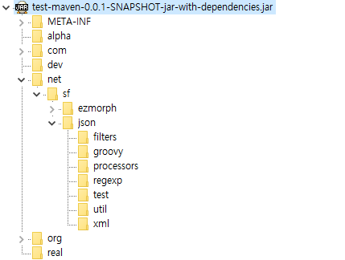
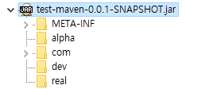

# Maven (2)

## \<plugin\>과 \<pluginManagement\>


Maveve은 빌드 작업을  할 때 \<plugins\> 요소의 \<plugin\>들을 사용하여 빌드작업을 한다. 플러그인에는 소스를 컴파일하기 위한 플러그인, war 파일을 만들기 위한 플러그인 , 톰캣에 배포하기 위한 플러그인 등이 있다. Maven은 많은 플러그인들이 존재한다

```xml
<build>
    ...
    <pluginManagement>
      <plugins>
        <plugin>
          <groupId>org.apache.maven.plugins</groupId>
          <artifactId>maven-jar-plugin</artifactId>
          <version>2.2</version>
          <executions>
            <execution>
              <id>pre-process-classes</id>
              <phase>compile</phase>
              <goals>
                <goal>jar</goal>
              </goals>
              <configuration>
                <classifier>pre-process</classifier>
              </configuration>
            </execution>
          </executions>
        </plugin>
      </plugins>
    </pluginManagement>
    ...
  </build>
```


 위의 이런 명세들을 플러그인(plugins) 요소에 추가했다면, 그것들은 단 하나의 POM에 적용될 것이다. 하지만 이것들을 pluginManagement 요소(element) 아래에 그서들을 적용한다면 이 pom과 maven-jar-plugin을 빌드에 추가한 상속받은 POM들은 마찬가지로 pre-process-classess excecution을 얻을 것이다. 따라서 모든 자식 pom.xml에서 복잡한 혼란스러운 설정이아니라 아래처럼 간단히 작성할 수 있다. 


```xml
<build>
    ...
    <plugins>
      <plugin>
        <groupId>org.apache.maven.plugins</groupId>
        <artifactId>maven-jar-plugin</artifactId>
      </plugin>
    </plugins>
    ...
  </build>
```


## 플러그인
maven은 빌드과정에서 다양한  여러 플러그인을 이용하여 허드슨이나 엔트, 넥서스 등의 유명 툴과 연동할 수 있다.  어떠한 플러그인이 있는지 알아본다.


### Apache Maven Compiler Plugin 플러그인

프로젝트의 소스를 컴파일하는데 사용한다. 

https://maven.apache.org/plugins/maven-compiler-plugin/


```xml
<plugin>
        <artifactId>maven-compiler-plugin</artifactId>
        <version>3.0</version>
        <executions>
          <execution>
            <id>default-testCompile</id>
            <phase>test-compile</phase>
            <goals>
              <goal>testCompile</goal>
            </goals>
            <configuration>
              <source>1.6</source>
              <target>1.6</target>
              <encoding>utf-8</encoding>
            </configuration>
          </execution>
          <execution>
            <id>default-compile</id>
            <phase>compile</phase>
            <goals>
              <goal>compile</goal>
            </goals>
            <configuration>
              <source>1.6</source>
              <target>1.6</target>
              <encoding>utf-8</encoding>
            </configuration>
          </execution>
        </executions>
        <configuration>
          <source>1.6</source>
          <target>1.6</target>
          <encoding>utf-8</encoding>
        </configuration>
      </plugin>

```


#### Compiling You Java Sources
```shell
mvv compile
mvn test-compile 
```

#### Configuring Your Compiler Plugin
Compiler Plugin은 자동적으로 단계들에서 실행되기 때문에, executions를 다른  많은  플러그인들과는 다르게 넣을 필요는 없다.  그러나  Compiler Plugin의 버전은 명시해야 한다.
```xml
<project>
  ...
  <build>
    <pluginManagement>
      <plugins>
        <plugin>
          <groupId>org.apache.maven.plugins</groupId>
          <artifactId>maven-compiler-plugin</artifactId>
          <version>3.5.1</version>
          <configuration>
            <!-- put your configurations here -->
          </configuration>
        </plugin>
      </plugins>
    </pluginManagement>
  </build>
  ...
</project>
```


### Apache Maven Dependency Plugin

http://maven.apache.org/plugins/maven-dependency-plugin/

dependency plugin 은  artifacts를 다루는 능력을 제공한다. 

특정 artifacts을 카피하면서,  depenbdency:copy mojo를 lifecycle에 bind할 필요가 있다. 
당신이 복사(copy)을 원하는 artifact을열 명시하고 plugin을 구성해라.
```xml
<project>
  [...]
  <build>
    <plugins>
      <plugin>
        <groupId>org.apache.maven.plugins</groupId>
        <artifactId>maven-dependency-plugin</artifactId>
        <version>3.0.0</version>
        <executions>
          <execution>
            <id>copy</id>
            <phase>package</phase>
            <goals>
              <goal>copy</goal>
            </goals>
          </execution>
        </executions>
        <configuration>
          <artifactItems>
            <artifactItem>
              <groupId>junit</groupId>
              <artifactId>junit</artifactId>
              <version>3.8.1</version>
              <type>jar</type>
              <overWrite>false</overWrite>
              <outputDirectory>${project.build.directory}/alternateLocation</outputDirectory>
              <destFileName>optional-new-name.jar</destFileName>
            </artifactItem>
          </artifactItems>
          <outputDirectory>${project.build.directory}/wars</outputDirectory>
          <overWriteReleases>false</overWriteReleases>
          <overWriteSnapshots>true</overWriteSnapshots>
        </configuration>
      </plugin>
    </plugins>
  </build>
  [...]
</project>
```
dependency:copy goal은 또한 막 생성된 artifact를 원한다면 custom 위치에 복사할 수 있다. 
그것은 package phage 뒤에 어떤 phase와 바운드되어야 한다.  아래는 어떻게 하는지 보여준다(이 경우에는 install phase와 바인드되었다.)


```xml
<project>
  [...]
  <build>
    <plugins>
      <plugin>
        <groupId>org.apache.maven.plugins</groupId>
        <artifactId>maven-dependency-plugin</artifactId>
        <version>3.0.0</version>
        <executions>
          <execution>
            <id>copy-installed</id>
            <phase>install</phase>
            <goals>
              <goal>copy</goal>
            </goals>
            <configuration>
              <artifactItems>
                <artifactItem>
                  <groupId>${project.groupId}</groupId>
                  <artifactId>${project.artifactId}</artifactId>
                  <version>${project.version}</version>
                  <type>${project.packaging}</type>
                </artifactItem>
              </artifactItems>
              <outputDirectory>some-other-place</outputDirectory>
            </configuration>
          </execution>
        </executions>
      </plugin>
    </plugins>
  </build>
  [...]
</project>
```


일단 생략한다. 


### Apache Maven JAR plugin

#### How to Build a JAR file

Maven을 가지고 jar 파일을 만들려면, 먼저 pom.xml에 최소한 다음과 같이 pom.xml 파일을 생성해야 한다.
```xml
<project>
  <modelVersion>4.0.0</modelVersion>
  
  <groupId>com.mycompany.project</groupId>
  <artifactId>core</artifactId>
  <version>1.0-SNAPSHOT</version>
  <!-- <packaging>jar</packaging>  -->
</project>
```


이 경우에 기본 패키징 타입이므로 그것을 설정할 필요는 없다.   jar 파일를 command로 만들려면 아래와 같이 한다. 

```shell
mvn package 
```

#### How to include/exclude content from jar artifact

```xml
<project>
  ...
  <build>
    <plugins>
      ...
      <plugin>
        <groupId>org.apache.maven.plugins</groupId>
        <artifactId>maven-jar-plugin</artifactId>
        <version>3.0.2</version>
        <configuration>
          <includes>
            <include>**/service/*</include>
          </includes>
        </configuration>
      </plugin>
      ...
    </plugins>
  </build>
  ...
</project>
```


#### How to create an additional attached jar artifact from the project
jar-plugin은 new execution을 정의해야 한다. 그렇지 않으면 그것은 두번째 artifact를 추가하는 대신에 jar-plugin의 기본 사용을 대체할 것이다. 
하나 이상의 artifact를 생성하려면 classifiedr 또한 필요하다.
```xml
<project>
  ...
  <build>
    <plugins>
      ...
      <plugin>
        <groupId>org.apache.maven.plugins</groupId>
        <artifactId>maven-jar-plugin</artifactId>
        <version>3.0.2</version>
        <executions>
          <execution>
            <phase>package</phase>
            <goals>
              <goal>jar</goal>
            </goals>
            <configuration>
              <classifier>client</classifier>
              <includes>
                <include>**/service/*</include>
              </includes>
            </configuration>
          </execution>
        </executions>
      </plugin>
      ...
    </plugins>
  </build>
  ...
</project>
```


#### Use Your Own Manifest File
https://maven.apache.org/shared/maven-archiver/examples/manifestFile.html

기본적으로, Maven Archiver는 당신을 위해 manifest 파일을 생성한다. 당신 자신의 손으로 가공한 manifest 파일을 사용하는 것은  쓸모있다.   src/main/resources/META-INF/MENIFEST.MF manifest 파일을 사용하고 싶다고 말하자. 이것은 <manifetFile> configuration element를 가지고 이루어진다. 당신의 팡리의 위치에 대한 값을 설정함으로써 할 수 있다. 

당신 자신의 manifest file의 content는 Maven Archiver에 의해 생성된 etries와 함께 머지될 것이다. 


당신 자신의 manifiest file에 entry를 명시한다면, 그것은 Maven Archiver에 의해 생성된 값을 override할 것이다. 
```xml
<project>
  ...
  <build>
    <plugins>
      <plugin>
        <groupId>org.apache.maven.plugins</groupId>
        <artifactId>maven-jar-plugin</artifactId>
        ...
        <configuration>
          <archive>
            <manifestFile>src/main/resources/META-INF/MANIFEST.MF</manifestFile>
          </archive>
        </configuration>
        ...
      </plugin>
    </plugins>
  </build>
  ...
</project>
```

다른 예) 
```xml
<plugin>
					<groupId>org.apache.maven.plugins</groupId>
					<artifactId>maven-jar-plugin</artifactId>
					<version>2.4</version>
					<configuration>
						<archive>
							<manifestFile>${project.build.outputDirectory}/META-INF/MANIFEST.MF</manifestFile>
						</archive>
					</configuration>
					<executions>
						<execution>
							<id>test-jar</id>
							<phase>package</phase>
							<goals>
								<goal>test-jar</goal>
							</goals>
							<configuration>
								<archive>
									<manifest>
										<addDefaultSpecificationEntries>true</addDefaultSpecificationEntries>
										<addDefaultImplementationEntries>true</addDefaultImplementationEntries>
									</manifest>
								</archive>
							</configuration>
						</execution>
					</executions>
				</plugin>
```

#### Manifest

https://maven.apache.org/shared/maven-archiver/examples/manifest.html


**Default Manifest**
```shell
Manifest-Version: 1.0
Archiver-Version: Plexus Archiver
Created-By: Apache Maven ${maven.version}
Built-By: ${user.name}
Build-Jdk: ${java.version}
```

**Adding Implementation And Specification Details**

디폴트르 Maven은 Implementation과 Specification details을 더이상 생성하지 않는다. 
당시의 manifest 파일에 그것을 두고 싶으면 configuration에 명확히 그렇게 말해야 한다.
```xml
<project>
  ...
  <build>
    <plugins>
      <plugin>
        <groupId>org.apache.maven.plugins</groupId>
        <artifactId>maven-jar-plugin</artifactId>
        <version>2.1</version>
        ...
        <configuration>
          <archive>
            <manifest>
              <addDefaultImplementationEntries>true</addDefaultImplementationEntries>
              <addDefaultSpecificationEntries>true</addDefaultSpecificationEntries>
            </manifest>
          </archive>
        </configuration>
        ...
      </plugin>
    </plugins>
  </build>
  ...
</project>
```


결과의 manifest는 이러한 조각들의 정보를 포함할 것이다.
```shell
Manifest-Version: 1.0
Archiver-Version: Plexus Archiver
Created-By: Apache Maven ${maven.version}
Built-By: ${user.name}
Build-Jdk: ${java.version}
Specification-Title: ${project.name}
Specification-Version: ${project.artifact.selectedVersion.majorVersion}.${project.artifact.selectedVersion.minorVersion}
Specification-Vendor: ${project.organization.name}
Implementation-Title: ${project.name}
Implementation-Version: ${project.version}
Implementation-Vendor-Id: ${project.groupId}
Implementation-Vendor: ${project.organization.name}
Implementation-URL: ${project.url}
```


### Apache Flex Maven Bundle Plugin(BND)1


http://felix.apache.org/documentation/subprojects/apache-felix-maven-bundle-plugin-bnd.html


이 플러그인은 OSGI와 관련이 있는 것 같은데 어디에서 사용하는지 어떤 결과를 만들어 내는지 아직 잘 모르겠다. 

 


bnd maven plugin을 이용하여 manifest.mf와 jar 파일을 생성할 수 있다.


```xml
	<plugin>
		<groupId>org.apache.felix</groupId>
		<artifactId>maven-bundle-plugin</artifactId>
		<executions>
			<execution>
				<id>bundle-manifest</id>
				<phase>process-classes</phase>
				<goals>
					<goal>manifest</goal>
				</goals>
			</execution>
		</executions>
	</plugin>

```

#### Goals
Maven goals을 통해 추가적인 기능들을 제공한다. 
```shell
mvn org.apache.felix:maven-bundle-plugin:GOAL
```

GOAL은 다음과 같다. 

bundle : OSGI bundle jar를 빌드한다. 
maniffest:   OSGI manifest 를 생성한다. 
    - manifestLocation ${project.build.outputDirectory}/META-INF가 디폴트다
      - supportedProjectTypes : “jar”가 디폴트이다. “bundle” 


#### OSGI 

http://wso2.com/library/tutorials/develop-osgi-bundles-using-maven-bundle-plugin/

http://blog.secmem.org/140

http://blog.naver.com/purser2/80193522867


OSGI(oPEN Service Gateway Initiative)


원격으로 관리될 수 있는 개방형 자바 임베디드 서버(JES) 기반의 네트워크 서비스 플랫폼 규격.

핵심개념은 프로그램을 만들 때 하나의 큰 프로그램으로 만들지 않고 여러가지의 작은 프로그램을 만든 후에 이것을 하나로 묶는 것입니다.  OSGI는 프로그램 자체를 모듈화(OSGI에서는 이것을 bundle 이라고 함)하고 OSGI Framework에서 이 모듈들을 각각 등록시키고 요청에 따라 실행을 시킨다. 

bundle은 아예 jar 파일로 컴파일 되어서 나오기 때문에  소스코드를 보지 않는 한 남의 코드를 볼 수 없다.  모듈을 수정할 때 들어오는 값의 형태(type)나 나가는 값의 형태만 유지하면 코드 변경으로 인해 다른 오류가 일어날 걱정을 하지 않아도 된다. 

특이한 장점은 , 각각의  모듈은 OSGI에 등록이 되어야 하고 life cycle(프로그램이 설치, 실행, 중지)이 프로그램과 별개로 일어나기 때문에 모듈을 업데이트하거나 새로운 모듈을 적용할 때 프로그램을 종료하지 않아도 된다. 


OSGI Framework 종류 : Felix, Spring DM , equinox 


### Apache Maven Deploy Plugin

deploy plugin은  remote repository에 artifact를 추가하기 위해서  deploy phase에서 주로 쓰인다. 

#### The deploy:deploy Mojo
대부분의 경우에, 이 mojo는 당신이 default build  lifecycle의 deploy phase를 호출할 때 적용된다. 

이 mojo가 동작하게 하려면 , 유효한 <distributionManagement> secion POM을 포함해야 한다. 당신의 repository가 secured 되었다면, 당신은 또한 당신의 settings.xml 파일에  대응하는 <server> server entries를 정의해야 한다. 
```xml
[...]
  <distributionManagement>
    <repository>
      <id>internal.repo</id>
      <name>MyCo Internal Repository</name>
      <url>Host to Company Repository</url>
    </repository>
  </distributionManagement>
[...]
```


별로 고려할 만한 내용이 없어서 일단 패스

### Apache Maven Eclipse Plugin (RETIRED)

http://maven.apache.org/plugins/maven-eclipse-plugin/


```xml
<plugin>
			<groupId>org.apache.maven.plugins</groupId>
			<artifactId>maven-eclipse-plugin</artifactId>
			<version>2.9</version>
</plugin>
```

retired 되어서 일단 패스


### Apache Maven GPG Plugin
GnuPG를 가지고 첨부된  모든 artifacts를 sign한다. 

	GnuPG (GNU 프라이버시 가드)
PGP를 대체하는 자유 소프트웨어이다. GnuPG는 오픈피지피 표준을 다루는 RFC 480을 만족한다.


```xml
<plugin>
	<groupId>org.apache.maven.plugins</groupId>
	<artifactId>maven-gpg-plugin</artifactId>
	<version>1.5</version>
</plugin>
```
특별한 것이 없어서 패스.


### Maven JXR Plugin

https://maven.apache.org/jxr/maven-jxr-plugin/

JXR Plugin 은  프로젝트의 소스의 cross-reference를 생산한다. 생성된 리포트는 사용자가 참조하거나 명세를 찾기 쉽게 만든다.
```xml
<project>
  ...
  <build>
    ...
  </build>
  <reporting>
    <plugins>
      <plugin>
        <groupId>org.apache.maven.plugins</groupId>
        <artifactId>maven-jxr-plugin</artifactId>
        <version>2.5</version>
      </plugin>
    </plugins>
  </reporting>
  ...
</project>
```


다음은 리포트가 생성될 것이다.

```shell
mvn site
```


### Maven Plugin Plugin


http://maven.apache.org/components/plugin-tools/maven-plugin-plugin/


이 플러그인은 Maven plugin descriptor르 생성하기 위해 사용된다. 
그것은 또한 plugin registry을 업데이트 하기 위한 것 뿐만이 아니라 Mojos을 위한 Report 파일들을 생산하는데 사용된다.

```xml
<plugin>
	<groupId>org.apache.maven.plugins</groupId>
	<artifactId>maven-plugin-plugin</artifactId>
	<version>3.3</version>
</plugin>
```


### Apache Maven Install Plugin

http://maven.apache.org/plugins/maven-install-plugin/

local repository에 artifact에 추가하기 위해서 install phase 동안에 사용된다.
```xml
<plugin>
	<groupId>org.apache.maven.plugins</groupId>
	<artifactId>maven-install-plugin</artifactId>
<version>2.5.1</version>
</plugin>
```

일단 중요한 내용이 없는 것 같아서 패스.

Install Plugin은 local repository에 산출물을 추가하기 위해서 isntall phase 동안에 사용된다. 이 플러그인은 로컬 저장소에 산출물(artifact)을 위한 적절한 위치를 결정하기 위해 POM에 있는 정보를 사용한다. 
```xml
<plugin>
        <artifactId>maven-install-plugin</artifactId>
        <version>2.3.1</version>
        <executions>
          <execution>
            <id>default-install</id>
            <phase>install</phase>
            <goals>
              <goal>install</goal>
            </goals>
          </execution>
        </executions>
      </plugin>
```


### Apache Maven PMD Plugin

https://maven.apache.org/plugins/maven-pmd-plugin/


PMD Plugin은 당신이 자동적으로 PMD code analysis를 실행하도록 해준다. 
이 플러그인은 PMD code analysis tool을 사용하여   PMD 와  CPD 를 생성한다. 
```xml
<plugin>
		<groupId>org.apache.maven.plugins</groupId>
		<artifactId>maven-pmd-plugin</artifactId>
		<version>3.6</version>
		<configuration>
		   <aggregate>true</aggregate>
		<targetJdk>${target.jdk}</targetJdk>
			<rulesets>
				<!-- <ruleset>/rulesets/maven.xml</ruleset> -->
				<ruleset>rulesets/java/basic.xml</ruleset>
			</rulesets>
			<format>xml</format>
			<linkXref>true</linkXref>
			<sourceEncoding>utf-8</sourceEncoding>
			<minimumTokens>100</minimumTokens>
		</configuration>
</plugin>
```
sourceEncoding : 지정하지 않으면 UTF-8
outputEncoding : 보고서의 출력 인코딩 
ruleset : 사용할 커스텀 루셋의 위치를 설정하며 URL 형식으로 지정하지 않으면 클래스 패스에서 찾게 된다 커스텀 룰셋을 사용하기 가장 좋은 방법은 메이븐 프로젝트에 룰셋을 넣어두고  file:/// 형식 URL로 지정하는 것이다. 절대경로를 사용해야 하므로 maven의 ${project.basedir} 프로퍼티를 활용한다.

리포트들은 linkXRef  parameter를 enable시키면 cross-referenced source 에 직접적으로 링크를 건다. JXR plugin을 참고한다.


PMD와 CPD reports는 동일한 configuration을 공유한다.  

```xml
<project>
  ...
  <reporting>
    <plugins>
      <plugin>
        <groupId>org.apache.maven.plugins</groupId>
        <artifactId>maven-pmd-plugin</artifactId>
        <version>3.7</version>
        <configuration>
          <linkXref>true</linkXref>
          <sourceEncoding>utf-8</sourceEncoding>
          <minimumTokens>100</minimumTokens>
          <targetJdk>1.5</targetJdk>
          <excludes>
            <exclude>**/*Bean.java</exclude>
            <exclude>**/generated/*.java</exclude>
          </excludes>
          <excludeRoots>
            <excludeRoot>target/generated-sources/stubs</excludeRoot>
          </excludeRoots>
        </configuration>
      </plugin>
    </plugins>
  </reporting>
  ...
</project>
```


#### Custom ruleset
사용하지 않는 변수에 대해서 검사하는 룰인 UnusedLocalVariable와 UnusedPrivateField를 포함하면 PMD 보고서 양이 너무 많아진다. 추가하는 경우에는 주의하자. 
```xml
<?xml version="1.0"?>
<ruleset name="Custom ruleset"
    xmlns="http://pmd.sourceforge.netruleset/2.0.0"
    xmlns:xsi="http://www.w3.org/2001/XMLSchema-instance"
    xsi:schemaLocation="http://pmd.sourceforge.netruleset/2.0.0 http://pmd.sourceforge.netruleset_2_0_0.xsd">
  <description>
  This ruleset checks my code for bad stuff
  </description>
  <!-- We'll use the entire 'strings' ruleset -->
  <rule ref="rulesets/java/strings.xml"/>
    <!-- <rule ref="rulesets/java/strings.xml/AvoidStringBufferField"/>  -->   
   
  <!-- basic rules -->
  <rule ref="rulesets/java/basic.xml/UnnecessaryConversionTemporary"/>
  <rule ref="rulesets/java/basic.xml/ReturnFromFinallyBlock"/>
  <rule ref="rulesets/java/basic.xml/EmptyCatchBlock"  message="Must handle exceptions">
    <priority>1</priority>
  </rule>
  <rule ref="rulesets/java/basic.xml/EmptyIfStmt"/>
  <rule ref="rulesets/java/basic.xml/EmptyWhileStmt"/>
   
  <rule ref="rulesets/java/basic.xml/EmptyTryBlock"/>
  <rule ref="rulesets/java/basic.xml/EmptyFinallyBlock"/>
  <rule ref="rulesets/java/basic.xml/EmptySwitchStatements"/>
  <rule ref="rulesets/java/basic.xml/JumbledIncrementer"/>
  <rule ref="rulesets/java/basic.xml/ForLoopShouldBeWhileLoop"/>
  <rule ref="rulesets/java/basic.xml/UnnecessaryConversionTemporary"/>
  <rule ref="rulesets/java/basic.xml/OverrideBothEqualsAndHashcode"/>
  <rule ref="rulesets/java/basic.xml/DoubleCheckedLocking"/>
   
  <rule ref="rulesets/java/basic.xml/EmptySynchronizedBlock"/>
  <rule ref="rulesets/java/basic.xml/UnnecessaryReturn"/>
  <rule ref="rulesets/java/basic.xml/EmptyStaticInitializer"/>
  <rule ref="rulesets/java/basic.xml/UnconditionalIfStatement"/>
  <rule ref="rulesets/java/basic.xml/EmptyStatementNotInLoop"/>
   
  <rule ref="rulesets/java/basic.xml/DontCallThreadRun"/> 
  <!-- strict -->
  <rule ref="rulesets/java/strictexception.xml/DoNotThrowExceptionInFinally"/>
  <rule ref="rulesets/java/logging-java.xml/SystemPrintln"/>
  <rule ref="rulesets/java/logging-java.xml/AvoidPrintStackTrace"/> 
   
  <!-- unusedcode 는 차후에 검사 --> 
  <!--
  <rule ref="rulesets/java/unusedcode.xml/UnusedLocalVariable"/> 
  <rule ref="rulesets/java/unusedcode.xml/UnusedPrivateField"/>
  -->
   
  <rule ref="rulesets/java/imports.xml/DuplicateImports"/>
   
  <!-- finalizer -->
  <rule ref="rulesets/java/finalizers.xml/FinalizeShouldBeProtected"/>
  <!-- We want to customize this rule a bit, change the message and raise the priority  -->
  <!-- Now we'll customize a rule's property value -->
  <rule ref="rulesets/java/codesize.xml/CyclomaticComplexity">
    <properties>
        <property name="reportLevel" value="5"/>
    </properties>
  </rule>
  <!-- We want everything from braces.xml except WhileLoopsMustUseBraces -->
  <rule ref="rulesets/java/braces.xml">
    <exclude name="WhileLoopsMustUseBraces"/>
  </rule>
</ruleset>
```

#### logging ruleset

http://pmd.sourceforge.net/pmd-5.1.3/rules/java/logging-java.html

AvoidPrintStackTrace
```xml
<rule ref="rulesets/java/logging-java.xml/AvoidPrintStackTrace"/>
```
아래와 같은 코드를 사전에 검출할 수 있다. 
```java
class Foo {
 void bar() {
  try {
   // do something
  } catch (Exception e) {
   e.printStackTrace();
  }
 }
}
```

**SystemPrintln**
```xml

<rule ref="rulesets/java/logging-java.xml/SystemPrintln"/>  
```
Logger 대신 System.out.print* 나 System.err.print* 로 프린트하는 코드를 검출할 수 있다.


#### Basic ruleset


http://pmd.sourceforge.net/pmd-5.1.3/rules/java/basic.html

**EmptyCatchBlock**
```xml
<rule ref="rulesets/java/basic.xml/EmptyCatchBlock"/>  
```

catch 구문에서 아무것도 안 하는 코드를 검출할 수 있다.
```java
public void doSomething() {
  try {
    FileInputStream fis = new FileInputStream("/tmp/bugger");
  } catch (IOException ioe) {
 
  }
}
```

**EmptyIfStmt**
```xml
<rule ref="rulesets/java/basic.xml/EmptyIfStmt/">  
```


if 문에서 아무 짓도 안 하는 코드를 검출한다.
```java
public class Foo {
 void bar(int x) {
  if (x == 0) {
   // empty!
  }
 }
}
```


### Apache Maven Project Info Reports Plugin

프로젝트에 대한 리포트 정보를 생성하는데 사용한다. 
pom.xml에서 설정할 것이 없다. 
```shell
mvn site
```

```xml
<plugin>
	<groupId>org.apache.maven.plugins</groupId>
	<artifactId>maven-project-info-reports-plugin</artifactId>
	<version>2.7</version>
</plugin>


	<plugin>
				<groupId>org.apache.maven.plugins</groupId>
				<artifactId>maven-project-info-reports-plugin</artifactId>
				<reportSets>
					<reportSet>
						<reports>
							<report>dependencies</report>
							<report>dependency-management</report>
							<report>dependency-convergence</report>
							<report>distribution-management</report>
							<report>index</report>
							<report>issue-tracking</report>
							<report>license</report>
							<report>mailing-list</report>
							<report>modules</report>
							<report>plugin-management</report>
							<report>plugins</report>
							<report>project-team</report>
							<report>scm</report>
							<report>summary</report>
						</reports>
					</reportSet>
				</reportSets>
			</plugin>

```


### Apache Maven Remote Resources Plugin

http://maven.apache.org/plugins/maven-remote-resources-plugin/


이 플러그인은 원격 리파지토리로부터 JARs 리소스들을 가져오고, 그 리소스들을 처리하고, 당신이 Maven으로 빌드하는  Jars들 속으로 그것들을 포함시킨다. 


```xml
<plugin>
	<groupId>org.apache.maven.plugins</groupId>
	<artifactId>maven-remote-resources-plugin</artifactId>
	<version>1.5</version>
</plugin>

```


#### How to Create a Resource Bundle 

bundle resource manifest generation을 켜 놓을려면(turn on), 다음과 같이 plugin을 설정해야 한다. 
```xml
<project>
  ...  
  <build>
    <plugins>
      <!-- Turn this into a lifecycle -->
      <plugin>      
        <artifactId>maven-remote-resources-plugin</artifactId>
        <version>1.5</version>
        <executions>
          <execution>
            <goals>
              <goal>bundle</goal>
            </goals>
          </execution>
        </executions>
      </plugin>
    </plugins>
  </build>
  ...
</project>
```

이것은 $basedir/src/main/resources 디렉토리를 scaning하도록 하고, $basedir/target/classes/META-INF/maven/remote-resources.xml manifest 파일을 생성한다. 


### Maven Release Plugin

http://maven.apache.org/maven-release/maven-release-plugin/

많은 반복적인 매뉴얼 작업을 저장하면서 Maven으로 프로젝트를 릴리즈하는데 사용된다. 
프로젝트를 릴리즈하는 것은 두개의 단계가 있다. prepare와 perform이다. 

```xml
<plugin>
          <artifactId>maven-release-plugin</artifactId>
          <version>2.5</version>
</plugin>

```


### Apache Maven WAR Plugin				

https://maven.apache.org/plugins/maven-war-plugin/

이 플러그인은 산출물(artifacts) 의존성, 클래스들 그리고 웹 어플리케이션의 리소스들을 모으고(collecting) 그것을 web application archive로 packaging할 책임이 있다. 

```xml
<plugin>
	<groupId>org.apache.maven.plugins</groupId>
	<artifactId>maven-war-plugin</artifactId>
	<version>2.4</version>
	<!-- <configuration> <archive> <manifestFile>${project.build.outputDirectory}/META-INF/MANIFEST.MF</manifestFile> 
	</archive> </configuration> -->
</plugin>
```

#### Using the package phase with the project package type as war
다음은 WAR Plugin을 사용하는 정상적인 방법이다.


```xml
<project>
  ...
  <groupId>com.example.projects</groupId>
  <artifactId>documentedproject</artifactId>
  <packaging>war</packaging>
  <version>1.0-SNAPSHOT</version>
  <name>Documented Project</name>
  <url>http://example.com</url>
  ...
</project>
```

프로젝트의 구조는 다음과 같이 보인다. 
```shell
|-- pom.xml
 `-- src
     `-- main
         |-- java
         |   `-- com
         |       `-- example
         |           `-- projects
         |               `-- SampleAction.java
         |-- resources
         |   `-- images
         |       `-- sampleimage.jpg
         `-- webapp
             |-- WEB-INF
             |   `-- web.xml
             |-- index.jsp
             `-- jsp
                 `-- websource.jsp
```
호출하기 
```shell
mvn package
```

또는 
```shell
mvn compile war:war
```

은 target/documentedproject-1.0-SNAPSHOT.war WAR 파일을 생성할 것이다. 여기에 WAR 파일의 컨텐츠가 있다. 
```shell
documentedproject-1.0-SNAPSHOT.war
  |-- META-INF
  |   |-- MANIFEST.MF
  |   `-- maven
  |       `-- com.example.projects
  |           `-- documentedproject
  |               |-- pom.properties
  |               `-- pom.xml
  |-- WEB-INF
  |   |-- classes
  |   |   |-- com
  |   |   |   `-- example
  |   |   |       `-- projects
  |   |   |           `-- SampleAction.class
  |   |   `-- images
  |   |       `-- sampleimage.jpg
  |   `-- web.xml
  |-- index.jsp
  `-- jsp
      `-- websource.jsp

```

나머지는 생략


### The Rat Maven Plugin

http://creadur.apache.org/rat/apache-rat-plugin/

이 플로그인은 Rat, the Release Audit Tool, 을 실행하는데 사용한다.  그것은  당신의 소스코드가 ASF Source Header와 Copyright Noticeㄹ와 같은 표준을 준수하는지 확인한다. 
```shell
	ASF ( Apache Software Foundation)
```

```xml
<plugin>
<groupId>org.apache.rat</groupId>
<artifactId>apache-rat-plugin</artifactId>
<version>0.10</version>
<configuration>
<excludes>
	<exclude>BUILDING.*</exclude>
	<exclude>HOWTO.*</exclude>
	<exclude>HOWTO_*</exclude>
	<exclude>LICENSE.*</exclude>
	<exclude>NOTICE.*</exclude>
	<!-- site resources -->
	<exclude>src/site/resources/download*.cgi</exclude>
	<exclude>src/site/resources/downloads/formatting.xml</exclude>
	<exclude>src/site/resources/js/galleria/**</exclude>
	<exclude>src/site/resources/model-eclipse-modeler/*</exclude>
	<exclude>src/site/resources/robots.txt</exclude>
	<!-- Generated by Maven -->
	<exclude>release.properties</exclude>
	<exclude>dist/**/*</exclude>
	<exclude>**/derby.log</exclude>
	<!-- Eclipse -->
	<exclude>**/.*</exclude>
	<exclude>.*/**/*</exclude>
	<!-- Schemas for offline use -->
	<exclude>**/META-INF/XSD/activemq-core-*.xsd</exclude>
	<exclude>**/META-INF/XSD/camel-spring-*.xsd</exclude>
	<exclude>**/META-INF/XSD/spring-beans-*.xsd</exclude>
</excludes>
</configuration>
</plugin>
```

### Build Helper Maven Plugin

http://www.mojohaus.org/build-helper-maven-plugin/

이 플러그인은 Maven build lifecycle 을 지원하기 위한 다양한 작은 독립적인 골을 포함한다. 

	build-helper:add-source  POM에 더 많은 소스 디렉토리들을 추가
	build-helper:add-test-source POM에 더 많은 테스트 소스 디렉토리들을 추가 
	build-helper:add-resource POM에 더 많은 리소스 디렉토리들을 추가 
이하 생략


#### Add more source directories to your project

pom.xml 파일은 하나의 source directory만들 허용하기 때문에 , 프로젝트에 더 많은 소스 디렉토리를 추가하기 위해서 아래의 예제를 사용해라.
```xml
<project>
  ...
  <build>
    <plugins>
      <plugin>
        <groupId>org.codehaus.mojo</groupId>
        <artifactId>build-helper-maven-plugin</artifactId>
        <version>1.12</version>
        <executions>
          <execution>
            <id>add-source</id>
            <phase>generate-sources</phase>
            <goals>
              <goal>add-source</goal>
            </goals>
            <configuration>
              <sources>
                <source>some directory</source>
                ...
              </sources>
            </configuration>
          </execution>
        </executions>
      </plugin>
    </plugins>
  </build>
</project>

```

이하 생략 

### Cobertura Maven Plugin

http://www.mojohaus.org/cobertura-maven-plugin/


이 플러그인은 Cobertura의 특징을 제공한다. 
cobertura

http://cobertura.github.io/cobertura/

A code coverage utility for Java. 

Coberturea는 test들에 의해 접근되는 코드의 퍼센티지를 계산하는 무료 자바 툴이다. 
이것은 당신의 Java program의 부분들이 test coverage가 부족한지를 발견(식별)하기 위해서 사용한다.


eclipse나 commnad line에서 코드 커버리지에 대한 보고 파일 생성
```shell
mvn cobertura:cobertura
```
최종 결과물은 target/site/cobertura 디렉토리에 html 형태로 생성

개인 프로젝트 품질관리를 위해 FindBugs, PMD, Cobertura 를, 빌드 도구로는 maven을 사용중인데 cobertura 가 자꾸 0% 커버리지 레포트를 발생해 골치를 썩이던 중 우연히 문제를 해결할 수 있었다.
 
  알고보니 maven cobertura plugin을 개발한 codehaus 의 이슈트래커인 JIRA 에 이미 레포트 되고 있었던 것이었다. 그것도 무려 4년전 (2006년)에... 문제의 원인은 maven cobertura plugin 이 내부적으로 사용중인 surefire plugin 의 아웃풋 디렉토리를 cobertura 가 조사하기 때문에 그렇다는 것.
 
  사실 커버리지 측정 도구로는 Atlassian 의 clover 라는 막강한 툴이 있고, 한국인 개발자가 개발한 undercover 라는 툴도 있지만 (http://code.google.com/p/undercover/) 설정 방법이 비교적 널리 알려진 cobertura 가 설정이 더 쉬울 것이라 생각한 것은 단순한 오산이었다 OTL
 
  그래도 무료니까, 어쩌겠나. 그정도 수고는 들여야지. (이 글을 쓰는 시점에 undercover 또한 버전업을 하여 cobertura 에 버금가는 기능을 자랑하게 되었다)


```xml
<plugin>
	<groupId>org.codehaus.mojo</groupId>
	<artifactId>cobertura-maven-plugin</artifactId>
	<version>2.6</version>
	<configuration>
		<aggregate>true</aggregate>
		<!-- Whether to remove GPL licensed files from the generated report. 
		This is required to distribute the report as part of a distribution, which 
		is licensed under the ASL, or a similar license, which is incompatible with 
		the GPL -->
		<omitGplFiles>true</omitGplFiles>
	</configuration>
</plugin>
```


### Exec Maven Plugin

http://www.mojohaus.org/exec-maven-plugin/

이 플러그인은 system과 java programs들을 실행하는 것을 돕기 위해 2개의 goal을  제공한다. 


####  Command line
system properties를 사용하여 당신은 다음의 예제에서와 같이 그것을 실행할 수 있을 것이다. 
```shell
mvn exec:exec -Dexec.executable="maven" 
[-Dexec.workingdir="/tmp"] -Dexec.args="-X myproject:dist"
```

#### POM Configuration
```xml
<project>
  ...
  <build>
    <plugins>
      <plugin>
        <groupId>org.codehaus.mojo</groupId>
        <artifactId>exec-maven-plugin</artifactId>
        <version>1.5.0</version>
        <executions>
          <execution>
            ...
            <goals>
              <goal>exec</goal>
            </goals>
          </execution>
        </executions>
        <configuration>
          <executable>maven</executable>
          <!-- optional -->
          <workingDirectory>/tmp</workingDirectory>
          <arguments>
            <argument>-X</argument>
            <argument>myproject:dist</argument>
            ...
          </arguments>
        </configuration>
      </plugin>
    </plugins>
  </build>
   ...
</project>
```
#### Java goal
이 goal은 당신이 동일한 VM 내에서 Java program을 실행하도록 돕는다. 

커맨드 라인에서 실행은 다음과 같이 한다. 
```shell
mvn exec:java -Dexec.mainClass="com.example.Main" [-Dexec.args="argument1"] ...
```
POM에 plugin을 구성할 수 있다. 
```xml
<project>
  ...
  <build>
    <plugins>
      <plugin>
        <groupId>org.codehaus.mojo</groupId>
        <artifactId>exec-maven-plugin</artifactId>
        <version>1.5.0</version>
        <executions>
          <execution>
            ...
            <goals>
              <goal>java</goal>
            </goals>
          </execution>
        </executions>
        <configuration>
          <mainClass>com.example.Main</mainClass>
          <arguments>
            <argument>argument1</argument>
            ...
          </arguments>
          <systemProperties>
            <systemProperty>
              <key>myproperty</key>
              <value>myvalue</value>
            </systemProperty>
            ...
          </systemProperties>
        </configuration>
      </plugin>
    </plugins>
  </build>
   ...
</project>
```

이 java goal은 새로운 프로세스를 생성(spawn) 하지 않는다. 


### FindBugs Maven Plugin

http://gleclaire.github.io/findbugs-maven-plugin/

FindBugs는 Java Program에서 버그들을 찾는다.  

이 플러그인은 PMD가 있으니까 사용하지 않도록 한다.  
```xml
<plugin>
	<groupId>org.codehaus.mojo</groupId>
	<artifactId>findbugs-maven-plugin</artifactId>
	<version>3.0.1</version>
	<configuration>
		<!-- required by dashboard plugin and jenkins -->
		<xmlOutput>true</xmlOutput>
		<effort>low</effort>
		<findbugsXmlOutput>true</findbugsXmlOutput>
		<findbugsXmlWithMessages>true</findbugsXmlWithMessages>
	</configuration>
</plugin>
```
나머지는 생략한다. 


### Maven Javacc Plug-in

http://maven.apache.org/archives/maven-1.x/plugins/javacc/

이 플러그인은 사용자 제공의 Javcc/JJTree 문법들에 근거한 코드를 생성한다. 
```xml
<plugin>
	<groupId>org.codehaus.mojo</groupId>
	<artifactId>javacc-maven-plugin</artifactId>
	<version>2.6</version>
</plugin>
```


###  Taglist Maven Plugin

http://www.mojohaus.org/taglist-maven-plugin/

@todo 또는 //TODO tags와 같은  코드에서 발견된 다양한 태그들을에 대한 리포트를 생성한다. 
```xml
<plugin>
	<groupId>org.codehaus.mojo</groupId>
	<artifactId>taglist-maven-plugin</artifactId>
	<version>2.4</version>
</plugin>

```

### Versions Maven Plugin

http://www.mojohaus.org/versions-maven-plugin/

이 플러그인은 당신이 프로젝트의 POM에서 산출물의 버전을 관리하고 싶을 때 사용된다. 
```xml
<plugin>
	<groupId>org.codehaus.mojo</groupId>
	<artifactId>versions-maven-plugin</artifactId>
	<version>2.1</version>
</plugin>
```

### wagon-maven-plugin

http://www.mojohaus.org/wagon-maven-plugin/

Maven Wagon을 사용하여 리파지토리간에 리소스들을 보거나 전송하는데 사용한다. 

```xml
<plugin>
	<groupId>org.codehaus.mojo</groupId>
	<artifactId>wagon-maven-plugin</artifactId>
	<version>1.0-beta-4</version>
	<executions>
		<execution>
			<id>upload-jar</id>
			<phase>install</phase>
			<goals>
				<goal>upload</goal>
			</goals>
		</execution>
	</executions>
</plugin>
```

#### Configuration example to upload 
```xml
<project>
  [...]
  <build>
    [...]
    <extensions>
      <extension>
        <groupId>org.apache.maven.wagon</groupId>
        <artifactId>wagon-ssh</artifactId>
        <version>2.8</version>
      </extension>
    </extensions>

    <plugin>
      <groupId>org.codehaus.mojo</groupId>
      <artifactId>wagon-maven-plugin</artifactId>
      <version>1.0</version>
      <executions>
        <execution>
          <id>upload-javadoc</id>
          <phase>deploy</phase>
          <goals>
            <goal>upload</goal>
          </goals>
          <configuration>
            <fromDir>local.dir</fromDir>
            <includes>*</include>
            <excludes>pom.xml</excludes>
            <url>scp://your.remote.host/</url>
            <toDir>remote.dir</toDir>
          </configuration>
          </execution>
        </executions>
        </plugin>
    </build>
    [...]
</project>
```


### lifecycle-mapping

http://stackoverflow.com/questions/30063357/how-can-i-map-maven-lifecycle-phases-not-covered-by-the-eclipse-m2e-plugin

M2Eclipse (the Maven integration plugin for Eclipse) is mapping and execution the default phases and goals of Maven into the internal Eclipse build workflow.


M2Eclipse는  Maven의  default 단계들(phases)과 goals들을 내부의 Eclipse build workflow에 매핑하고 실행한다. 


https://www.eclipse.org/m2e/documentation/m2e-execution-not-covered.html


M2Eclipse는 plugin executions을 plugin groupid, artifactid, version ragne와 goal을 사용하여 actions에 매치한다. 

plugin executiton을 가지고 하기 위해서 지시받을 수 있는 3개의 기본 action들이 있다. – ignore, execute 그리고 project에 대한 delegate이다. 
```xml
<plugin>
<groupId>org.eclipse.m2e</groupId>
<artifactId>lifecycle-mapping</artifactId>
<version>1.0.0</version>
<configuration>
<lifecycleMappingMetadata>
<pluginExecutions>
<pluginExecution>
<pluginExecutionFilter>
<groupId>org.codehaus.mojo</groupId>
<artifactId>openjpa-maven-plugin</artifactId>
<versionRange>[1.1,)</versionRange>
<goals><goal>enhance</goal></goals>
</pluginExecutionFilter>
<action>
<execute> <runOnIncremental>false</runOnIncremental></execute>
<ignore />
</action>
</pluginExecution>
<pluginExecution>
<pluginExecutionFilter>
<groupId>org.codehaus.mojo</groupId>
<artifactId>gwt-maven-plugin</artifactId>
<versionRange>[2.4.0,)</versionRange>
<goals><goal>resources</goal></goals>
</pluginExecutionFilter>
<action>
<execute>
<runOnIncremental>false</runOnIncremental>
</execute>
<ignore />
</action>
</pluginExecution>

<pluginExecution>
<pluginExecutionFilter>
<groupId>org.bsc.maven</groupId>
<artifactId>maven-processor-plugin</artifactId>
<versionRange>[2.0.5,)</versionRange>
<goals><goal>process</goal></goals>
</pluginExecutionFilter>
<action>
<execute>
<runOnIncremental>false</runOnIncremental>
</execute>
<ignore />
</action>
</pluginExecution>

<pluginExecution>
<pluginExecutionFilter>
<groupId>org.codehaus.mojo</groupId>
<artifactId>javacc-maven-plugin</artifactId>
<versionRange>[2.6,)</versionRange>
<goals><goal>javacc</goal><goal>jjtree-javacc</goal></goals>
</pluginExecutionFilter>
<action>
<ignore />
</action>
</pluginExecution>
<pluginExecution>
<pluginExecutionFilter>
<groupId>org.ops4j.pax.exam</groupId>
<artifactId>maven-paxexam-plugin</artifactId>
<versionRange>[1.2.4,)</versionRange>
<goals><goal>generate-config</goal><goal>generate-depends-file</goal></goals>
</pluginExecutionFilter>
</pluginExecution>
</pluginExecutions>
</lifecycleMappingMetadata>
</configuration>
</plugin>
```


#### Delegate to a Project Configurator(recommended)

configurator mapping은 projectConfigurators extension point을 사용한 m2e에 등록된 AbstractProjectConfigurator의 구현에 대한 plugin execution을 위한 M2Eclipse에 workspace project configuration mappaing을 위임한다. 

대부분의 경우에, configurator mapping은 M2Eclipse extension 개발자들에 의해서 사용될 것이다. 


#### Ignore Plugin Goal

ignore option은 이름이 제안하는 대로, M2Eclipse가 plugin  execution을 조용히 무시하도록 한다.  여기에 pom.xml 조각 예제가 있다. 
```xml
<pluginManagement>
  <plugins>
    <plugin>
     <groupId>org.eclipse.m2e</groupId>
     <artifactId>lifecycle-mapping</artifactId>
     <version>1.0.0</version>
     <configuration>
       <lifecycleMappingMetadata>
         <pluginExecutions>
           <pluginExecution>
             <pluginExecutionFilter>
               <groupId>some-group-id</groupId>
               <artifactId>some-artifact-id</artifactId>
               <versionRange>[1.0.0,)</versionRange>
               <goals>
                 <goal>some-goal</goal>
               </goals>
             </pluginExecutionFilter>
             <action>
               <ignore/>
             </action>
           </pluginExecution>
         </pluginExecutions>
       </lifecycleMappingMetadata>
     </configuration>
    </plugin>
  </plugins>
</pluginManagement>
```
M2Eclipse늕 \<pluginManagement/\\> 요소들을 쉽게 생성하도록 “plugin execution not covered”와 관련된 quick-fix를 제공한다. 위에서 처럼. 


#### Execute  Plugin Goal

execution option은 Eclipse workspace full 또는 증분 build의 일부로서 m2e가 실행하도록 한다. 

M2Eclipse는 classloader들 누수(leak)하는 해를 끼치는(rogue) maven plugins들에 대한 어떤 안전 장치를 제공하지 않고, workspace 내의 임의의 파일을 수정하고, 빌드가 실패하도록 고약한 예외를 던진다. 

마지막 휴양지로써 이것을 사용하고 당신이 하고 있는 것을 확신해라. 
```xml
<pluginManagement>
  <plugins>
    <plugin>
     <groupId>org.eclipse.m2e</groupId>
     <artifactId>lifecycle-mapping</artifactId>
     <version>1.0.0</version>
     <configuration>
       <lifecycleMappingMetadata>
         <pluginExecutions>
           <pluginExecution>
             <pluginExecutionFilter>
               <groupId>some-group-id</groupId>
               <artifactId>some-artifact-id</artifactId>
               <versionRange>[1.0.0,)</versionRange>
               <goals>
                 <goal>some-goal</goal>
               </goals>
             </pluginExecutionFilter>
             <action>
               <execute>
                 <runOnIncremental>false</runOnIncremental>
               </execute >
             </action>
           </pluginExecution>
         </pluginExecutions>
       </lifecycleMappingMetadata>
     </configuration>
    </plugin>
  </plugins>
</pluginManagement>
```

“ignore” mapping을 생성하기 위해 quick fix를 사용하라. 그런다음에 <execute/>로 <ignore/> action을 대체하라.


#### Metadata Source Lookup Order


1.	프로젝트의 pom.xml
2.	부모 pom.xml, 할아버지 pom.xml 기타 등등
3.	M2Eclipse 1.2+ workspace preferences
4.	설치된 M2Eclipse extensions 
5.	Maven plugin에 의해 제공된 M2Eclipse 1.1+ lifecycle mapping metadata 


### Using the openjpa-maven-plugin

http://people.apache.org/~mikedd/openjpa/openjpa-maven-plugin/
http://openjpa.apache.org/enhancement-with-maven.html

이 플러그인은 공식적으로 Codehaus project에서 제공되는데, 지금 OpenJPA 2.2.0의 파트이다. 

모든 OpenJPA Mojos는  classpath에 있는 다음의 리소스를 기대한다. 

META-INF/persistence.xml, or
META-INF/openjpa.xml

```xml
<plugin>
    <groupId>org.apache.openjpa</groupId>
    <artifactId>openjpa-maven-plugin</artifactId>
    <version>1.2</version>
    <configuration>
      <includes>com/myproject/entities/**/*.class</includes>
      <addDefaultConstructor>true</addDefaultConstructor>
      <enforcePropertyRestrictions>true</enforcePropertyRestrictions>

      <!-- Pass additional properties to the Plugin here -->     
      <toolProperties>
        <property>
          <name>directory</name>
          <value>otherdirectoryvalue</value>
        </property>              
      </toolProperties>

    </configuration>
    <executions>
      <execution>
        <id>enhancer</id>
        <phase>process-classes</phase>
        <goals>
          <goal>enhance</goal>
        </goals>
      </execution>
    </executions>

    <dependencies>
      <dependency>
        <groupId>org.apache.openjpa</groupId>
        <artifactId>openjpa</artifactId>
        <version>2.0.1</version>
      </dependency>
    </dependencies>

  </plugin>
```
openjpa:enhance mojo는 자동적으로 process-classes phase에서 호출될 것이다. 

persistence-enabled classes에  있는 OpenJPA PCEnhancer를  매뉴얼적으로 실행하기 위해서 command line에서 다음을 실행하라. 


```shell
mvn openjpa:enhance 
```


###	Mojo's Maven Plugin for GWT

https://gwt-maven-plugin.github.io/gwt-maven-plugin/


이거 왜 쓰는지 잘 모르겠음. 확인 후 문서 보완 예정.

```xml

<pluginExecution>
	<pluginExecutionFilter>
	<groupId>org.codehaus.mojo</groupId>
		<artifactId>gwt-maven-plugin</artifactId>
	<versionRange>[2.4.0,)</versionRange>
		<goals>
			<goal>resources</goal>
		</goals>
	</pluginExecutionFilter>
	<action>
		<execute>
			<runOnIncremental>false</runOnIncremental>
		</execute>
		<ignore />
	</action>
</pluginExecution>

```

### Maven process plugin


http://mojo.codehaus.org/apt-maven-plugin/

compile time 시에 jdk6을 위한 annotation을 처리하기 위한 플러그인이다. 이 플러그인은 Java compiler에 제공된 새로운 annotation 을 maven으로부터 사용하도록 돕는다.
```xml
<pluginExecution>
	<pluginExecutionFilter>
	<groupId>org.bsc.maven</groupId>
	<artifactId>maven-processor-plugin</artifactId>
	<versionRange>[2.0.5,)</versionRange>
	<goals>
		<goal>process</goal>
	</goals>
	</pluginExecutionFilter>
		<action>
		  <execute>
			<runOnIncremental>false</runOnIncremental>
		  </execute>
		  <ignore />
	        </action>
</pluginExecution>
```


### Pax Exam 0.4.0

https://ops4j1.jira.com/wiki/display/paxexam/Configuration+using+Maven+Plugin


Pax Exam 0.4.0은 dependency management , 상속과 식별자를 위한 변수들 과 같은모든 메이븐 이점을 사용하는 당신의 pom.xml내부에 완전히 test들의 구성을 소개한다. 


내용이 잘 이해되지 않는데,  관련 지식이 없어서.... 나중에 다시 정리 .


### Tomcat servlet container 6.X에 WAR 프로젝트를 배포하기 위한  플러그인
```xml
                    <plugin>
                         <groupId>org.apache.tomcat.maven</groupId>
                         <artifactId>tomcat6-maven-plugin</artifactId>
                         <version>2.2</version>
                    </plugin>
```

### Tomcat servlet container version 7.X에 WAR 프로젝트를 배포하기 위한 플러그인
```
                    <plugin>
                         <groupId>org.apache.tomcat.maven</groupId>
                         <artifactId>tomcat7-maven-plugin</artifactId>
                         <version>2.2</version> 
</plugin>
```

### Apache Maven Site Plugin

이 플러그인은 프로젝트를 위한 site를 생성하는데 사용된다.  생성된 사이트는 또한 프로젝트의 리포트들을 포함한다. 

```
<plugin>
	<groupId>org.apache.maven.plugins</groupId>
	<artifactId>maven-site-plugin</artifactId>
	<version>3.3</version>
	<!-- <executions> <execution> <id>attach-descriptor</id> <goals> <goal>attach-descriptor</goal> 
	</goals> </execution> </executions> -->
	<dependencies>
		<dependency>
			<groupId>org.apache.maven.wagon</groupId>
			<artifactId>wagon-ssh</artifactId>
			<version>2.6</version>
		</dependency>
</dependencies>
</plugin>
```

#### Generating a Site
프로젝트의 사이트와 리포트를 생성하기 위해서
```shell
mvn site
```
실행한다.

디폴트로 결과 사이트는 target/site 디렉토리에  있을 것이다. 

#### Deploying a Site


사이트를 디플로이하려면, 디플로이될 사이트를 먼저 명시해야 한다.  이것은 \<distrbutionManagement\> 요소에 설정된다. 

```xml
<project>
  ...
  <distributionManagement>
    <site>
      <id>www.yourcompany.com</id>
      <url>scp://www.yourcompany.com/www/docs/project/</url>
    </site>
  </distributionManagement>
  ...
</project>
```

\<id\> 요소는 repository를 구별한다.  settings.xml 파일에 있는 그것에 대한 자격을 붙이기 위해서 \<servers\> 요소를 사용한다. 

\<url\> 요소는 디플로이할 장소를 준다. 위 예제에서 host www.mycompany.com에 path /www/docs/project 에 복사한다. 

site:deploy 골을 실행할 수 잇다. 

site:deploy 를 실행하기 전에 먼저 generated 되어야 한다. 

```shell
mvn site:deploy 
```

한번에 사이트를 생성하고 실행하기 원한다면 

```shell
mvn site-deploy 
```

Maven에서 FTP 프로토콜을 사요하려면 wagon-sh가 필요하다. 

pom.xml 파일에 사이트 정보 추가 

```xml
<distributionmanagement>
    <site>
        <id>my_site</id>
        <url>scp://127.0.0.1/home/www</url>
    </site>
</distributionmanagement>
```


plugin에 배포할 사이트 정보를 추가한다. 


settings.xml에 서버 접속 정보 추가한다. 
```xml
<settings 
xmlns="http://maven.apache.org/SETTINGS/1.0.0" xmlns:xsi="http://www.w3.org/2001/XMLSchema-instance" xsi:schemalocation="http://maven.apache.org/SETTINGS/1.0.0
                      http://maven.apache.org/xsd/settings-1.0.0.xsd">
    <servers>
        <server>
            <id>my_site</id>
            <username>admin</username>
            <password>admin</password>
        </server>
    </servers>
</settings>
```

settings.xml에 실제 ftp 접속 정보를 추가한다. 

### Maven Surefire Plugin

application의 unit test를 실행하기 위햇 build lifecycle의 test phase 동안에 사용된다. 이것은 두개의 다른 report를 생성한다. 


Plain text files(*.txt)
XML files(*.xml)

디폴트로 이러한 파일들은 ${basedir}/target/surfire-reports에 생성된다. 
```xml
<plugin>
		<groupId>org.apache.maven.plugins</groupId>
		<artifactId>maven-surefire-plugin</artifactId>
		<version>2.17</version>
		<configuration>
			<argLine>-Xms256m -Xmx512m</argLine>
			<forkMode>always</forkMode>
		</configuration>
</plugin>
```

Surfire Plugin은 test phase를 호출할 때 invoke된다. 
```shell
mvn test
```


### Maven Surefire Report Plugin

https://maven.apache.org/surefire/maven-surefire-report-plugin/

이 플러그인은 \${basedir}/target/surfire-reports 아래에 생성된 TEST-*.xml 파일을 파싱한다. 그리거 DOXIA를 사용하여 render한다.  DOXIA test results의 web interface version이다. 


#### Generate ther Report as Part of Project Reports
site generation의 일부로써 Surefire report를 생성하려면,  \<reporting\> section에 다음을 추가한다. 
```xml
<project>
  ...
  <reporting>
    <plugins>
      <plugin>
        <groupId>org.apache.maven.plugins</groupId>
        <artifactId>maven-surefire-report-plugin</artifactId>
        <version>2.19.1</version>
      </plugin>
    </plugins>
  </reporting>
  ...
</project>
```


### Apache Maven Clean Plugin 

https://maven.apache.org/plugins/maven-clean-plugin/

 Clean Plugin은 프로젝트의 디렉토리에 buid-time시에 생성된 파일들을 제거하기 원할 때 사용한다. 

이것은 하나의 goal만을 가진다. 
```shell
clean:clean 
```
프로젝트의 working directory를 clean하려고 한다. 

#### Cleaning a Maven project using the command-line
```shell
mvn clean:clean
mvn clean 
```


#### Running the Clean Plugin automatically during build 
몇가지 이유로, command-line에 clean을 추가하는 것은, Clean Plugin은  pom.xml 안으로 넣을 수 있다. 
그래거 그것이 project가 빌드되는 모든 시점에 실행되게 할 수 있다. 
```xml
<project>
  [...]
  <build>
    <plugins>
      <plugin>
        <artifactId>maven-clean-plugin</artifactId>
        <version>3.0.0</version>
        <executions>
          <execution>
            <id>auto-clean</id>
            <phase>initialize</phase>
            <goals>
              <goal>clean</goal>
            </goals>
          </execution>
        </executions>
      </plugin>
    </plugins>
  </build>
  [...]
</project>
```

### Apache Maven Resources Plugin
https://maven.apache.org/plugins/maven-resources-plugin/


Resources Plugin은 프로젝트 resource의 복사본을 output directory에 복사한다. 리소스에는 두가지의 다른 종류가 있는데 main resources와 test resources가 있다. main resource는 main source code와 연과된 리소스이고 반면에 test resource는 test source 코드와 연관되어 있다. 따라서 이 플러그인은 main source code와 그것의 단위테스트 코드를 위한 리소스의 분리를 허용한다. 


```xml
<plugin>
        <artifactId>maven-resources-plugin</artifactId>
        <version>2.5</version>
        <executions>
          <execution>
            <id>default-resources</id>
            <phase>process-resources</phase>
            <goals>
              <goal>resources</goal>
            </goals>
          </execution>
          <execution>
            <id>default-testResources</id>
            <phase>process-test-resources</phase>
            <goals>
              <goal>testResources</goal>
            </goals>
          </execution>
        </executions>
      </plugin>
```


#### Copy Resources for the main source code
```shell
mvn resources:resources
```

#### Copy resources for the unit tests
```shell
mvn resources:testResources
```


### Maven SCM Plugin

구성된 scm에 대한 명령(command) mappings의 셋트를 제공함으로써 공통의 scm commans에 대한 vender 
독립적인 access를 제공한다. 

이 플러그인은 다양한 scm 구현에 대한 많은 command를 맵핑한다. 그러나 2가지 빈번한 사용되는 명령어가 있다. 

	checkin – commit the changes to the remote repository( scm server )
	update   - updates the local working copy with the one from the remote repository(scm server)
```xml
<plugin>
		<groupId>org.apache.maven.plugins</groupId>
		<artifactId>maven-scm-plugin</artifactId>
		<version>1.9</version>
</plugin>
```

#### Configuration SCM 
각각의 SCM은  수정된 소스를 커밋하기 위해 다른 명령어 라인 실행을 가진다.   이 프로세스를 사용하는 것은 scm task르 수행하기 위해 명령어 라인 번역기를 maven이 다루게 하는 것으로 이것을 실행하는 통일된 방식을 제공하는 것으로 단순화 된다. 

메이븐에 대한 scm 지원을 구성하기 위해서, 당시는 scm configuration을 필요로 한다. 


```xml
<project>
  ...
  <packaging>jar</packaging>
  <version>1.0-SNAPSHOT</version>
  <name>SCM Sample Project</name>
  <url>http://somecompany.com</url>
  <scm>
    <connection>scm:svn:http://somerepository.com/svn_repo/trunk</connection>
    <developerConnection>scm:svn:https://somerepository.com/svn_repo/trunk</developerConnection>
    <url>http://somerepository.com/view.cvs</url>
  </scm>
  ...
</project>
```

메이븐은  scm command에 대한 command mapping을 결정하기 위해서  scm configuration에 내장된 정보를 사용할 것이다.  

*사용할려면 좀 복잡할 것 같은데 나중에 고려하자. 


### Apache Maven Source Plugin

https://maven.apache.org/plugins/maven-source-plugin/


Source Plugin은  소스 파일들의  jar archive를 생성한다. 
```xml
<plugin>
	<groupId>org.apache.maven.plugins</groupId>
	<artifactId>maven-source-plugin</artifactId>
	<version>2.2.1</version>
</plugin>

```

command line으로 jar 파일을 생성하려면  다음의 명령어를 사용한다. 
```shell
mvn source:jar 

```
test file의 jar jar를 또한 생성할 수 있다. 
```shell
mvn source:test-jar
```


### Apache Maven Shade Plugin

https://maven.apache.org/plugins/maven-shade-plugin/


uber-jar라는 것은 자바 어플리케이션의모든 패키지와 그에 의존관계에 있는 패키지 라이브러리까지 모두 하나의 jar에 담겨져 있는 것을 말한다.

http://beji.tistory.com/33

```shell
mvn package
```
해당 프로젝트의 의존성 라이브러리들을 그대로 둔체 패키징 한다. 

프로젝트가 의존하고 있는 다른 라이브러리들은 그대로 둔채 패키징 한다. 
프로젝트가 의존하고 있는 다른 라이브러리들을 함께 패키징하려면 -> uber-jar 파일을 생성하려면, 

maven-assembly-plugin나  maven-shade-plugin을 사용해야 한다.


### Maven Assemblyu plugin 
dependencies로 참조한 모든 거것을 포함(class등)해서 패키징 한다. 


Maven Shade plugin

패키징 시에 dependency 옵션 중 scope의 값에 따라 해당 dependency를 패키징에 포함할지 안할지를 결정할 수 있어 가벼운 jar 파일을 생성할 수 있다. 


패키지에 포함할 dependency
```xml
<dependency>
   <groupId>com.xxxx.xxxxxxxx</groupId>
   <artifactId>xxxx</artifactId>
   <version>x.x.x</version>
   <classifier>jar-with-dependencies</classifier>

   <scope>compile</scope>
</dependency>
```


패키지에 포함하지 않을 dependency 
```xml
<dependency>
   <groupId>com.xxxx.xxxxxxxx</groupId>
   <artifactId>xxxx</artifactId>
   <version>x.x.x</version>
   <classifier>jar-with-dependencies</classifier>

   <scope>provided</scope>
</dependency>
```

maven 명령시 goal을 shade:shade로 지정하여 실행할 수 있지만, <execution> 설정을 통해 package에 shade를 바인딩하는 설정으로 mvn package를 구동할 수 있다.

```xml
<build>
    <plugins>
        <plugin>
            <groupId>org.apache.maven.plugins</groupId>
            <artifactId>maven-shade-plugin</artifactId>
            <version>2.4.3</version>
            <configuration>
                <!-- put your configurations here -->                         
            </configuration>
            <executions>
                <execution>
                    <phase>package</phase>
                    <goals>
                        <goal>shade</goal>
                    </goals>
                </execution>
            </executions>
        </plugin>
    </plugins>
</build>
```

Resource Transformer

shade 플러그인을 사용할 때 Resource Transformer 설정을 하면 
서로다른 artifacts들로 부터 uber-jar를 생성할 때 classes 및 resources 파일들을 중복없이 패키징 할 수 있게 해준다. 


각 Resources Transformer 설저의 종류 및 특징. 


ManifestResources Transformer
자바 MANIFEST 파일의 entries를 세팅해 준다.  실행가능한 jar 파일을 생성할 시에 자바 어프리케이션을 구동할 MainClass를 지정해야 하는데, 이것은 ‘MANIFEST’파일의 entry중 하나이다. 


\<configuration\> 설정을 추가한다. 
```xml
<configuration>
    <transformers>
        <transformer implementation="org.apache.maven.plugins.shade.resource.ManifestResourceTransformer">
            <mainClass>com.asuraiv.project.aaa.MainClass</mainClass>
        </transformer>
    </transformers>
</configuration>
```

실행 가능한 jar 파일을 생성할 시에 자바 어플리케이션을 구동할 MainClass를 지정해야 하는데, 이것은 MANIFEST 파일의 entry 중 하나이다.  위 예제ㅔ처럼 <mainClass> 설정으로 해당 어플리케이션의 메인클래스를 입력한다. 

AppendingTransformer
maven-assembly-plugin을 사용하면, 파일내에 명시된 클래스의 namespace가 중복되는 경우, 파일들이 동일한 이름의 존재하는 경우에 마지막 것만 남는다. 하지만 maven-shade-plugin의 AppendingTransformer를 설정해 주면, 파일의 중복문제, namespace의 중복문제를 해결해 준다. 
(하나의 파일로 합쳐짐) 
```xml
<configuration>
    <transformers>
        <transformer
            implementation="org.apache.maven.plugins.shade.resource.ManifestResourceTransformer">
            <mainClass>org.springframework.batch.core.launch.support.CommandLineJobRunner</mainClass>                                   
        </transformer>
        <transformer
            implementation="org.apache.maven.plugins.shade.resource.AppendingTransformer">
            <resource>META-INF/spring.handlers</resource>
        </transformer>
        <transformer
            implementation="org.apache.maven.plugins.shade.resource.AppendingTransformer">
            <resource>META-INF/spring.schemas</resource>
        </transformer>
</configuration
```


> MANIFEST.MF이란?
> Manifest 파일은 해당 자바 어플리케이션의 정보 즉, 일종의 메타정보(패키지 관련 정보 및 파일 확장 관련 정보)를 담고 있는 파일이다.
> JAR 파일을 생성할 때 자동적으로 기본 manifest 파일이 생성된다.
> 하나의 아카이브 안에는 오직 하나의 manifest 파일이 존재하고 META-INF 디텍토리에 있어야 한다.


### JavaDoc 만들기 – maven-javadoc-plugin

#### Project의 일부로 javadoc 만들기

site generation의 일부로써 javadocs를 만들기 위해서, Javadoc Plugin을 <reporting> section에 추가해야 한다.
```xml
<project>
  ...
  <reporting>
    <plugins>
      <plugin>
        <groupId>org.apache.maven.plugins</groupId>
        <artifactId>maven-javadoc-plugin</artifactId>
        <version>2.10.4</version>
        <configuration>
          ...
        </configuration>
      </plugin>
    </plugins>
    ...
  </reporting>
  ...
</project>
```

mvn site를 실행할 때, javadocs 생성되고 생성된 사이트에 포함될 것이다. javadocs에 대한 링크는 Project Reports menu에 추가될 것이다.


#### Standalone Javadocs 만들기
프로젝트에 대한 standalone javadocs를 생성하려면, Javadoc Plugin 을  <build> section에 추가해야 한다.  설정(configuration)이 없으면 , 기본값을을 사용한다. 

```xml
<project>
  ...
  <build>
    <plugins>
      <plugin>
        <groupId>org.apache.maven.plugins</groupId>
        <artifactId>maven-javadoc-plugin</artifactId>
        <version>2.10.4</version>
        <configuration>
          ...
        </configuration>
      </plugin>
    </plugins>
    ...
  </build>
  ...
</project>
```
그리고 다음 commands에서 하나를 실행한다. 
```shell
mvn javadoc:javadoc
mvn javadoc:jar
mvn javadoc:aggregate
mvn javadoc:aggregate-jar
mvn javadoc:test-javadoc
mvn javadoc:test-jar
mvn javadoc:test-aggregate
mvn javadoc:test-aggregate-jar
```


#### Javadoc Configuration
Javadoc plugin은 많은 configuration parameters를  지원한다. 각 configuration parameter는 tag name으로 변한다.  자세한 사항은 https://maven.apache.org/plugins/maven-javadoc-plugin/javadoc-mojo.html 을 참고한다. 

\<reporting/\> or \<build/\> 요소에 Javadoc plugin을 설정하는 것은 Plugins 설정하기에 대한 가이드에서 설명한 것과 동일한 동작을 갖는다.
```xml
<project>
  <build>
    <plugins>
      <plugin>
        <groupId>org.apache.maven.plugins</groupId>
        <artifactId>maven-javadoc-plugin</artifactId>
        <version>2.10.4</version>
        <configuration>
          <show>private</show>
          <nohelp>true</nohelp>
        </configuration>
      </plugin>
    </plugins>
  </build>
 
  <reporting>
    <plugins>
      <plugin>
        <groupId>org.apache.maven.plugins</groupId>
        <artifactId>maven-javadoc-plugin</artifactId>
        <version>2.10.4</version>
        <configuration>
          <stylesheetfile>${basedir}/src/main/javadoc/stylesheet.css</stylesheetfile>
          <show>public</show>
        </configuration>
      </plugin>
    </plugins>
  </reporting>
  </build>
```

```shell
mvn site
```


\<reporting/\>에 정의된, 주어진 stylesheet를 사용하여 \<reporting/\>에 정의된 public member들을에 대한 Javadoc를 생성할 것이다. help page가 있는(기본은 없다)
```shell
mvn javadoc:javadoc
```
\<build/\>에서 정의된 help page, \<reporting/\>에서 정의된 stylesheet를 사용하여   \<build/\>에서 정의된 private members에 대한 javadoc를 생성할 것이다. 


### Apache Maven Assembly Plugin

http://maven.apache.org/plugins/maven-assembly-plugin/usage.html


프로젝트의 따라오는 그것의 dependencies, modules, site documentation, 그리고 다른 파일들을 하나의 배포물(distributable archive)로 만들도록 해준다. 

당신의 프로젝트는 배포 “assemblies”를 쉽게 빌드할 수 있다.  현재,  다음의 포맷에서 배포물을 생성할 수 있다. 
```shell
zip
tar
tar.gz (or tgz)
tar.bz2 (or tbz2)
jar
dir
war
and any other format that the ArchiveManager has been configured for
```
	“assembly”는 files, directories 그리고 dependencies의 그룹이다.


#### Configuration
우리의 프로젝트는 하나의 JAR 파일을 생산한다고 가정하라. 우리가 우리의 project의 의존들을 포함한 assembly binary을 생성하고 싶다면,  다음과 같이 설정할 수 있다. 
```xml
<project>
  [...]
  <build>
    [...]
    <plugins>
      <plugin>
        <!-- NOTE: We don't need a groupId specification because the group is
             org.apache.maven.plugins ...which is assumed by default.
         -->
        <artifactId>maven-assembly-plugin</artifactId>
        <version>2.6</version>
        <configuration>
          <descriptorRefs>
            <descriptorRef>jar-with-dependencies</descriptorRef>
          </descriptorRefs>
        </configuration>
        [...]
</project>
```

Assembly Plugin은 당신이 다중의 descriptorRef를  한번에  명시하도록 허용한다. 

대안적으로, 우리는 src.xml이라고 부르는 – src/assembly 디렉토리에 있는- custom assembly descriptor를 생성했다. 우리는 Assembly Plugin 에게 대신에 그것을 사용하라고 말할 수 있다. 
```xml
<project>
  [...]
  <build>
    [...]
    <plugins>
      <plugin>
        <artifactId>maven-assembly-plugin</artifactId>
        <version>2.6</version>
        <configuration>
          <descriptors>
            <descriptor>src/assembly/src.xml</descriptor>
          </descriptors>
        </configuration>
        [...]
</project>
```

다시, 우리는 다중 custom assembly descriptiors을 여기에 명시할 수 있을 것이다.  게다가,  그것은같은 configuration내에 desciptors와 descriptorRefs를 섞어서 명시하는게 가능하다.


#### Execution : Building an Assembly
대부분의 경우에 당신은 당신의 assemblies가 당신의 정상적인 build process의 일부분으로써 생성된 것을 확인하고 싶을 것이다. 
이것은 assembly archives가 설치와 배포시에 유용하도록 만들어진것을 보장한다.  

이것은 assembly:single goal에 의해서 처리된다. 

single goal을 project의 build lifecycle과 bind하기 위해서, 당신은 이 configuration을 추가할 수 있다. (조립식의(prefabricated) descriptor jar-with-dependencies를 사용하고 있다고 가정하고)
```xml
<project>
  [...]
  <build>
    [...]
    <plugins>
      <plugin>
        <artifactId>maven-assembly-plugin</artifactId>
        <version>2.6</version>
        <configuration>
          <descriptorRefs>
            <descriptorRef>jar-with-dependencies</descriptorRef>
          </descriptorRefs>
        </configuration>
        <executions>
          <execution>
            <id>make-assembly</id> <!-- this is used for inheritance merges -->
            <phase>package</phase> <!-- bind to the packaging phase -->
            <goals>
              <goal>single</goal>
            </goals>
          </execution>
        </executions>
      </plugin>
      [...]
</project>
```
그런다음, 프로젝트 assembly를 생성하기 위해서, default lifecycle로부터 normal package phase를 실행한다. 

```shell
mvn package
```

이 빌드가 완료된면, 당신은 target directory에 하나의 파일을 볼수 있다. 다음과 비슷한 이름을 가졌다. 


target/sample-1.0-SNAPSHOT_jar-withh-dependencies.jar


#### 정리

pom 파일에 json-lib 의존을 설정했다. 
```xml
<dependency>
	<groupId>net.sf.json-lib</groupId>
	<artifactId>json-lib</artifactId>
	<version>2.3</version>
	<classifier>jdk15</classifier>
</dependency>
```


mvn package 를 실행했다. 
두개의 Jar 파일이 생기는데 


```shell
📂 maven-status
📂 site
    📄test-maven-0.0.1-SNAPSHOT-jar-with-dependencies.jar
    📄test-maven-0.0.1-SNAPSHOT.jar 
```


XX-with-dependencies.jar 파일을 열어보면  org.net.sf.json이 포함되어 있고,



test-maven-0.0.1-SNAPSHOT.jar를 열어보면 의존하는 jar가 포함되지 않았다.





####  custom assembly descriptiors

http://maven.apache.org/plugins/maven-assembly-plugin/assembly.html


### Ant 작업 실행 - maven-antrun-plugin

http://maven.apache.org/plugins/maven-antrun-plugin/

이 플러그인은 Ant tasks를 Maven내에서 실행하는 능력을 제공한다. POM에 Ant scripts를 포함할 수 있다. 

http://maven.apache.org/plugins/maven-antrun-plugin/examples/tasksAttributes.html

### Run
mvan-antrun-plugin은 오직 하나의 goal – run 만을 가진다. 
이것은  Maven 이 Ant tasks를 실행할 수 있도록 해준다.  그렇게 하기 위해서, 존재하는 프로젝트가 있어야 하고, maven-antrun-plugin은 그것의 <target> tag를 설정해야 한다. (그것이 <target> tag 없이 여전히 실행할 수 있을 것이지만).  그것은 어떤것도 하지 않는다.   아래는 maven-antrun-plugin에 대한 template이다. 
```xml
<project>
  [...]
  <build>
    <plugins>
      <plugin>
        <artifactId>maven-antrun-plugin</artifactId>
        <version>1.8</version>
        <executions>
          <execution>
            <phase> <!-- a lifecycle phase --> </phase>
            <configuration>
              <target>

                <!--
                  Place any Ant task here. You can add anything
                  you can add between <target> and </target> in a
                  build.xml.
                -->

              </target>
            </configuration>
            <goals>
              <goal>run</goal>
            </goals>
          </execution>
        </executions>
      </plugin>
    </plugins>
  </build>
  [...]
</project>

```
더욱이, 당신은 각 lifecycle phase에  \<execution/\> section을 중복하고 새로운 phase를  명시해서  script를 추가할 수 있다.  

궁극적으로,  당신은   \<target/\> tag안에 몇몇 Ant \<target/\> 속성을 명시할 수 있을 것이다. 

```xml
[...]
<configuration>
  <target name="The name of the target"
    if="The name of the property that must be set in order for this task"
    unless="The name of the property that must NOT be set in order for this task"
    description="A short description of this target's function">

    <!--
      Place any Ant task here. You can add anything
      you can add between <target> and </target> in a
      build.xml.
    -->

  </target>
<configuration>
[...]
```

#### Additional source directories

만일 당신의 Ant tasks가 빌드에 덧 붙여질 필요가 있는  추가적인 source code를 생산한다면,  당신은 build-helper-maven-plugin을 사용할 수 있다. 

http://mojo.codehaus.org/build-helper-maven-plugin/


#### Using Maven properties
Maven에서 유용한 모든 properties는 target configuaration에서 또한 유용하다. 
그렇지만, 당시는 ant task를 사용하여 외부의  Ant build script를 호출하기를 원할수도 있다.  이름 충돌을 피하기 위해서,  properties의 subset 만이 external Ant build에 전달된다. 
이것들은  POM의 properties section에 정의된 모든 속성등를 포함한다. 일반적으로 사용되는 Maven properties의 prefixed versions의 일부분도 포함된다. 
```shell
maven.project.groupId
maven.project.artifactId
maven.project.name
etc.
```

사용하기 원하는 Maven property 가 외부 파일에서 유용하지 않게하려면, 당신은 ant을 호출하기 전에 property를 재정의해야 할 것이다. 
```xml
<property name="maven.project.url" value="${project.url}"/>
<ant antfile="build.xml"/>
```

#### Ant Expressions to Maven Expressions Mapping
몇몇 Ant Expressions은 Maven에서 각자의 대응 하는 것(respective counterparts)이 있다. 


