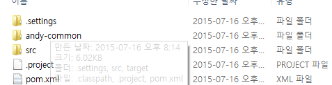

# Maven (3)


## Java 실행 옵션 


-classpath	-cp,  참조할 클래스 패스
-D<property name>=<property value>	시스템의 프로퍼티 값을 설정


-Djava.library.path=


## 플러그인 활용법 
### 기본 jar 생성
pom.xml에 특별한 설정 없이 maven build를 하면  target 폴더에  xxxx-0.0.1-SNAPSHOT.jar 파일이 생성됨

### test case를 모아 놓은 jar 생성

maven-jar-plugin을 사용하여  goal을 test-jar로 설정하고 maven build를 하면,  xxxx-0.0.1-SNAPSHOT-test.jar 파일이 생성된다. 

test-class들을 포함한 jar를 생성하고 싶을 때, 이러한 클래스들을 재사용하고 싶을 것이다.  두가지 방법이 있는데, 

-	현재 프로젝트로 부터 test-classes를 가진 attached jar 를 생성, 타동사의(transitive) test-scoped 의존성들을 느슨하게 한다. 
-	test-calsses를 가진 분리된 project를 생성 

```xml
<project>
...

  <build>
    <plugins>
      ...
      <plugin>
        <groupId>org.apache.maven.plugins</groupId>
        <artifactId>maven-jar-plugin</artifactId>
        <version>3.0.2</version>
        <executions>
          <execution>
            <goals>
              <goal>test-jar</goal>
            </goals>
          </execution>
        </executions>
      </plugin>
      ...
    </plugins>
  </build>
  ...
</project>
```


test classe와 resources 을 포함한 jar을 생산할 수 있다. 

생성된 test-jar 파일을 풀어보면 test case가 들어 있다. 


http://maven.apache.org/plugins/maven-jar-plugin/examples/create-test-jar.html


### 의존하는 패키지를 하나의  빌드하는 project의  jar에 넣기 
\<pluginManagement\>안의 \<plugins\>에  다음을 추가 
```xml
<plugin>
	<groupId>org.apache.maven.plugins</groupId>
	<artifactId>maven-assembly-plugin</artifactId>
	<version>2.4</version>
	<configuration>
		<descriptorRefs>
			<descriptorRef>jar-with-dependencies</descriptorRef>
		</descriptorRefs>
	</configuration>
	<executions>
		<execution>
			<id>make-assembly</id> <!-- this is used for inheritance merges -->
			<phase>package</phase> <!-- bind to the packaging phase -->
			<goals>
				<goal>single</goal>
			</goals>
		</execution>
	</executions>
</plugin>
```


\<build\>바로 아래의 \<plugins\>에 다음을 추가한다. 
```xml
<plugin>
	<groupId>org.apache.maven.plugins</groupId>
	<artifactId>maven-assembly-plugin</artifactId>
</plugin>
```


build하면 –jar-with-dependencies 가 붙은 jar 파일이 하나 더 생긴다.  jar파일을 살펴보면 \<dependencies\>에 추가한 의존 라이브러리들이 들어 있다. 


### 빌드 시에 생성된 파일들 삭제
```shell
mvn clean
```
\<pluginManagement\>에 다음을 추가한다. 

```xml
                <plugin>
                    <groupId>org.apache.maven.plugins</groupId>
                    <artifactId>maven-clean-plugin</artifactId>
                    <version>3.0.0</version>
                    <executions>
                        <execution>
                            <id>auto-clean</id>
                            <phase>initialize</phase>
                            <goals>
                                <goal>clean</goal>
                            </goals>
                        </execution>
                    </executions>

                </plugin>
```


\<execution\>에서 오류가 표시된다. 


\<exuction\>에 마우스 커서를 갖다대면 아래 그림과 같이 표시된다.  “Mark goal clean as ignored in pom.xml” 을 선택한다. 


그러면 아래 그림이 표시된다. OK 버튼을 클릭한다. 


\<pluginManagement\>에  다음이 추가된다.

```xml

                <!--This plugin's configuration is used to store Eclipse m2e settings only. It has no influence on the Maven build itself.-->
                <plugin>
                	<groupId>org.eclipse.m2e</groupId>
                	<artifactId>lifecycle-mapping</artifactId>
                	<version>1.0.0</version>
                	<configuration>
                		<lifecycleMappingMetadata>
                			<pluginExecutions>
                				<pluginExecution>
                					<pluginExecutionFilter>
                						<groupId>
                							org.apache.maven.plugins
                						</groupId>
                						<artifactId>
                							maven-clean-plugin
                						</artifactId>
                						<versionRange>
                							[3.0.0,)
                						</versionRange>
                						<goals>
                							<goal>clean</goal>
                						</goals>
                					</pluginExecutionFilter>
                					<action>
                						<ignore></ignore>
                					</action>
                				</pluginExecution>
                			</pluginExecutions>
                		</lifecycleMappingMetadata>
                	</configuration>
                </plugin>

```


이제 정상적이다. 

Eclipse에서 build를 해 보면, 


clean  goal이 먼저 실행된 것을 확인할 수 있다. 


### Maven Ant 명령어 실행 
\<pluginManagement\>에 다음을 추가한다. 
```xml
<plugin>
	<artifactId>maven-antrun-plugin</artifactId>
	<version>1.8</version>
	<executions>
		<execution>
			<phase><!-- a lifecycle phase -->compile</phase>
			<configuration>
				<target>
		<!-- Place any Ant task here. You can add anything you can add between 
					<target> and </target> in a build.xml. -->
				<echo message="Hello Echo"  />
				</target>
			</configuration>
			<goals>
				<goal>run</goal>
			</goals>
		</execution>
	</executions>
</plugin>
```


\<phase\>에 실행할 단계를 넣는다.  \<configuration\>에 task를 넣는다.  \<excuction\>에 오류가 발생하면  maven-clean-plugin 처럼 처리한다. 

\<build\> 아래의 \<plugins\>에 다음을 추가한다. 
```xml
		 <plugin>
			<artifactId>maven-antrun-plugin</artifactId>
		</plugin>
```
```shell
mvn package 
```
실행하면 그림과 같이 Hello Echo 가 출력이 된다. 

### maven compiler jave version 설정하기


\<properties\>에 java version 설정
```xml
<properties>
		<project.build.sourceEncoding>UTF-8</project.build.sourceEncoding>
		<target.jdk>1.8</target.jdk>
	</properties>
```
\<pluginManagement\>에 다음을 추가한다. 
```xml
<plugin>
					<groupId>org.apache.maven.plugins</groupId>
					<artifactId>maven-compiler-plugin</artifactId>
					<version>3.1</version>
					<configuration>
						<optimize>true</optimize>
						<source>${target.jdk}</source>
						<target>${target.jdk}</target>
					</configuration>
				</plugin>
```

프러퍼티에 jdk버전을 지원하지 않는 버전인 20.0으로 입력하면 빌드 시에 오류가 난다. 


### JavaDoc 생성하기 

\<pluginManagement\>에 다음을 추가한다. 

```
				<plugin>
					<groupId>org.apache.maven.plugins</groupId>
					<artifactId>maven-javadoc-plugin</artifactId>
					<version>2.9.1</version>
					<configuration>
						<linksource>true</linksource>
						<maxmemory>1g</maxmemory>
						<minmemory>256m</minmemory>
						<source>${target.jdk}</source>
						<tags>
							<tag>
								<name>note</name>
								<placement>a</placement>
								<head>NOTE</head>
							</tag>
							<tag>
								<name>todo</name>
								<placement>a</placement>
								<head>TODO</head>
							</tag>
							<tag>
								<name>warning</name>
								<placement>a</placement>
								<head>WARNING</head>
							</tag>
						</tags>
						<!-- apiviz stuff, comment ATM as it doesn't works on poms packaging 
							pom -->
						<!-- <doclet>org.jboss.apiviz.APIviz</doclet> <docletArtifact> <groupId>org.jboss.apiviz</groupId> 
							<artifactId>apiviz</artifactId> <version>1.3.1.GA</version> </docletArtifact> 
							<useStandardDocletOptions>true</useStandardDocletOptions> <charset>UTF-8</charset> 
							<encoding>UTF-8</encoding> <docencoding>UTF-8</docencoding> <breakiterator>true</breakiterator> 
							<version>true</version> <author>true</author> <keywords>true</keywords> <additionalparam>-sourceclasspath 
							${project.build.outputDirectory}</additionalparam> -->
					</configuration>
				</plugin>
```
\<reporting\>\<plugins\> 에 다음을 추가한다. 


```xml		
    <plugin>
                <groupId>org.apache.maven.plugins</groupId>
                <artifactId>maven-javadoc-plugin</artifactId>
                <reportSets>
                    <reportSet>
                        <reports>
                            <report>aggregate</report>
                        </reports>
                    </reportSet>
                </reportSets>
            </plugin>
			
```


## PMD로 정적 코드 검사하기 

\<pluginManagement\>에 다음을 추가한다. 

```xml
	
				    <plugin>
                    <groupId>org.apache.maven.plugins</groupId>
                    <artifactId>maven-pmd-plugin</artifactId>
                    <version>3.6</version>
                    <configuration>
                        <aggregate>true</aggregate>
                        <targetJdk>${target.jdk}</targetJdk>
                        <rulesets>
                            <!-- <ruleset>/rulesets/maven.xml</ruleset> -->
                            <ruleset>rulesets/java/basic.xml</ruleset>
                        </rulesets>
                        <format>xml</format>
                        <linkXref>true</linkXref>
                        <sourceEncoding>utf-8</sourceEncoding>
                        <minimumTokens>100</minimumTokens>
                    </configuration>
                </plugin>
```


\<reporting\>에 다음을 추가한다.
```xml
 <plugin>
         <groupId>org.apache.maven.plugins</groupId>
         <artifactId>maven-pmd-plugin</artifactId>
</plugin>
```

다음을 실행하면 site에 보고서가 생성될 것이다. 

```shell
mvn site 
```


## Maven Eclipse 활용방법
이번 장에서는 POM Relations에서 설명한 상속과 집합(multi module)을 응용한 프로젝트들을 Eclipse을 이용하여 만들고 관리하는 방법을 설명한다. 설명을 위해 모두 4개의 프로젝트를 생성할 것이다. 

-	하나, 모든 프로젝트에서 공통으로 적용할 최상위 프로젝트로 POM 상속을 위해 생성
-	둘,여러개의 프로젝트를 하나의 프로젝트로 관리하기 위한 컨테이너 역할을 할 프로젝트 생성
-	셋,컨테이너 역할을 할 프로젝트의 모듈 프로젝트로 만들 두 개의 프로젝트 생성


위 그림에서  최상위 POM 프로젝트를 상속받은 자식 프로젝트들이 두 개가 있다. B프로젝트와 E 프로젝트가 해당된다. 다시 B프로젝트는 C와 D를 하위 프로젝트로 두고 있다. 그런데 이런 구조를 왜 만들어야 할까? 한 번쯤은 고민해 볼 일이다. 


규모가 있는 프로젝트에서는 공통적으로 적용할 환경에 대한 설정들이 있을 수 있고 모든 프로젝트들에서 공통적으로 사용할 빌드 플러그인 등이 있을 수 있다. 이러한 설정들을 각 프로젝트에서 중복으로 설정하기보다는 한 곳에서만 설정하여 사용하면 좋을 것이다. Maven에서는 이러한 설정을 빌드 시에 아무것도 하지 않는 프로젝트를 만들 수 있다. 위의 그림에서 B와 E는 A에서 설정한 내용들을 상속하여 중복적으로 설정하지 않아도 된다.  각자만의 필요한 설정만 자신의 POM에 하면 된다. 


B 프로젝트는 여러개의 프로젝트를 가지는 프로젝트이다. 이런 프로젝트가 왜 필요한가?  B프로젝트는 자식프로젝트로 C와 D프로젝트가 있다. 각각은 독립된 프로젝트이고 각각 프로젝트가 따로 빌드되고 산출물(artifact)이 만들어진다. 하나의 독립된 모듈들을 하나의 그룹으로 묶어서 프로젝트를 할 필요가 있을 때 이런 식으로 구성한다. 


실제 예를 들어볼까? 
웹 프로젝트에서 날짜처리라든가 문자열 처리라든가 업무기능과는 관련이 없는 기능이지만 업무기능을 구현하기 위해서 꼭 필요한 기능을 반드시 개발해야할 필요가 있다. 예를들어 문자열을 자르기, 붙이기, 가공하는 등의 공통 메소드를 만들 때 보통 StringUtil이라는 클래스를 만든다. 또 두 날짜 사이의 기간 계산, 음력날짜 구하기 등의 기능들을 DateUtil이라는 클래스를 만들어서 그 안에 구현한다. 이러한 클래스들을 패키지로 묶어서 util이라는 패키지 안에 둔다. 

이러한 java pakcage의 소스들을 웹프로젝트에 모두 두고 빌드하고 관리할 수도 있지만 패키지만의 독립성을 유지하고 관리하기 위해서는 별도의 프로젝트를 생성해서 그 결과물(보통은 jar 파일)을 웹프로젝트에서 의존하여 사용하는 것이 좋다. 

우리가 만들고 싶은 것은 웹어플리케이션이지만 공통의 기능들을 각 프로젝트로 나누어서 빌드하고 그 결과물을 웹프로젝트에서 사용하고 싶은 것이다. 메이븐은 이러한 프로젝트 구조를 쉽게 관리할 수 있도록 해준다. 


다시 그림으로 돌아가서, 위의 B 프로젝트는 C 프로젝트와 D 프로젝트를 가지고 있고 C와 D는 각각 jar 파일로 만들어진다. C와 D는 각각의 독립된 프로젝트이지만 B가 모두 관리를 하고 있다. B를 빌드하면 C와 D가 빌드된다. 

이제부터 실제로 프로젝트를 만들어 본다. 


### 프로젝트 생성
New \> Other \> Maven \> Maven Project를 선택한다. 


Create a simple project(skip archetype selection)을 체크한다. 

Group Id, Artifact Id에 적절한 값을 입력한다. 여기서는 com.andy를 Group Id로 하고 Artifact Id를 andy-base로 입력한다. 


Version은 그대로 두어도 되고 packaging을 pom으로 선택해야 한다. Package Explorer로 보면 생성된andy-base 프로젝트가 보인다. 


이 프로젝트는 빌드를 해도 아무것도 생성하지 않는다. 다른 프로젝트들의 부모 pom을 위한 프로젝트로 만든 것이다. 이제 하위 프로젝트를 만드는데 하위 프로젝트는 여러개의 모듈로 나누어진 프로젝트를 만들 것이다.  이 하위 프로젝트도 동일한 방식으로 만든다. 

Group Id에는 com.andy를 입력하고, Artifact Id에는 andy-myapp를 입력한다. package은 역시 pom을 선택한다. 프로젝트 생성화면의 하단에 보면 Parent Project라는 섹션이 있는데 여기서 이전에 생성한프로젝트의 정보를 입력 한다. Group Id에는  com.andy를 입력하고 Artifact Id에는 andy-base를 입력한다.


프로젝트가 생성되면 다음과 같이 보인다. 


pom.xml을 열어보면 GroupId is duplicate of parent groupid라고 나온다.


그룹아이디를 삭제하고 저장한다. 메시지가 사라진다.  Overview를 다시 보면 Version is duplicate of parent version 이라고 표시된다. 부모 pom의 버전과 다른 버전을 입력한다. 메시지가 사라지고 없다.


andy-webapp는 두개의 자식 프로젝트를 가질 것이고 Maven에서는 andy-webapp를 multi-module 프로젝트라고 한다. 하나씩 프로젝트를 만든다. 

New \> Other \> Maven \> Maven Module를 선택한다.


Module Name을 andy-common이라고 입력한다.


maven-archetype-quickstart를 선택한다.


디폴트를 선택하고 Finish 버튼을 클릭한다.


프로젝트가 생성된 것을 확인해 본다. 


Package Explorer 에서 보면 andy-common인 andy-webapp안에도 보이고 같은 레벨에서도 보이지만 실제로는 andy-webapp안에 들어있다.




Eclipse에서는 독립적인 프로젝트로써 작업을 할 수 있도록 지원하고 있다. 하지만 하나의 소스 디렉토리 안에서 관리된다는 것을 확인할 수 있다. 나머지 webapp 프로젝트도 생성해 본다. 여기서는 예제를 간단히 하기 위해서 webapp 타입이 아닌 quick type을 선택한다. 이름이 andy-web인 모듈을 생성한다. 생성된 전체 프로젝트는 아래 그림과 같이 보일 것이다. 


### 프로젝트 의존관계 만들기

andy-common에 Java Bean을 하나 만든다. StringUtil 클래스를 만들 것이다. org.andy.common.util 패키지를 생성한다. StringUtil class를 생성한다. 두개의 문자열을 합치는 append 메서드를 다음과 같이 만든다. 


andy-common을 빌드한다. andy-common을 빌드하기 전에 먼저 andy-base를 빌드한다. 자동으로 빌드가 되어야 하지만 잘 안되는 경우도 있다. 순서대로 빌드하도록 한다. andy-base 프로젝트에서  Run As > Maven Install을 선택한다.


BUILD SUCCESS라고 보이면 성공이다. 빌드를 하면 사용자 디렉토리의 .m2 디렉토리 아래에 pom 파일이 만들어 졌다는 메시지를 볼 수 있다. 

andy-common도 같은 방법으로 빌드한다. 이번에는 jar 파일과 pom 파일이 만들어 졌다는 메시지를 볼 수 있다. 


이제 andy-web에서 andy-common에 대한 의존관계를 설정한다. 

pom.xml 파일을 열고 dependency 요소에 다음과 같이 정의한다. 


이제 andy-web은 andy-common을 의존하게 된다. andy-web 프로젝트에 TestCas를 하나 만들어서 테스트 해본다.  com.andy.web 패키지를 만든다. StringUtilTest Test Case를 만든다. 


실행하면 :1122”가 출력된다. 

이제 전체를 빌드해 본다. andy-webapp 에서 Maven Install을 선택하여 빌드한다. 의존관계가 설정되어 있으므로 모든 것이 빌드될 것이다.  그런데 에러가 나온다. andy-web이 실패했다는 메시지가 보일 것이다.  andy-web만 다시 빌드해 본다. 

성공했다. 다시 andy-webapp를 빌드해 본다. 정상적으로 모든 것이 빌드될 것이다.  여기까지 했으면 Maven을 이용한 프로젝트 구조를 이클립스를 이용하여 생성하고 빌드하는 방법은 알게 되었다.


## 저장소
메이븐의 저장소는 세 가지로 나눈다. 중앙저장소, 원격저장소, 로컬저장소가 있다. 메이븐을 이용하여 빌드할 때 필요한 라이브러리들을 로컬저장소에 다운로드한다. 회사에서 사용하는 원격저장소가없으면 중앙저장소에서 다운로드하여 로컬저장소에 보관한다. 대부분의 오픈소스 라이브러리들은 중앙저장소에서 제공한다. 일부 라이브러리들은 별도의 메이븐 원격저장소를통하여 제공하는 경우가 많다. 중앙저장소에서 제공하지 않는 라이브러기가 있다면 \<repository/\> 엘리먼트에 저장소 정보를 설정하면 된다.  메이븐은 라이브러리를 다운로드할 때 \<repository/\> 엘리먼트에 설정되어 있는 저장소 순서로 다운로드 한다. 첫번째 저장소에서 의존 관계에 있는 라이브러리를 찾았다면 다음 저장소에 접근하지 않고 다른 라이브러리를 찾는 방식으로 동작한다.


**중앙저장소** 
 오픈소스 라이브러리, 메이븐 플러그인, 메이븐 아키타입을 관리하는 저장소이다.  중앙 저장소는 개발자가 임의로 라이브러리를 배포할 수 없다.

**원격저장소**
 메이븐 중앙 저장소이외에 각각의 회사 혹은 오픈소스 재단에서 운영 관리하는 저장소 

**로컬저장소**
 메이븐을 빌드할 때 다운로드하는 라이브러리, 플러그인을 관리하는 개발자의 PC 저장소 


pom에서는 저장소의 위치를 정할 수 있는 \<repository\> 요소를 제공한다.  repository 요소 내부에 <url>요소에 접근할 수 있는 저장소의 url을 넣으면 된다. 

```xml
     <repositories>
          <repository>
               <id>Your repo</id>
               <name>Your Maven Repository</name>
               <url>http://nexus.yourdomain.com/content/groups/public</url>
          </repository>
  
<reppository>
			<id>repo</id>
			<name>maven repo</name>
			<url>http://repo1.maven.org/maven2/</url>
	  </repository>
     </repositories>
```


## 원격저장소 배포 
http://swtest.co.kr/72


### Nexus 사용

Type	설명
Hosted	기본 Type, 회사내에서 개발한 jar 파일, 3rd party의 jar 파일을 관리하기 위한 Repository.  Hosted Type Repository는 Snapshoots(개발용), Release(제품) , 3rd Party를 제공
Proxy	외부 레파지토리에 대해서  proxy 역할.
Nexus에서는 기본적으로 제공하는 Proxy Type Repository는 Google Code, java.net, Maven Central이 있음. 
Virtual	서로 다른 타입의 Repository에 대해서 adapter 역할을 한다. Nexus는 maven1 repository와 maven2 repository에 대한 adaptoor .역할만 제공
Group	여러개의 Repository를 하나로 묶어주는 역학


	settings.xml에 remote repository에 대한 계정 정보 및 url을 등록
	최상위 pom.xml에 필요한 플러그인 추가, repository에 대한 정보를 등록
	mvn clean deploy를 통해 Nexus에 실제로 배포가 되는지 확인 


#### settings.xml 설정

**서버등록**

```xml
<servers>
  <server>
    <id>ttia-releases</id>
    <username>ttia-deployment</username>
    <password>password</password>
  </server>
  <server>
    <id>ttia-snapshots</id>
    <username>ttia-deployment</username>
    <password>password</password>
  </server>
</servers>
```


**profile 등록**


jdk버전, repositories, pluginRepositories 정보를 입력합니다.
- 주의 repository의 id는 반드시 Nexus에 등록된 repository의 id와 동일해야 하며, 이는 추후 수정할 pom.xml의 repository의 id와 일치해야합니다.
```xml
<profiles>
  <profile>
    <id>ttia-dev</id>

    <activation>
      <jdk>1.6</jdk>
    </activation>

    <repositories>
       <repository>
         <id>ttia-releases</id>
         <url>http://localhost:8081/nexus/content/repositories/ttia-releases</url>
         <snapshots>
           <enabled>false</enabled>
         </snapshots>
       </repository>

       <repository>
         <id>ttia-snapshots</id>
         <url>http://localhost:8081/nexus/content/repositories/ttia-snapshots</url>
         <releases>
           <enabled>false</enabled>
         </releases>
       </repository>
     </repositories>

     <pluginRepositories>
       <pluginRepository>
         <id>ttia-releases</id>
         <url>http://localhost:8081/nexus/content/repositories/ttia-releases</url>
         <snapshots>
           <enabled>false</enabled>
         </snapshots>
       </pluginRepository>

       <pluginRepository>
         <id>ttia-snapshots</id>
         <url>http://localhost:8081/nexus/content/repositories/ttia-snapshots</url>
         <releases>
           <enabled>false</enabled>
         </releases>
      </pluginRepository>
    </pluginRepositories>
  </profile>
</profiles>
```

**profile 등록**

settings.xml에서 마지막으로 할 작업은 활성화할 profile을 등록하는 것입니다. 방금 전 만들었던 profile을 등록합니다.
소스닫기
```xml
<activeProfiles>
  <activeProfile>ttia-dev</activeProfile>
</activeProfiles>
```

**최상위 pom.xml 수정**
다음은 최상위 pom.xml을 수정할 차례입니다. 먼저 plugin을 설정합니다. 아래에 설명하는 4개의 plugin을 주로 많이 사용합니다.
- maven-compiler-plugin : 컴파일을 위한 플러그인(필수)
- maven-source-plugin : 배포시 소스를 포함하기 위한 플러그인(옵션)
- maven-javadoc-plugin : 배포시 javadoc을 포함하기 위한 플러그인(옵션)
- maven-deploy-plugin : 배포에 관련된 설정을 하기 위한 플러그인(옵션)


```xml
<build>
  <plugins>
    <plugin>
      <groupId>org.apache.maven.plugins</groupId>
      <artifactId>maven-compiler-plugin</artifactId>
      <version>2.3.2</version>
      <configuration>
        <source>1.6</source>
        <target>1.6</target>
        <encoding>UTF-8</encoding>
      </configuration>
    </plugin>

    <plugin>
      <groupId>org.apache.maven.plugins</groupId>
      <artifactId>maven-source-plugin</artifactId>
      <version>2.1.2</version>
      <executions>
        <execution>
          <id>attach-sources</id>
          <goals>
            <goal>jar</goal>
          </goals>
        </execution>
      </executions>
    </plugin>

    <plugin>
      <groupId>org.apache.maven.plugins</groupId>
      <artifactId>maven-javadoc-plugin</artifactId>
      <version>2.7</version>
      <executions>
        <execution>
          <id>attach-javadocs</id>
          <goals>
            <goal>jar</goal>
          </goals>
        </execution>
      </executions>
    </plugin>

    <plugin>
      <groupId>org.apache.maven.plugins</groupId>
      <artifactId>maven-deploy-plugin</artifactId>
      <version>2.5</version>
      <configuration>
        <updateReleaseInfo>true</updateReleaseInfo>
      </configuration>
    </plugin>
  </plugins>
</build>
```

#### Repository 정보 등록

pom.xml에 Repository의 정보를 등록합니다. 위에서도 설명했듯이 repository와 snapshotRepository의 id는 반드시 settings.xml의 profile에 등록한 repository의 id와 동일해야 합니다.

```xml
<distributionManagement>
  <repository>
    <id>ttia-releases</id>
    <name>TTIA Releases Repository</name>
    <url>http://localhost:8081/nexus/content/repositories/ttia-releases</url>
  </repository>

  <snapshotRepository>
    <id>ttia-snapshots</id>
    <name>TTIA Snapshots Repository</name>
    <url>http://localhost:8081/nexus/content/repositories/ttia-snapshots</url>
  </snapshotRepository>
</distributionManagement>
```


**배포**
콘솔에서의 명령어는 pom.xml이 있는 위치에서 "mvn clean deploy"를 합니다.


## Distribution – 배포

빌드 산출물을 배포하기 위한 설정을 하는 곳이다. Nexus를 설치하여 리파지터리를 만들 수 있다. Nexus를 설치하면 최초에 다음의 리파지터리를 제공한다.
- Release
- Snapshots
- 3rd party
- 기타 Central, Apache Snapshots, Codehaus Snapshos 등 외부 리파지터리 연결
```xml
<distributionManagement>
		<repository>
			<uniqueVersion>true</uniqueVersion>
			<id>releases</id>
			<name>Naonsoft Releases</name>
			<url>http://not.naonsoft.com:8074/nexus/content/repositories/releases</url>
			<layout>default</layout>
		</repository>
		<snapshotRepository>
			<uniqueVersion>true</uniqueVersion>
			<id>snapshots</id>
			<name>Naonsoft Snanshots</name>
			<url>http://not.naonsoft.com:8074/nexus/content/repositories/snapshots</url>
			<layout>default</layout>
		</snapshotRepository>
		<site>
			<id>james-website</id>
			<url>file:///opt/naonsoft-james/site/server</url>
			<!-- <url>scpexe://people.apache.org/www/james.apache.org/${deployTechnicalSiteDirectory}</url> -->
		</site>
	</distributionManagement>
```

	id, name  : 유니크한 이름, 아이디를 나타낸다.
	uniqueVersion :  true 또는 false 값을 취한다. 산출물이 유니크하게 생성된 버전 번호를 얻을지, 주소의 일부로써 정의된 버전 번호를 사용할지를 나타낸다. 
	url : 리파지터리 엘리먼트의 핵심. 생성된 산출물을 전송하기 위해 사용할 전송 프로토콜과 위치(location)을 설명한다. 
	layout: 기본값은 legacy이다. 
	site: 리파지터리에 배포하는 것 이상으로 distributionManagement은 프로젝트의 사이트와 문서화를 배포하는 방법을 정의할 책임이 있다. 

id, name, url은 repository 요소에 있는 것들과 대응된다. 
```xml
<distributionManagement>
   <repository>
  <id>[릴리즈 레포지토리 아이디]</id>
  <url>http://[nexus서버 아이피]:8081/nexus/content/repositories/[릴리즈 레포지토리 아이디]</url>
   </repository>
   <snapshotRepository>
  <id>[스냅샷 레포지토리 아이디]</id>
  <url>http://[nexus서버 아이피]:8081/nexus/content/repositories/[스냅샷 레포지토리 아이디]</url>
   </snapshotRepository>
</distributionManagement>
```


외부 SSH 명령어에서 산출물을 배포하기
```xml
<distributionManagement>
    <repository>
      <id>ssh-repository</id>
      <url>scpexe://repository.mycompany.com/repository</url>
    </repository>
  </distributionManagement>

```


## Maven 내부용 리파지토리 만들고 Maven 설정하기

pom.xml 파일에 \<distributionManagement\> 태그를 등록
```xml
<distributionManagement>
		<repository>
			<id>mycompany.internal.release</id>
			<name>MyCompany Internal Repository</name>
			<url>http://host/nexus/content/repositories/releases/</url>
		</repository>
	</distributionManagement>

```

settings.xmolo 파일에 pom.xml 파일에 설정한 리포지토리에 연결할 때 사용할 정볼르 추가해 준다. 

```xml
<settings xmlns="http://maven.apache.org/SETTINGS/1.0.0"
  xmlns:xsi="http://www.w3.org/2001/XMLSchema-instance"
  xsi:schemaLocation="http://maven.apache.org/SETTINGS/1.0.0
                      http://maven.apache.org/xsd/settings-1.0.0.xsd">
	<servers>
		<server>
			<id>mycompany.internal.release</id>
			<username>deployment</username>
			<password>deployment123</password>
		</server>	
	</servers>

</settings>
```

\<server\> 태그는 특정 서버에 연결할 때 사용할 아이디/암호를 입력하는데 이때 \<id\>의 값은 pom.xml에 등록한 리포지토리의 \<id\> 값과 일치해야 한다.


### 등록된 것 사용하기 

배포된 artifact를 다른 프로젝트에서 사용하려면 다음과 같이 앞서 구축한 내부용 리포지토리를 등록해주고 depedency를 추가해주면 된다.
```xml
<repositories>
		<repository>
			<id>mycompany.internal.repo</id>
			<url>http://host/nexus/content/repositories/releases/</url>
			<releases>
				<enabled>true</enabled>
			</releases>
		</repository>
	</repositories>

	<dependencies>
		<dependency>
			<groupId>com.mycompany</groupId>
			<artifactId>my-common-module</artifactId>
			<version>3.0</version>
		</dependency>
	</dependencies>

```


