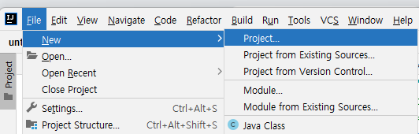
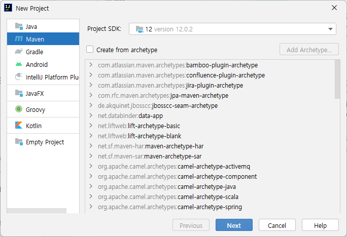
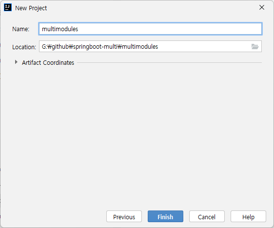
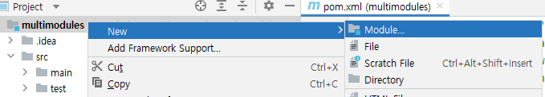
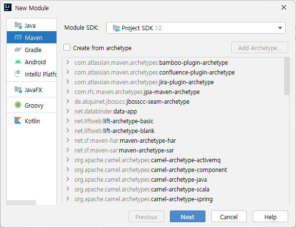
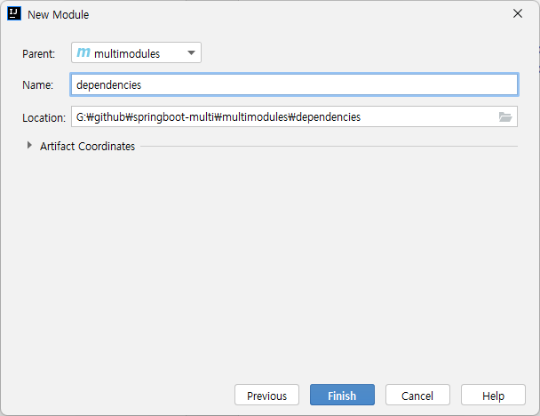
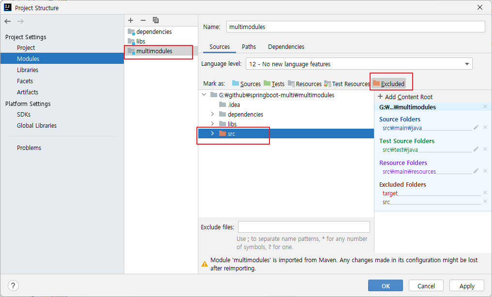
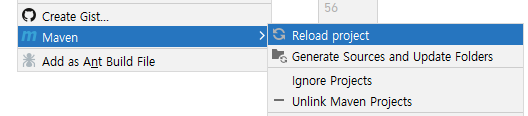
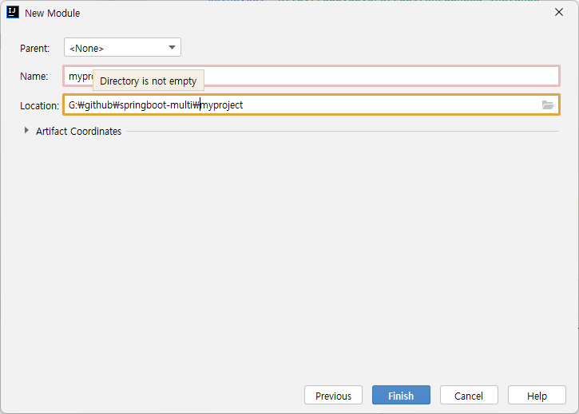
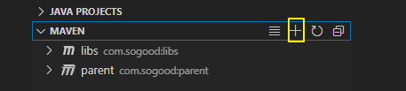

# Maven Multi Module Project 


## IntelliJ 

### 프로젝트 생성 


File \> New \> Project



Maven을 선택하고 Next 버튼을 클릭한다. 





Location에 프로젝트를 생성할 디렉토리 선택한다Name에 프로젝트 이름을 입력한다. 디렉터리 뒤에 프로젝트명을 입력한다.




다음과 같이 프로젝트가 생성될 것이다. 

```shell
📁multimodules
  📁src
     📁main
        📁java
  📄pom.xml 
```


### 하위 모듈 생성 


프로젝트를 선택하고 New \> Module을 선택한다. 




Maven을 선택하고 Next 버튼을 클릭한다. 



Parent에 방금 생성한 프로젝트가 선택되어 있다. 하위 모듈의 이름을 입력한다.Finish 버튼을 클릭한다. 




다음과 같이 디렉터리 구조가 생성될 것이다. 

```shell
📁multimodules
  📁depenndencies 
    📁src
      📁main
        📁java	
		📄pom.xml 
  📁src
     📁main
        📁java
  📄pom.xml 
```

하위 모듈을 하나 더 만들어 보자. 이름은 libs라고 짖는다. 다음과 같이 프로젝트 폴더 구조가 생성될 것이다.

```shell
📁multimodules
  📁depenndencies 
    📁src
      📁main
        📁java	
	  📄pom.xml 
  📁libs
    📁src
      📁main
        📁java
		📄pom.xml 					
  📁src
     📁main
        📁java
  📄pom.xml 
```

### pom.xml 파일 내용 확인
부모가 되는 multimodules 프로젝트의 pom.xml 파일을 살펴보자.  packaging이 pom으로 설정되어 있고, modules에 dependencies와  libs가 있다.

```xml
<?xml version="1.0" encoding="UTF-8"?>
<project xmlns="http://maven.apache.org/POM/4.0.0"
         xmlns:xsi="http://www.w3.org/2001/XMLSchema-instance"
         xsi:schemaLocation="http://maven.apache.org/POM/4.0.0 http://maven.apache.org/xsd/maven-4.0.0.xsd">
    <modelVersion>4.0.0</modelVersion>

    <groupId>org.example</groupId>
    <artifactId>multimodules</artifactId>
    <packaging>pom</packaging>
    <version>1.0-SNAPSHOT</version>
    <modules>
        <module>dependencies</module>
        <module>libs</module>
    </modules>

    <properties>
        <maven.compiler.source>12</maven.compiler.source>
        <maven.compiler.target>12</maven.compiler.target>
    </properties>

</project>
```

dependencies 모듈의 pom.xml 파일을 살펴보자. parent에 multimotules가 설정되어 있다. 
```xml
<?xml version="1.0" encoding="UTF-8"?>
<project xmlns="http://maven.apache.org/POM/4.0.0"
         xmlns:xsi="http://www.w3.org/2001/XMLSchema-instance"
         xsi:schemaLocation="http://maven.apache.org/POM/4.0.0 http://maven.apache.org/xsd/maven-4.0.0.xsd">
    <parent>
        <artifactId>multimodules</artifactId>
        <groupId>org.example</groupId>
        <version>1.0-SNAPSHOT</version>
    </parent>
    <modelVersion>4.0.0</modelVersion>

    <artifactId>dependencies</artifactId>

    <properties>
        <maven.compiler.source>12</maven.compiler.source>
        <maven.compiler.target>12</maven.compiler.target>
    </properties>

</project>
```
libs의 pom.xml 파일을 살펴보자. 역시 parent에 multimodules가 선택되어 있다. 


```xml
<?xml version="1.0" encoding="UTF-8"?>
<project xmlns="http://maven.apache.org/POM/4.0.0"
         xmlns:xsi="http://www.w3.org/2001/XMLSchema-instance"
         xsi:schemaLocation="http://maven.apache.org/POM/4.0.0 http://maven.apache.org/xsd/maven-4.0.0.xsd">
    <parent>
        <artifactId>multimodules</artifactId>
        <groupId>org.example</groupId>
        <version>1.0-SNAPSHOT</version>
    </parent>
    <modelVersion>4.0.0</modelVersion>

    <artifactId>libs</artifactId>

    <properties>
        <maven.compiler.source>12</maven.compiler.source>
        <maven.compiler.target>12</maven.compiler.target>
    </properties>

</project>
```

### multimodules에 소스 폴더 제거 
File \> Project Structure를 선택하고 Modules에서 multimodules를 선택한다.  src 디렉터리를 선택하고  Excluded를 클릭한다. 



apply 버튼을 클릭하고 창을 닫는다. 그리고 src 디렉터리를 삭제한다. 


### 의존성 추가 
부모 pom 프로젝트인 multimodules의 pom.xml 파일을 선택하고, parent와 dependencies에 의존성을 추가한다. 
```xml

    <parent>
        <groupId>org.springframework.boot</groupId>
        <artifactId>spring-boot-starter-parent</artifactId>
        <version>2.6.1</version>
        <relativePath/> <!-- lookup parent from repository -->
    </parent>


    <dependencies>
     
        <dependency>
            <groupId>org.mybatis.spring.boot</groupId>
            <artifactId>mybatis-spring-boot-starter</artifactId>
            <version>2.2.0</version>
        </dependency>
				<!-- 생략 -->
    </dependencies>
```

전제 내용은 다음과 같다. 
```xml
<?xml version="1.0" encoding="UTF-8"?>
<project xmlns="http://maven.apache.org/POM/4.0.0"
         xmlns:xsi="http://www.w3.org/2001/XMLSchema-instance"
         xsi:schemaLocation="http://maven.apache.org/POM/4.0.0 http://maven.apache.org/xsd/maven-4.0.0.xsd">
    <modelVersion>4.0.0</modelVersion>
    <parent>
        <groupId>org.springframework.boot</groupId>
        <artifactId>spring-boot-starter-parent</artifactId>
        <version>2.6.1</version>
        <relativePath/> <!-- lookup parent from repository -->
    </parent>

    <groupId>org.example</groupId>
    <artifactId>multimodules</artifactId>
    <packaging>pom</packaging>
    <version>1.0-SNAPSHOT</version>
    <modules>
        <module>dependiences</module>
        <module>libs</module>
    </modules>

    <properties>
        <maven.compiler.source>12</maven.compiler.source>
        <maven.compiler.target>12</maven.compiler.target>
    </properties>


    <dependencies>

        <!-- SpringBoot -->
        <dependency>
            <groupId>org.springframework.boot</groupId>
            <artifactId>spring-boot-starter-freemarker</artifactId>
        </dependency>
        <dependency>
            <groupId>org.springframework.boot</groupId>
            <artifactId>spring-boot-starter-web</artifactId>
        </dependency>

        <dependency>
            <groupId>org.springframework.boot</groupId>
            <artifactId>spring-boot-devtools</artifactId>
            <scope>runtime</scope>
            <optional>true</optional>
        </dependency>
        <!-- for deploying this as war -->
        <dependency>
            <groupId>org.springframework.boot</groupId>
            <artifactId>spring-boot-starter-test</artifactId>
            <scope>test</scope>
        </dependency>
        <dependency>
            <groupId>org.springframework.boot</groupId>
            <artifactId>spring-boot-starter-data-jdbc</artifactId>
        </dependency>

        <dependency>
            <groupId>org.mybatis.spring.boot</groupId>
            <artifactId>mybatis-spring-boot-starter</artifactId>
            <version>2.2.0</version>
        </dependency>

        <!-- for batch -->
        <dependency>
            <groupId>org.springframework.boot</groupId>
            <artifactId>spring-boot-starter-batch</artifactId>
        </dependency>
    </dependencies>
</project>
```

pom.xml 파일을 선택하고 우측 마우스 버튼을 클릭하여 Maven \> Reload project를 클릭한다. 



이제 하위 모듈에서 의존성을 상속 받기 때문에 부모가 의존하는 의존성들을 사용할 수 있다. 

com.sogood.core 패키지를 만들고 TestConf.java 파일을 만든다. 다음과 같이 코드를 작성한다. pom.xml의 dependencies가 상속되기 때문에  Spring의 @Configuration을 쓸 수 있다. 
```java
package com.sogood.core;

import org.springframework.context.annotation.Configuration;

@Configuration
public class TestConf {
}
```


### 패키징 해보기 
maven 창을 선택하고 multimodules를 선택한다. LifeCycle \> package를 실행한다.  부모를 실행하면 하위 모듈 모두가 컴파일되고 패키징 될 것이다. 

dependencies와 libs 모듈에는 jar 파일이 생성된다. 그러나 부모인 multimodules에는 jar파일이 생성되지 않는다.  또 jar 파일을 살펴보면 의존하고 있는 라이브러리들은 포함되지 않는다. 모듈에서 작성한 코드만 포함한다. 


### 인스톨 해보기 

인스톨하면 로컬 리파지토리에 폴더가 생성되고 jar파일이 생성된다. 

```shell
📁com
  📁sogood 
    📁dependencies
      📁1.0.0
        📄dependencies-1.0.0.pom 
        📄dependencies-1.0.0.jar 
    📁libs
      📁1.0.0
        📄libs-1.0.0.pom 
        📄libs-1.0.0.jar 
    📁multimodules
      📁1.0.0
        📄multimodules-1.0.0.pom 
```

## 생성한 libs 라이브러리를 이용하는 모듈 생성 
지금 생성하려는 모듈은 Maven의 하위 모듈이 아니라 독립적인 모듈이다. 이 모듈에서 multimoeules를 상속하고 libs.jar를 이용할 것이다. 

### 모듈 생성 
File \>  New \> Module를 선택한다. Mavne을 선택하고 Next 버튼을 클릭한다. 

Parent는 None을 선택하고 multimodule과 위치에서 Locaion을 선택한다. Name에 myprojet로 입력한다. 





### pom.xml 설정하기 
\<parent\>를 다음과 같이 설정한다. 
```xml
    <parent>
        <groupId>com.sogood</groupId>
        <artifactId>multimodules</artifactId>
        <version>1.0.0</version>
        <relativePath/> <!-- lookup parent from repository -->
    </parent>
```

libs.jar의 의존성을 추가한다. 
```xml
    <dependencies>
        <dependency>
            <groupId>com.sogood</groupId>
            <artifactId>libs</artifactId>
            <version>1.0.0</version>
        </dependency>
    </dependencies>
```
\<build\> 에 다음을 추가한다. 
```xml

    <build>
        <plugins>
            <plugin>
                <groupId>org.springframework.boot</groupId>
                <artifactId>spring-boot-maven-plugin</artifactId>
                <configuration>
                    <excludes>
                        <exclude>
                            <groupId>org.projectlombok</groupId>
                            <artifactId>lombok</artifactId>
                        </exclude>
                    </excludes>
                </configuration>
            </plugin>
        </plugins>
    </build>
```


### libs에 LibStringUtil.java 생성 
```java
package com.sogood.core;

public class LibStringUtil {
    public static String getName(){
        return "Hong";
    }
}
```

Maven install을 실행한다. com.sogood.biz 패키지를 생성하고 ByBiz.java를 다음과 같이 작성한다. 
```java
package com.sogood.biz;

import com.sogood.core.LibStringUtil;

public class MyBiz {
    public String getUserName(){
        return LibStringUtil.getName();
    }
}

```
정상적으로 컴파일 된다.  이제 SoogoodApplicatino.java를 com.sogood 패키지에 생성한다. 

```java
package com.sogood;
import org.springframework.boot.SpringApplication;
import org.springframework.boot.autoconfigure.SpringBootApplication;

@SpringBootApplication
public class SogoodApplication {
    public static void main(String[] args) {
        SpringApplication.run(SogoodApplication.class, args);
    }

}

```

### 패키징 
myproject를 packaging한다. mvan package를 실행한다.  생성된  jar 파일을 살펴보면 BOOT-INF에 클래스와 의존하는 jar 파일들을 볼 수 있을 것이다. 


```shell
📁myproject-1.0.0.jar
  📁BOOT_INFO 
    📁classes
      📁com
        📁sogood
         📄SogoodApplication.class
          ... 생략 ....
    📁lib
      📄libs-1.0.0.jar
      📄spring-web-5.3.13.jar 
			... 생략 ....
```


## Multi Module 구성 시 주의 사항 

###  pom.xml 
**최상위 모듈**
spring-boot-starter-parent를 상속 받는다.
```xml
    <parent>
        <groupId>org.springframework.boot</groupId>
        <artifactId>spring-boot-starter-parent</artifactId>
        <version>2.6.1</version>
        <relativePath/> <!-- lookup parent from repository -->
    </parent>
```

packaging 형식은 pom으로 한다.  
```xml
    <groupId>com.sogood</groupId>
    <artifactId>multimodules</artifactId>
    <packaging>pom</packaging>
    <version>1.0.0</version>
```
\<modules\>를 사용하여 하위 모듈을 포함한다. 
```xml
    <modules>
        <module>dependiences</module>
        <module>libs</module>
    </modules>
```
하위 모듈에서 이 pom을 상속 받기 때문에 공통으로 적용할 의존성을 여기서 관리한다. 
```xml

    <dependencies>
           <dependency>
            <groupId>org.springframework.boot</groupId>
            <artifactId>spring-boot-starter-freemarker</artifactId>
        </dependency>
				... 생략 ....
        <dependency>
            <groupId>org.springframework.boot</groupId>
            <artifactId>spring-boot-starter-batch</artifactId>
        </dependency>
    </dependencies>
```


**하위 모듈**
parent를 사용하여 상속 받는다. 
```xml
    <parent>
        <artifactId>multimodules</artifactId>
        <groupId>com.sogood</groupId>
        <version>1.0.0</version>
    </parent>
```		

groupId는 사용하지 않는다. 적절한 packaging 형태를 선택한다. 
```xml
    <artifactId>libs</artifactId>
    <packaging>jar</packaging>
```

**응용 모듈** 
parent를 정의하여 상속 받는다. 
```xml
    <parent>
        <groupId>com.sogood</groupId>
        <artifactId>multimodules</artifactId>
        <version>1.0.0</version>
        <relativePath/> <!-- lookup parent from repository -->
    </parent>
```
응용 모듈에서만 필요한 의존성을 추가한다. 
```xml

    <dependencies>

        <dependency>
            <groupId>com.sogood</groupId>
            <artifactId>libs</artifactId>
            <version>1.0.0</version>
        </dependency>
        <dependency>
            <groupId>org.projectlombok</groupId>
            <artifactId>lombok</artifactId>
            <version>1.18.20</version>
            <scope>provided</scope>
        </dependency>
    </dependencies>
```

SpringBoot의 경우 의존성까지 포함하여 빌드해야하기 때문에 \<build\>를 설정한다. 
```xml
    <build>
        <plugins>
            <plugin>
                <groupId>org.springframework.boot</groupId>
                <artifactId>spring-boot-maven-plugin</artifactId>
                <configuration>
                    <excludes>
                        <exclude>
                            <groupId>org.projectlombok</groupId>
                            <artifactId>lombok</artifactId>
                        </exclude>
                    </excludes>
                </configuration>
            </plugin>
        </plugins>
    </build>
```


### repositories 설정 

\<dependencies\> 를 사용하면  의존성을 관리하기 때문에 \<repository\>를 설정해야 한다. 
```xml
	<repositories>
		<repository>
			<id>mvn2</id>
			<url>https://repo1.maven.org/maven2/</url>
			<releases>
				<enabled>true</enabled>
			</releases>
			<snapshots>
				<enabled>true</enabled>
			</snapshots>
		</repository>
  </repositories>    
```

### 플러그인 
메이븐이 제공하는 모든 기능은 플러그인 기반으로 동작한다.  메이븐 페이즈 또한 플러그인을 통해 실행된다. plugin은 \<plugins\>와 \<pluginManagement\> 두 곳에서 설정할 수 있는데 pluginManagement에 설정하면 부모 pom을 상속받는 하위 프로젝트에서 사용할 수 있다. 


#### 최상위  모듈에 플러그인 설정 
최상위 모듈의 pom.xml 파일에  기본적으로 사용할 플러그인 들을 pluginManagement에 설정한다. 

```xml
	<build>
		<pluginManagement>
			<plugins>
				<plugin>
					<groupId>org.apache.maven.plugins</groupId>
					<artifactId>maven-clean-plugin</artifactId>
					<version>3.0.0</version>
					<executions>
						<execution>
							<id>auto-clean</id>
							<phase>initialize</phase>
							<goals>
								<goal>clean</goal>
							</goals>
						</execution>
					</executions>
				</plugin>
				<plugin>
					<groupId>org.apache.maven.plugins</groupId>
					<artifactId>maven-assembly-plugin</artifactId>
					<version>2.4</version>
					<configuration>
						<descriptorRefs>
							<descriptorRef>jar-with-dependencies</descriptorRef>
						</descriptorRefs>
					</configuration>
					<executions>
						<execution>
							<id>make-assembly</id> <!-- this is used for inheritance merges -->
							<phase>package</phase> <!-- bind to the packaging phase -->
							<goals>
								<goal>single</goal>
							</goals>
						</execution>
					</executions>
				</plugin>
				<plugin>
					<groupId>org.apache.maven.plugins</groupId>
					<artifactId>maven-compiler-plugin</artifactId>
					<configuration>
						<source>${target.jdk}</source>
						<target>${target.jdk}</target>
						<encoding>UTF-8</encoding>
					</configuration>
				</plugin>

				<plugin>
					<groupId>org.apache.maven.plugins</groupId>
					<artifactId>maven-surefire-plugin</artifactId>
					<version>2.16</version>
					<configuration>
						<skipTests>true</skipTests>
					</configuration>
				</plugin>
			</plugins>
		</pluginManagement>
	</build>
```

#### 응용 모듈에 plugin 추가 
응용 모듈에서 빌드 시에 사용할 plugin을 추가하거나 부모에서 설정한 plugin을 오버라이드할 경우에 plugin을 추가한다. 


```xml
  <build>
		<plugins>
			<plugin>
				<groupId>org.apache.maven.plugins</groupId>
				<artifactId>maven-clean-plugin</artifactId>
			</plugin>
			<plugin>
				<groupId>org.apache.maven.plugins</groupId>
				<artifactId>maven-jar-plugin</artifactId>
			</plugin>
			<plugin>
				<groupId>org.apache.maven.plugins</groupId>
				<artifactId>maven-compiler-plugin</artifactId>
			</plugin>
			<plugin>
				<groupId>org.apache.maven.plugins</groupId>
				<artifactId>maven-surefire-plugin</artifactId>
			</plugin>
		</plugins>
	</build>
```


## VScode 
VSCode에서 Maven 멀티 모듈 프로젝트를 생성하는 방법을 간단히 설명한다. 

* Ctrl + Shift + P 실행 
* Maven:Create Maven Project  선택
* archetype 창에서 More 누른뒤 pom-root 선택
* 1.4 선택
* group id : com.sogood 
* artifact id : multimodules 입력 
* 디렉터리 선택 
* Explorer 창에서 Maven 탭 선택 
* '+' 버튼(Create Maven Project) 선택 



* maven-archetype-quickstart 선택
* Group id 입력
* artifact id 입력
* 위에서 생성한 프로젝트 하위 폴더 선택


### pom 설정
#### 최상위 pom.xml 
```xml
<?xml version="1.0" encoding="UTF-8" standalone="no"?>
<project xmlns="http://maven.apache.org/POM/4.0.0" xmlns:xsi="http://www.w3.org/2001/XMLSchema-instance" xsi:schemaLocation="http://maven.apache.org/POM/4.0.0 http://maven.apache.org/xsd/maven-4.0.0.xsd">
  <modelVersion>4.0.0</modelVersion>
  <parent>
        <groupId>org.springframework.boot</groupId>
        <artifactId>spring-boot-starter-parent</artifactId>
        <version>2.6.1</version>
        <relativePath/> <!-- lookup parent from repository -->
  </parent>

  <groupId>com.sogood</groupId>
  <artifactId>parent</artifactId>
  <version>1.0.0</version>
  <packaging>pom</packaging>
  <name>parent</name>
  <modules>
    <module>libs</module>
  </modules>
    <properties>
        <maven.compiler.source>12</maven.compiler.source>
        <maven.compiler.target>12</maven.compiler.target>
    </properties>  

    <dependencies>

        <!-- SpringBoot -->
        <dependency>
            <groupId>org.springframework.boot</groupId>
            <artifactId>spring-boot-starter-freemarker</artifactId>
        </dependency>
        <dependency>
            <groupId>org.springframework.boot</groupId>
            <artifactId>spring-boot-starter-web</artifactId>
        </dependency>

        <dependency>
            <groupId>org.springframework.boot</groupId>
            <artifactId>spring-boot-devtools</artifactId>
            <scope>runtime</scope>
            <optional>true</optional>
        </dependency>
        <!-- for deploying this as war -->
        <dependency>
            <groupId>org.springframework.boot</groupId>
            <artifactId>spring-boot-starter-test</artifactId>
            <scope>test</scope>
        </dependency>
        <dependency>
            <groupId>org.springframework.boot</groupId>
            <artifactId>spring-boot-starter-data-jdbc</artifactId>
        </dependency>

        <dependency>
            <groupId>org.mybatis.spring.boot</groupId>
            <artifactId>mybatis-spring-boot-starter</artifactId>
            <version>2.2.0</version>
        </dependency>

        <!-- for batch -->
        <dependency>
            <groupId>org.springframework.boot</groupId>
            <artifactId>spring-boot-starter-batch</artifactId>
        </dependency>
    </dependencies>    
</project>
```

#### 하위 모듈 pom.xml 
```xml
<?xml version="1.0" encoding="UTF-8"?>
<project xmlns="http://maven.apache.org/POM/4.0.0" xmlns:xsi="http://www.w3.org/2001/XMLSchema-instance" xsi:schemaLocation="http://maven.apache.org/POM/4.0.0 http://maven.apache.org/xsd/maven-4.0.0.xsd">
  <modelVersion>4.0.0</modelVersion>
  <parent>
    <artifactId>parent</artifactId>
    <groupId>com.sogood</groupId>
    <version>1.0.0</version>
  </parent>
  <artifactId>libs</artifactId>
</project>
```


