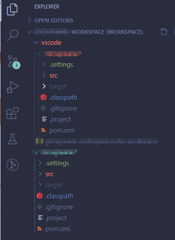

# Visual Studio Code 가이드(1)

## 설치전 준비사항

* Open JDK 12 버전 설치
* Windows 용 git 설치
* Maven 설치

.png>)

## Maven 설정

Maven이 설치된 폴더의 setting.xml을 연다.

.png>)

localRepository 설정, jar 파일을 보관할 경로 설정

```xml
<localRepository>e:/mavenrepository</localRepository>
```

서버 설정을 다음과 같이 한다. 계정이 없으면 설정하지 않아도 된다.

```xml
<server>     
   <id>latte-release</id>      
   <username>xxx</username>      
   <password>xxx</password>    
</server>        
<server>      
  <id>latte-thirdparty</id>      
  <username>xxx</username>      
  <password>xxx</password>    
</server>        
<server>      
  <id>latte-snapshot</id>      
  <username>xxx</username>      
  <password>xxx</password>    
</server>
```

## Java, Maven 환경 변수 설정

VIsualStudio Code는 JDK 11이상 버전에서 실행된다. java와 maven의 실행경로를 path에 추가

.png>)

JAVA\_HOME. MAVEN\_HOME 이 환경 변수에 설정되어 있음. Java는 Open JDK 12. 버전 사용

.png>)

## Font 설정

Preferences > Settings 선택

\


.png>)

폰트 사이즈 15설정

\


.png>)

선호하는 폰트 맨 앞에 입력하고 콤마

\


.png>)

Tab Size 를 2로 설정

 (1).png>)

## Java Extension Pack 설치

.png>)

### Access restriction 오류

프로젝트가 Java 8을 사용하는 경우에 오류가 나온다. Java Extension Pack 설치 후에 Java 8에서만 지원하는 클래스를 사용하면 경고 메시지 나온다

.png>)

Eclipse에서는 이와 같이 처리한다.

\


.png>)

Visual Studio에서 Project를 생성하면 Eclipse .settings 폴더가 생성되는데 그 폴더 아래의 org.eclipse.jdt.core.prefs 파일을 열어서 수정한다.

VSCode에서는 이와 같이 ignore로 값을 변경

.png>)

.png>)

## Maven for java 설정

Maven은 터미널에서 실행되므로 Maven for Java에서 설정해주어야 한다.

* settings에서 Maven for Java 선택
* USer 탭을 선택하면 사용자 설정이고 Workspace를 선택하면 프로젝트에만 적용
* javahome을 별도로 설정

.png>)

workspace의 settings.json 파일. 프로젝트 폴더의 .vscode 폴더 안에 생성

**settings.json**

```json
{
  "maven.terminal.useJavaHome": true,
  "maven.terminal.customEnv": [
    {
      "environmentVariable": "JAVA_HOME",
      "value": "E:\\dev\\apps\\jdk1.8.0_231"
    }
  ],
  "maven.excludedFolders": [
    "**/.*",
    "**/node_modules",
    "**/target",
    "**/bin"
  ]
}
```

**사용자 설정 settings.json**\
사용자 설정 settings.json은 다음의 경로에 있다.

```shell
C:\Users\sangh\AppData\Roaming\Code\User\settings.json
```

```json
{
    "editor.suggestSelection": "first",
    "vsintellicode.modify.editor.suggestSelection": "automaticallyOverrodeDefaultValue",
    "java.configuration.checkProjectSettingsExclusions": false,
    "editor.fontFamily": "D2Coding,Consolas, 'Courier New', monospace",
    "editor.tabSize": 2,
    "window.zoomLevel": 0,
    "editor.fontSize": 15,
    "workbench.colorTheme": "GitHub Light",
    "java.configuration.maven.userSettings": "E:\\dev\\apps\\apache-maven-3.6.0\\conf\\settings.xml",
    "java.configuration.maven.globalSettings": "E:\\dev\\apps\\apache-maven-3.6.0\\conf\\settings.xml",
    "maven.excludedFolders": [
        "**/.*",
        "**/node_modules",
        "**/target",
        "**/bin"
    ],
    "java.configuration.runtimes": [
        {
        "name":"JavaSE-1.8",
        "path":"E:\\dev\\apps\\jdk1.8.0_231"
        },
        {
            "name":"JavaSE-12",
            "path":"E:\\dev\\apps\\jdk.12.0.2",
            "default": true
        }
    ]
}
```

## Git Len , Git Graph설치

.png>)

## Live Server 설치

.png>)

html 파일에서 Open with Liver Server 선택

.png>)

live Server 가 실행되면서 브라우저가 열린다. 브라우저에서 확인해 볼 수 있다.

.png>)

## Maven 설정

### Maven Settings.xml 경로 설정

Maven의 settings.xml을 별도로 설정하지 않은 경우에는 설정할 필요가 없다.

* settings에서 maven 검색
* 환경 변수가 설정되어 있으면 할 필요 없음
* Edit in settings.json 클릭

.png>)

자신만의 settings.xml 설정하려면 경로를 설정한다.\


.png>)

## Eclipse의 egit 설정

윈도우용 git가 설치된 경우에는 System Settings은 윈도우용 Git의 gitconfig를 참조한다. 없으면 Unknown이라고 표시된다.

.png>)

**core.autocrlf로 인한 소스 충돌 문제**

.png>)

### git 버전 확인 및 사용자 등록

git config –global .옵션이 저장되는 위치

사용자 디렉토리의 git config는 C:/Users/사용자/.gitconfig에 저장된다.

.png>)

VSCode의 Terminal 창에서 git 버전 확인

.png>)

git 사용자 등록. global로 설정하면 windows의 모든 프로젝트에 영향을 준다.

```shell
git config –-global user.name “name”
git config –-global user.email “aaa@gmail.com”
```

설정확인

```shell
git config --list
```

결과 중에서 사용자 목록을 확인할 수 있다.

\


.png>)

프로젝트 마다 다른 Email을 사용하고 싶으면 –global 옵션을 제거하면 된다.

### gitconfig 내용 확인

Windows용 git를 설치한 경우에만 C:/Program Files에 git가 있다.

C:/Progam\~/Git/etc/gitconfig 파일의 내용을 보고 싶으면 –system option을 사용한다.

.png>)

.png>)

.png>)

### CR/LF 이슈

Windows에서 line endin으로 CRE/LF 사용. Unix나 Mac OS는 LF만 사용

실제 코드는 변경된 게 없는데 소스의 CR/LF 때문에 변경으로 착각하여 commit 될 수 있으며 merge시 마다 문제가 될 소지가 있다.

#### core.eof

git가 line ending을 어떻게 처리하는지 관련된 항목

core.eol = native\
기본설정. 시스템에서 line endin을 처리하는 방법을 따른다.\
core.eol = crlf\
crlf를 line ending으로 사용한다.\
core.eol = lf\
LF를 line ending으로 사용한다.

#### core.autocrlf

text file을 git object database에 checkin, checkout할 때 어떻게 처리할지를 설정하는 변수

core.autocrlf=false 기본설정. 파일에 CRLF를 썼던 LF를 썼던 git는 무시하고 그대로 checkin, checkout한다.

core.autocrlf=true text file을 object database에 넣기전에 crlf를 lf로 변경한다.

core.autocrlf=input LF를 line endin으로 사용한다

core.autocrlf 설정

이 값은 system 설정을 따르도록 false를 설정한다.

```shell
git config core.autocrlf false
```

core.eol 설정

egit에서 이 값을 어떻게 설정하고 있는지 확인하지 못했음. 일단 lf로 설정

```shell
git config core.eol lf
```

## 워크스페이스

여러개의 프로젝트를 묶으려면 워크스페이스를 만들면 된다.

이전에 선택한 폴더아래에 프로젝트가 클론된다.

.png>)

선택한 폴더를 워크스페이스로 하여 프로젝트를 오픈할지 새로운 창으로 프로젝트를 오픈할지를 물어본다.

.png>)

Add to Workspace를 선택했다.


File > Save Workspace As 선택

.png>)

vscode 루트 폴더에 my-workspace 라는 이름으로 저장

.png>)

vscode가 workspace 폴더가 되고 그 아래에 my-workspace.code-workspace 파일이 생성됨

.png>)

Vscode는 workspace 파일로 프로젝트들을 그룹핑할 수 있다. 파일을 열어보면 프로젝트 폴더의 경로와 이름이 설정된 것을 확인할 수 있다.

.png>)

vscode의 Explorer을 보면 워크 스페이스를 기준으로 폴더를 보여주고 , 프로젝트를 루트에 배치하여 폴더 구조를 보여주고 있다.


