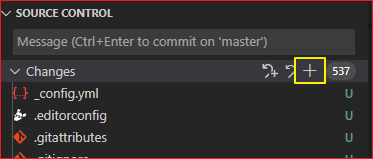
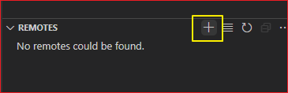
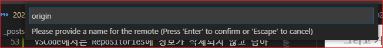
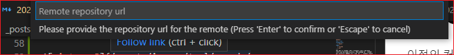
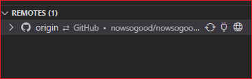

# VsCode에서 git history 초기화

API KEY 등 보안에 민감한 내용들이 포함된 커밋들이 많은 경우 해당 커밋들의 history만 삭제하기가 힘든 경우에 git history를 초기화 해야 한다. 하지만 commmit 이력이 없어지기 때문에 최후의 방법으로만 사용해야 한다.

## 로컬 저장소의 git 히스토리 삭제

shell에서 다음과 같이 삭제하거나 윈도우즈의 경우에는 파일 탐색기에서 .git 폴더를 삭제한다.

```shell
rm -rf .git 
```

## 로컬 저장소를 다시 초기화

아래의 git command를 사용하여 저장소를 초기화 한다.

```shell
git init
```

VSCode에서는 Source Control 패널에서 'Initialize Repository' 버튼을 클릭한다.

.png>)


## 파일 추가 및 커밋트

파일들을 추가하고 커밋한다.

```shell
git add . 
git comit -m '프로젝트 초기화' 
```

VSCode에서는 Chagnes 항목의 'Stage All changes' 버튼을 클릭한다. 





그리고 커밋한다.

## 커밋 히스토리 확인

이전의 커밋 히스토리가 모두 삭제된 것을 확인할 수 있다.

```shell
git log
```

## 저장소 연결하고 푸시

원격 저장소를 추가하여 연결하고 강제로 푸시한다.

```shell
git remote add orgin <url>
git push -u --force origin master
```

Remotes 탭에서 Add Remote 버튼을 클릭한다.




Remote 이름을 입력한다. 'origin'으로 입력했다. 




Remote URL을 복사하여 붙여 넣는다. 그리고 엔터키글 입력한다. 




Remotes 탭에서 origin이 추가된 것을 확인할 수 있다. 




지금까지는 VSCode에서 작업이 가능했찌만 PUSH는 할 수 없었다. 강제로 푸시를 하려면 'Terminal > New Terminal'을 클릭하여 Terminal 창에서 명령을 실행해야 한다.
