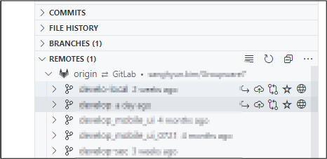

# VSCode에서 Git 사용 가이드

## Clone a git repository

### gitlab에서 URL 복사

URL 복사


Ctrl+Shift+P 입력하고,Git Clone 입력하고,Git Clone 선택한 다음에 엔터


복사한 URL 붙여 넣기


### 폴더 선택 및 클론진행

폴더 선택


id/password 입력 후 확인 클릭


Clone 진행 표시


## Source Control View

Source Contorl 버튼을 클릭하면 이와 같은 화면을 볼 수 있다.


Changes에는 커밋하지 않은 변경된 파일들을 볼 수 있다.


COMMITS에서는 현재 체크아웃 브랜치의 COMMITS를 볼 수 있다.


BRANCHES는 로컬 브랜치를 보여준다.REMOTES에는 원격저장소의 브랜치들을 보여준다.


STASHES는 스태시된 이력을 보여주고 TAGS는 태그들을 보여준다.


## 버전관리 제외하기

변경된 파일이 4개임을 표시


test.txt를 생성하고 저장하면 Changes에 나타남\
버전관리를 하지 않을 파일들은 선택하고 Add to .gitignore 클릭


## State/Unstage 인덱스에 넣기 빼기

index에 넣고 싶으면 파일 선택하고 Stage Changes 선택


또는 + 버튼 클릭


다시 Unstaged 상태로 돌리고 싶으면 Unstage Changes 선택


Staged Changed에 들어 간 것을 확인


### commit

Commit 버튼 클릭


커밋 메시지 입력


### commit 이력확인

Git graph 아이콘 클릭


커밋 이력을 확인할 수 있음


## 이력 보기 
Explorer 창에서 파일을 선택하고 우측 마우스 버튼을 클릭한다. Open File History를 선택한다. 


File History 섹션에 파일이 커밋된 이력이 표시된다. 


## Check out 로컬 브랜치 생성

Remotes의 브랜치 선택



Switch to Branch 선택


브랜치 명 입력 또는 그냥 엔터키를 누른다


로컬 브랜치에 생성되고 작업 브랜치로 활성화 된다


## 브랜치 스위칭하기

작업 브랜치로 변경하려는 브랜치를 선택하고 Switch to Branch 선택


## Fetch하기

Remotes의 upstream인 origin을 선택하고 Fetch 클릭


## 원격 저장소 추가

커맨드 창에서 Add Remote 검색


URL 붙여 넣고 엔터


remote 이름 입력


추가된 리모트 원격 브랜치를 확인할 수 있음


## 추가된 원격저장소에서 패치하기

Git Graph View에서 설정 버튼 클릭


Yes Fetch 클릭


Fetch 아이콘 클릭 하여 패치


## Rebase

로컬에 두 개의 커밋이 있음


원격 브랜치 선택


Rebase Current on to Upstream 선택. 원격 브랜치의 커멋 위로 현재 브랜치를 올린다는 의미.


Interactive Rebase 선택


로컬에서 커밋한 것을 선택할지를 물어본다. remote에서 가져온 커밋 위로 로컬의 커밋을 올릴 지 물어보는 것이기 때문에 pick을 선택한다. vi 에디터 창이므로 wq!를 입력한다. Eclipse와는 다르게 skip이 보이지 않는다. 선택하지 않으려면 drop 입력

skip을 하면 아무것도 처리되지 않는다. 소스 관리자가 rebase하여 서버에 푸시한 경우 패치를 적용하기 위해서 리베이스 하는 경우 이전에 패치를 받은 파일들이 변경된 것으로 보이는데, 이 경우에는 그런 사항이 없어 noting to do 오류를 내고 아무것도 처리되지 않는다.

만일 그런 경우라면 자신이 로컬에서 커밋하지 않는 파일들은 모두 skip하고 자신이 로컬에서 커밋한 파일들은 pick한 다음에 리베이스를 진행해야 한다.


커맨드 창에 성공했다는 메시지가 표시


커밋 히스토리를 보면 리모트 커밋이 로컬 커밋 아래에 있는 것을 볼 수 있다.


## Push

푸시 아이콘 클릭


Push 선택\
푸시할 커밋 갯수가 표시된다.


## Compare

Explorer에서 파일 선택


Open Time line 선택


Timeline에 변경 이력이 표시된다.


왼쪽이 이전 버전이고 오른쪽이 최근 선택한 버전


## Revert, Reset 등

Git Graph에서 Revert, Drop, Reset 등 지원


### 단축키

Preferencese \> Keyboard Shortcuts 클릭&#x20;


사용할 수 있는 단축키를 표시함

```shell

  Ctrl+X            줄 삭제 (잘라내기)
  Ctrl+C            줄 복사
  Ctrl+Shift+K      줄 삭제
  Ctrl+Enter        커서 위에 빈줄 생성
  Ctrl+Shift+Enter  커서 아래에 빈줄 생성
  Alt+Down          줄 아래로 이동
  Alt+Up            줄 위로 이동
  Shift+Alt+Down    그줄을 아래로 복제
  Shift+Alt+Up      그중을 위로 복제
  Ctrl+D            같은 단어를 추가하며 검색
  Ctrl+K Ctrl+D     현재 단어 끝에 도달 계속 같은 단어 끝으로 이동
  Ctrl+U            직전 커서 명령 취소
  Shift+Alt+I       여러 라인을 선택 후 각 라인 끝에 커서를 위치
  Ctrl+Shift+L      현재 선택 부분과 동일한 모든 것을 선택
  Ctrl+F2           커서가 위치한 동일한 모든 단어를 선택
  Ctrl+I            커서가 위치한 라인 선택
  Ctrl+Alt+Down     다중 커서 아래로
  Ctrl+Alt+Up       다중 커서 위로
  Ctrl+Shift+\      매칭되는 괄호로 점프
  Ctrl+]            라인 들여쓰기
  Ctrl+[            라인 내여쓰기
  Home              라인 시작으로
  End               라인 끝으로
  Ctrl+End          파일의 맨 끝으로
  Ctrl+Home         파일의 맨 처음으로
  Ctrl+Down         커서는 두고 페이지를 위로
  Ctrl+Up           커서는 두고 페이지를 아래로
  Alt+PageDown      커서는 두고 한 페이지 위로
  Alt+PageUp        커서는 두고 한 페이지 아래로
```

여러줄 선택

```shell
Ctrl + Alt + 화살표 여러줄을 선택한다.
```

```shell
Ctrl+Shift+[      커서가 있는 블럭 접음
  Ctrl+Shift+]      커서 하위 블럭 폄
  Ctrl+K Ctrl+[     괄호아래 모든 블럭 접음
  Ctrl+K Ctrl+]     괄호아래 모든 블럭 폄
  Ctrl+K Ctrl+0     파일의 모든 블럭 접음
  Ctrl+K Ctrl+J     파일의 모든 블럭 폄
  Ctrl+K Ctrl+C     그 줄을 주석으로 변경
  Ctrl+K Ctrl+U     주석 제거
  Ctrl+/            주석 토글
  Shift+Alt+A       선택 블럭 /**/ 주석 토글
  Ctrl+F            검색
  Ctrl+H            찾아 바꾸기
  F3                다음 찾기
  Shift+F3          앞으로 찾기
  Alt+Enter         찾은 단어와 같은 단어를 모두 선택, 다중커서
  Alt+C             검색 시 대소문자 구분 토글
  Alt+R             Toggle Find Regex
  Alt+W             정확히 그 단어만 토글
  Ctrl+M            Toggle Use of Tab Key for Setting Focus
  unassigned        Toggle Render Whitespace
  Alt+Z             자동 줄바꿈 토글
```

추가 편집 기능

```shell

  Ctrl+Space        자동 완성 추천
  Ctrl+Shift+Space  Trigger Parameter Hints
  Shift+Alt+F       Format Document
  Ctrl+K Ctrl+F     Format Selection
  F12               Go to Definition
  Alt+F12           Peek Definition
  Ctrl+K F12        Open Definition to the Side
  Ctrl+.            Quick Fix
  Shift+F12         Show References
  F2                Rename Symbol
  Ctrl+Shift+.      Replace with Next Value
  Ctrl+Shift+,      Replace with Previous Value
  Shift+Alt+Right   Expand AST Select
  Shift+Alt+Left    Shrink AST Select
  Ctrl+K Ctrl+X     Trim Trailing Whitespace
  Ctrl+K M          Change Language Mode
```

이동

```shell
  Ctrl+T            Show All Symbols
  Ctrl+G            줄번호로 이동
  Ctrl+P            Go to File..., Quick Open
  Ctrl+Shift+O      Go to Symbol...
  Ctrl+Shift+M      Show Problems
  F8                Go to Next Error or Warning
  Shift+F8          Go to Previous Error or Warning
  Ctrl+Shift+P      모든 명령어 보기
  Ctrl+Shift+Tab    Navigate Editor Group History
  Alt+Left          구문 단위로 뒤로 이동
  Alt+Right         구문 단위로 앞으로 이동
```

파일이름으로 찾기

```shell
  Ctrl+P            파일이름으로 찾기
```

편집기 창 관리

```shell
  Ctrl+Shift+N          새 창 열기
  Ctrl+W                현재 탭 닫기
  Ctrl+F4               프로그램 종료
  Ctrl+K F              현재 폴더 닫기
  Ctrl+\                창 수직 나누기
  Ctrl+1                1번 탭으로 이동
  Ctrl+2                2번 탭으로 이동
  Ctrl+3                3번 탭으로 이동
  Ctrl+K Ctrl+Left      왼쪽 탭으로 이동
  Ctrl+K Ctrl+Right     오른쪽 탭으로 이동
  Ctrl+Shift+PageUp     Move Editor Left
  Ctrl+Shift+PageDown   Move Editor Right
  Ctrl+K Left           왼쪽 탭으로 이동
  Ctrl+K Right          오른쪽 탭으로 이동
```

파일다루기

```shell
  Ctrl+N            새 파일
  Ctrl+O            파일 열기
  Ctrl+S            저장
  unassigned        Save All
  Ctrl+Shift+S      다른 이름으로 저장
  Ctrl+F4           프로그램 종료
  unassigned        Close Others
  Ctrl+K W          Close Group
  unassigned        Close Other Groups
  unassigned        Close Group to Left
  unassigned        Close Group to Right
  Ctrl+K Ctrl+W     모든 창 닫기
  Ctrl+Shift+T      Reopen Closed Editor
  Ctrl+K Enter      Keep Open
  Ctrl+Tab          Open Next
  Ctrl+Shift+Tab    Open Previous
  Ctrl+K P          Copy Path of Active File
  Ctrl+K R          Reveal Active File in Windows
  Ctrl+K O          Show Opened File in New Window
  unassigned        Compare Opened File With
```

보이기

```shell

  F11               전체 화면 토글
  Ctrl+K Z          좀더 전체 화면
  Escape Escape     좀더 전체 화면 나가기
  Ctrl+=            글자 크게
  Ctrl+-            글자 작게
  Ctrl+Numpad0      글자 크기 원래로
  Ctrl+B            사이드 영역 보이기 토글
  Ctrl+Shift+E      Show Explorer / Toggle Focus
  Ctrl+Shift+D      Show Debug
  Ctrl+Shift+G      Show Git
  Ctrl+Shift+X      Show Extensions
  Ctrl+Shift+U      Show Output
  Ctrl+Q            Quick Open View
  Ctrl+Shift+F      Show Search
  Ctrl+Shift+H      Replace in Files
  Ctrl+Shift+J      Toggle Search Details
  Ctrl+Shift+C      Open New Command Prompt
  Ctrl+Shift+V      Toggle Markdown Preview
  Ctrl+K V          Open Preview to the Side
  Ctrl+`            Toggle Integrated Terminal
```


