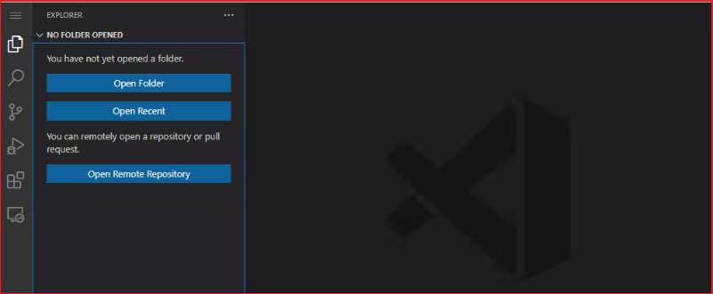

# VSCode Web 


Visual Studio Code의 web 버전이 공개되었다. 아래 사이트로 가면 에디터가 실행된다

https://vscode.dev/




로컬 폴더를 열어서 편집할 수 있다. 그러나  실행과 디버깅은 지원하지 않는다. 


# github 리파지터리 연결 
자신의 리파지터리가 다음과 같다고 가정한다. 

```
https://github.com/sego/my-app.git
```

그러면 다음과 같이 브라우저에 주소를 입력한다. 
```
https://vscode.dev/github.com/sego/my-app.git
```

작업하고 파일을 저장한다음에 git add , git commit하면 바로 리파지터리에 반영된다. 아주 편리한다. 


그런데 URL 접속 말고 간단히 리파티터리에서 점(.)을 입력하면 바로 연결된다. 
