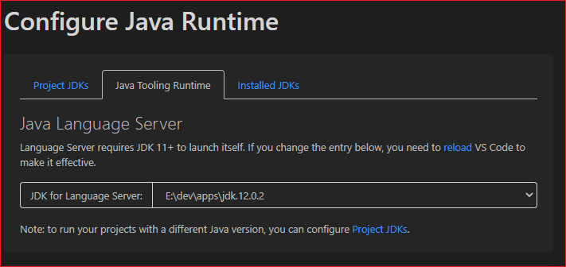
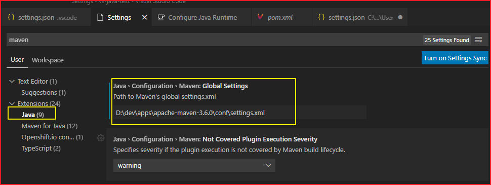
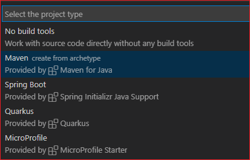
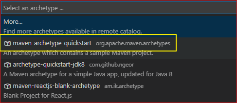
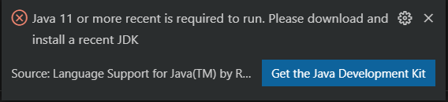
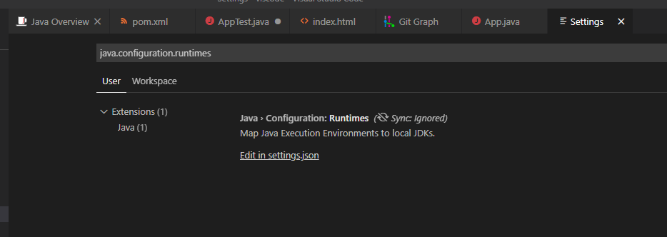
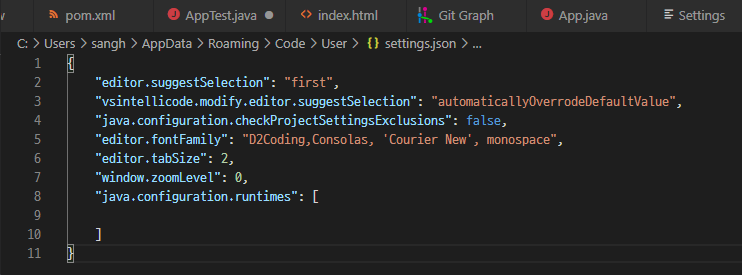
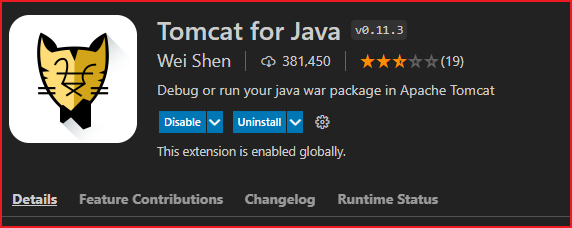
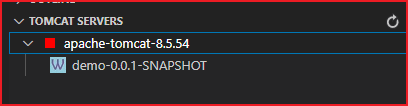

# VScode에서 자바 개발환경 설정

Visual Studio Code에서 Java 개발을 위한 환경 설정은 [Gettring Started with Java in VS Code](https://code.visualstudio.com/docs/java/java-tutorial)을 참고한다.

## JDK설치

VS Code에서 자바를 개발하기 위해서는 두 개의 분리된 runtimes이 존재한다는 것을 이해해야 한다. Java 개발을 위한 VS Code를 실행하기 위해서는 JDK 11 이상이 필요하다. 다음 중에서 원하는 것을 설치한다.

* Oracle Java SE
* AdoptOpenJDK
* Azul Zulu for Azure - Enterprise Edition

VS Code는 JDK 1.5 이상의 버전을 사용하는 프로젝트를 지원한다. 프로젝트 별로 다른 JDK 버전을 사용할 수 있기에 프로젝트를 빌드하기 위한 JDK도 필요하다.

* 하나는, VS Code를 실행하기 위한 버전
* 나머지는, Java 프로젝트를 개발하기 위한 버전

## Extension Pack 설치

먼저 Java Extension Pack을 설치한다. 이 팩에는 다음의 extension을 포함하고 있다.

* Language Support for Java(TM) by Red Hat
* Debugger for Java
* Java Test Runner
* Maven for Java
* Project Manager for Java

Java Extension의 Quick Start Guide를 보려면 다음을 입력한다.

```shell
Ctrl + Shift + P
```

.png>)


### Java Runtime 구성


Command Palette(CTrl + Shift + P)를 연다. 다음을 타이핑한다.

```shell
Java:Configure Java Runtime
```

### 시스템에 설치된 JDK 보기

Installed JDKs 탭에서 보면 두개의 JDK가 설치되었다고 나온다. 둘다 시스템 환경 변수에 잡혀 있다는 것을 의미한다. JDK 12는 시스템 환경 변수에서 JAVA_HOME으로 설정된 위치이다. JDK 8의 경우는 설치 버전으로 설치한 경우인데 시스템 어딘가에 경로를 저장하고 있다.


> 나의 경우에는 JDK8을 지우고 별도의 디렉터리에 JDK8을 복사해 두었는데, 이 경우에는 당연하게도 Detected JDKs에 8 버전이 표시되지 않는다.

### VS Code의 Java Tool이 사용하는 JDK

VS Code settings를 사용하여 JDK를 설정할 수 있지만 일반적인 방법은 시스템 환경 변수에 JAVA_HOME의 값을 설정하는 것이다. VSCode 전역 설정은 사용자 디렉터리 아래의 다음의 경로에 있다.

```shell
C:\Users\[사용자이름]\AppData\Roaming\Code\User\settings.json
```

VSCode가 실행하는데 필요한 JDK는 java.home 항목에 설정한다. Maven의 settings.xml을 별도로 설정하려면 java.configuration.maven.globalSettings 항목을 설정한다.

```json
    "java.home": "D:\\dev\\apps\\jdk.12.0.2",
    "java.configuration.maven.globalSettings": "D:\\dev\\apps\\apache-maven-3.6.0\\conf\\settings.xml",
```

Java Tooling Runtime에서는 Java Extenion에 대한 VS Code를 실행하기 위한 JDK를 설정한다. 이 값은 환경 변수 JAVA_HOME의 값을 읽는다.



### Project를 위한 JDK 설정

Project에서 사용하는 Java Version은 Project JDKs 탭에서 볼수 있다. 설정된 값이 없으면 표 시되지 않는다.


프로젝트에서만 사용하는 버전을 명시하려면 build script에 버전을 정의해야 한다. 'Click to see how'를 클릭해 보자.


Maven Project에서는 pom.xml 파일에 자바 버전을 명시한다.


```xml
<properties>
  <maven.compiler.source>1.8</maven.compiler.source>
  <maven.compiler.target>1.8</maven.compiler.target>
</properties>
```

Gralde 프로젝트에서는 build.gradle에 자바 버전을 명시한다.

```properties
sourceCompatibility = 1.8
targetCompatibility = 1.8
```

그러나 위와 같이 설정해도 표시되지 않았다. Maven의 경우 java.version이라고 설정해야 나온다.

```xml
<properties>
	<java.version>1.8</java.version>
</properties>
```

프로젝트에서만 사용하는 JDK를 설정하기 위해서는 .vscode 디렉터리 안에 settings.json에 다음을 추가한다.

```json
{
  "maven.terminal.customEnv": [
    {
      "environmentVariable": "JAVA_HOME",
      "value": "D:\\dev\\apps\\jdk1.8.0_231"
    },
  ],
  "java.debug.settings.hotCodeReplace": "auto",
  "java.configuration.updateBuildConfiguration": "interactive"
}
```

### Maven 설정

Preferences > Settings 에서 Java > Configuration > Maven : Global Settings 항목을 선택하여 settings.xml 파일의 경로를 설정한다.





Maven: Settings File 항목에 Edit in settings.json 링크를 클릭하여 다음을 설정한다. 


```json
"maven.settingsFile": "D:\\dev\\apps\\apache-maven-3.6.0\\conf\\settings.xml",
```

Maven > Termal: Use Java Home 항목을 선택하여 체크를 푼다.


## Java Project 생성

'Ctrl + Shift + P'를 입력한다음에 Command Palate에 'create java project'를 입력한다.

생성할 수 있는 프로젝트 유형들이 보여진다. 




Maven이나 Spring Boot를 선택한다. No build Tool은 선택하지 않는다. maven-archetype-quickstart를 선택한다.




다음 순서대로 진행한다.

1. archetype의 버전을 선택한다.
2. Group ID를 입력한다.
3. Artifact 아이디를 입력한다.

터미널 창이 열릴 것이고 값을 입력하고 싶으면 입력하고 엔터로 넘어가도 된다. 생성된 프로젝트의 pom.xml에 다음과 같이 되어 Java Version이 설정되어 있을 것이다.

```xml
  <properties>
    <project.build.sourceEncoding>UTF-8</project.build.sourceEncoding>
    <maven.compiler.source>1.7</maven.compiler.source>
    <maven.compiler.target>1.7</maven.compiler.target>
  </properties>
```

위 값을 1.8로 변경하고 다시 컨트롤 팔레트에서 Configure Java Runtime 창을 불러오자. 다음과 같이 보일 것이다. 


## Maven Build 하기

Maven Build는 아래의 URL을 참고한다. [Java build tools in VS Code](https://code.visualstudio.com/docs/java/java-build)

## JDK 11 오류

위에서 설명한 방법대로 하면 문제가 없을 것이다. 지금부터는 settings.json 파일에 별도의 설정을 하는 방법을 설명한다. 위에서 설명한대로 Java 11버전이 없으면 에러가 표시된다.





* Java Extention Pack을 설치하며 Language Support for Java by Red Hat 플러그인이 같이 설치되는데 여기서 자바 환경을 설정할 수 있다. 방법은 전역 설정이다.
* 이 플러그인은 JDK 11 이상으로 실행된다.

**이 내용은 필요 없는 경우 삭제할 것이다. 참고만 하라.**

### settings.json에 java.configuration.runtimes 설정

**여기서 설명하는 내용은 굳이 설정할 필요가 없었다.** JDK가 설정되지 않으면 환경변수 JAVA_HOME을 사용한다. Project가 다른 JDK 버전을 사용하는 경우 java.configuration.runtimes 프러퍼티를 사용한다. 사용자의 settings.json에 설정한다.

File > Preferences > Settings 클릭하면 setting UI를 열 수 있음


default runtime은 단독으로 java 파일을 열 때 사용된다. defaul는 JDK11 이상만 설정할 수 있다.

```json
    "java.configuration.runtimes": [
        {
        "name":"JavaSE-1.8",
        "path":"E:\\dev\\apps\\jdk1.8.0_231"
        },
        {
            "name":"JavaSE-12",
            "path":"E:\\dev\\apps\\jdk.12.0.2",
            "default": true
        }
    ]
```

default runtime은 단독으로 java 파일을 열 때 사용된다. defaul는 JDK11 이상만 설정할 수 있다. settings에서 java.configuration.runtimes 검색하기 위해 java.configuration.runtimes 입력하고 Edit in settings.json 클릭한다.





settings을 열면 이와 같이 보임





settings에 다음과 같이 추가한다.

```json
    "java.configuration.runtimes": [
        {
        "name":"JavaSE-1.8",
        "path":"E:\\dev\\apps\\jdk1.8.0_231"
        },
        {
            "name":"JavaSE-12",
            "path":"E:\\dev\\apps\\jdk.12.0.2",
            "default": true
        }
    ]
```

## Tocmat 연동

### Tomcat for Java 설치

Tomcat for Java를 설치한다.




### 프로젝트 생성

start.spring.io에서 패키징을 war로 선택하고 Spring Web 의존성을 추가하여 Demo 프로젝트를 생성한다. 


다운로드 받은 프로젝트를 VSCode에서 열고 Maven으로 빌드하여 war를 생성한다.

### 톰캣 연동

war 파일을 선택하고 우측마우스 클릭하여 Run on Tomcat Server를 선택한다.


TOMCAT SERVERS 아래에 다음과 같이 연동된 구성항목이 표시된다. 




우측 마우스를 클릭하면 다양한 명령어를 볼 수 있다. 


Open Server Configuration 명령을 선택하면 server.xml 파일이 열린다. 여기서 포트를 8080에서 80으로 변경이 가능하다.
