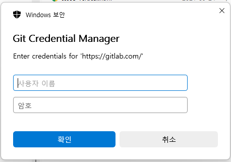
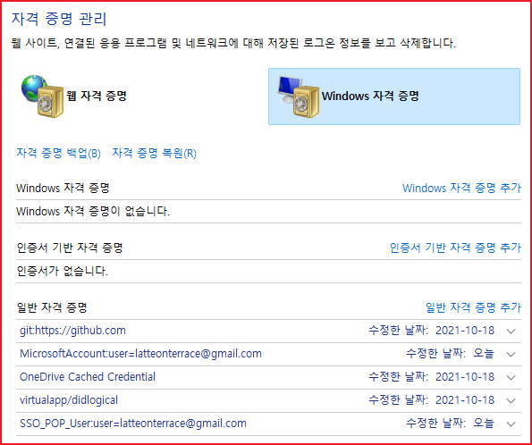

# Windows에서 git 계정 관리

윈도우즈를 다시 설치하거나 어떤 이유에서는 push가 안될 때는 다음과 같이한다.&#x20;

1. 먼저 git push 명령어를 사용해서 git에 로그인 해야 한다.&#x20;
2. git config 명령어를 사용하여 사용자 이름과 이메일을 설정해야 한다.&#x20;

VSCode의 터미널 창에서 다음을 실행한다.&#x20;

```
git push <저장소명> <브랜치명> 
```

자격증명이 없는 경우 로그인을 요구한다.&#x20;



Windows 자격증명 관리에서 자격증명이 등록되어 있는지 확인한다.  자격증명 프로그램은 윈도우즈 검색 매뉴를 사용하여 검색한다.&#x20;


**제어판 - 사용자 계정 - 자격증명 관리자**



**프로젝트의 이름 및 이메일 확인**

```
//이름 확인
git config user.name
//이메일 확인
git config user.email 
```

**global 이름 및 이메일 확인**

```
git config --global user.name 
git config --global user.email
```

**이름 삭제**

Windows 환경에서 git 사용자 계정을 변경하기 위해서는 위 스크린샷과 같이 제어판에서 편집을 해야합니다.

```
// 이름 삭제 
git config --global --unset user.name 
// 이메일 삭제 
git config --global --unset user.email 

```

## push할 때 다른 계정으로 push가 되어서 권한이 없을 때 
github에서 clone한 프로젝트를 푸시할 때 다른 계정으로 푸시가 되어서 권한이 없다는 오류를 만나게 되는 경우가 있다. 이런 경우의 해결 방법을 알아 보자. 


프로젝트 폴더에서  다음의 명령어를 입력하여 리모트 리파지토리 정보를 출력한다. 
```shell
git remote -v
```
다음과 같이 출력이 된다. 
```shell
PS G:\gitbook\projects\gitbook-tool> git remote -v
origin  https://github.com/rtgo/gitbook-tool.git (fetch)
origin  https://github.com/rtgo/gitbook-tool.git (push)
```
다음의 명령을 사용하여 리모트 정보를 수정해야 하는데 리모트 정보 앞에 '사용자이름@'을 붙인다.  형식은 이렇게 한다. 
```shell
https://[사용자이름]@github.com/rtgo/gitbook-cloud.git
```
사용자 이름이 abc라면 다음과 같이 한다. 
```shell
git remote set-url origin https://abc@github.com/rtgo/gitbook-cloud.git
```

